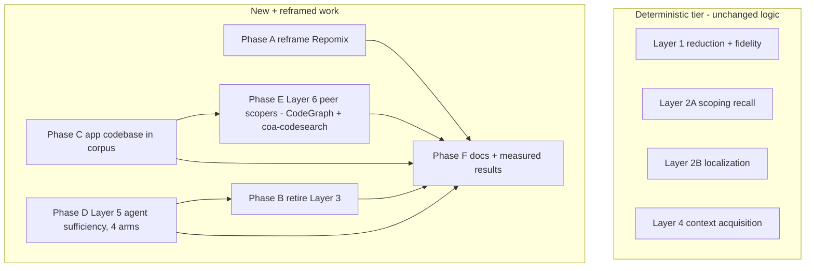

# Benchmark honesty overhaul: agent layer, peer comparison, reframing

## Current status (updated 2026-06-25, branch feature/roslyn-mandatory-sqlite-cache)

Done and committed:
- Phase A reframe (ebfa93c).
- Phase D1 spike (03027c0).
- Phase D2 Layer 5 build for the native and fuse arms, plus the MCP-hang fix: every claude launch now goes through `Invoke-ClaudeBounded` in [common.ps1](tests/benchmarks/harness/common.ps1) (per-MCP-call timeout via MCP_TOOL_TIMEOUT, a wall-clock backstop, and a process-tree kill so no `fuse mcp serve` child orphans). Root cause of the original hang: the claude CLI MCP_TOOL_TIMEOUT defaults to ~28h, and the harness left orphaned servers holding the worktree SQLite WAL lock; the focus pipeline itself does not deadlock. Commits b3f4439 (harness), fcadfb5 (results: 10 PRs x 2 rollouts, claude-haiku-4-5; native and fuse reach equal 46% mean recall, fuse at lower median tokens 324k vs 440k and higher sufficiency), 1c271bf (Layer 5 docs).

Remaining (see the goal prompt and the todos above): Phase B (retire Layer 3), Phase C (app repo + title/diff-mismatch filter), Phase E (Layer 6, script unverified), finish Phase D2 (codegraph + serena arms, scale-up), Phase F (Layer 6 + corpus docs), Phase G (regenerate the figure). Peer tools (CodeGraph, Serena, coa-codesearch-mcp) are NOT installed yet; the codegraph/serena Layer 5 arms and all of Layer 6 are blocked on installing them (offline, keyless).

## Why this plan exists

The current suite compares Fuse against Repomix (a concatenate-everything packer) and models the agent round-trip cost with a hand-rolled quadratic. Two consequences:

1. Repomix can only lose on tokens-at-one-call. It never scopes, so it is a strawman for the scoping claim even though it is a fair baseline for the cost of *not* scoping. The page already half-concedes this; we make the framing explicit.
2. The real product thesis (Fuse collapses a multi-turn explore phase into one scoped call) is only measured as a structural lower bound (Layer 4) and an illustrative model (Layer 3), never as a real agent, and never against a tool that does the same job. The benchmarks page lists the agent layer under "Blocked and Out of Scope."

This plan adds a real (model-dependent) agent layer, adds an honest peer comparison against the closest public rival, expands the corpus beyond clean libraries, and retires the illustrative model. It does **not** rewrite the deterministic layers or change the harness language.

## Decisions already made (do not relitigate)

- **Layer 5 scope:** context sufficiency only (did the agent gather the files the task needs, at what cost). Full task resolution (patch + test oracle, SWE-bench style) is explicitly deferred, not built. Four arms under one Claude driver: bare tools, Fuse MCP, CodeGraph MCP, Serena MCP.
- **Layer 3:** retire the illustrative quadratic prefill model once Layer 5 lands.
- **Peer set and selection rule.** The rule for every peer is **offline and local only**: no API key, no remote model, no server. aider is dropped (its repo map needs the front-door LLM session or a programmatic `RepoMap` hack to run keyless); Cody/Sourcegraph are out (server/cloud). The peers are assigned by role:
  - **Layer 5 agent arms** (a toolbox handed to the same Claude): **CodeGraph** ([github.com/colbymchenry/codegraph](https://github.com/colbymchenry/codegraph), offline graph, tree-sitter, advertises "fewer tool calls") and **Serena** ([github.com/oraios/serena](https://github.com/oraios/serena), the most recognized rival, an LSP-backed symbol toolkit that is multi-call by design, so it fits the agent layer not the one-shot layer; in Layer 5 the model is Claude, which Serena needs and we already supply).
  - **Layer 6 one-shot peers** (give a query, score the returned file set): **CodeGraph** (graph) and **coa-codesearch-mcp** ([github.com/anortham/coa-codesearch-mcp](https://github.com/anortham/coa-codesearch-mcp), .NET 9 + Lucene + tree-sitter, C# and Razor/Blazor, the closest methodological cousin to Fuse's BM25F on Fuse's own platform).
  - **Held in reserve, named not wired:** codebase-memory-mcp ([github.com/DeusData/codebase-memory-mcp](https://github.com/DeusData/codebase-memory-mcp), single static binary, clean CLI, swap in for CodeGraph if it scripts more easily) and Probe ([github.com/probelabs/probe](https://github.com/probelabs/probe), lighter ripgrep+tree-sitter search). Add either only if a wired peer proves troublesome.
- **Corpus:** add one ASP.NET application codebase. Medium priority, before Layer 6.
- **Language/structure:** keep PowerShell and the existing harness layout. No .NET port, no restructure.

## Context for the implementer

Fuse is a .NET codebase context optimizer (CLI `fuse` plus an MCP server `fuse mcp serve` with eleven `fuse_*` tools). The benchmark suite measures token reduction, public-API fidelity, and scoping recall over a commit-pinned corpus of real .NET repositories, counted with `o200k_base`.

Harness layout (all under [tests/benchmarks/](tests/benchmarks/)):

- [harness/common.ps1](tests/benchmarks/harness/common.ps1): shared paths and helpers. Reuse these, do not duplicate. Key helpers: `Get-Corpus`, `Resolve-RepoPath`, `Get-Tokens`, `Measure-Process` (runs an exe, returns wall-clock ms, peak MB, exit code), `Get-CsFiles`, `Compare-Results`, `New-CsMirror`.
- [harness/run-all.ps1](tests/benchmarks/harness/run-all.ps1): the one-command front door. Builds the CLI and the measurement tools, sets up the corpus, regenerates PR ground truth, then runs the layers.
- Layer scripts: [layer1.ps1](tests/benchmarks/harness/layer1.ps1) (reduction + fidelity), [layer2a.ps1](tests/benchmarks/harness/layer2a.ps1) (scoping recall vs PRs), [layer2b.ps1](tests/benchmarks/harness/layer2b.ps1) (localization), [layer3.ps1](tests/benchmarks/harness/layer3.ps1) (illustrative quadratic, to be retired), [layer4-scenario.ps1](tests/benchmarks/harness/layer4-scenario.ps1) (context acquisition: Fuse vs no-fuse vs Repomix).
- Data: `corpus.json` (pinned repos), `prs.json` (PR ground truth: per PR `repo`, `pr`, `title`, `base`, `head`, `changed_cs`), `questions.json` (localization).
- Compiled .NET measurement tools under `tools/`: `TokenCount`, `Fidelity`, `BodyIntegrity`. Shell out to these as the existing scripts do.
- `spike-*.ps1`: one-off experiments, not part of the published suite.
- Results land in `results/` as committed JSON, CSV, and Markdown summaries.

Published page: [site/content/docs/project/benchmarks.mdx](site/content/docs/project/benchmarks.mdx). Headline figures are also summarized in [AGENTS.md](AGENTS.md) (Measured Results section).

### The honesty contract every layer must satisfy

These are the criteria. New layers are rejected if they break any of them.

1. **Pinned, reproducible inputs.** Corpus repos pinned by commit; PR ground truth records base and head; question sets recorded with known answers.
2. **One tokenizer.** All token counts use `o200k_base` through the shared `TokenCount` tool, so every arm is on one scale.
3. **No tuning for the result.** Fuse runs documented flags only.
4. **Recall is read with tokens, never alone.** A low token count that dropped needed files is not a win. State recall and tokens together.
5. **Report losses.** Every results table includes the arms and repos where Fuse ties or loses. Per-repo variance is shown, not hidden in a mean.
6. **Omit, never stub.** When an external tool is unavailable (no npx, no `claude`, no CodeGraph), omit that arm with a clear notice. Never publish a fabricated or floor-stubbed number.
7. **Numbers come from committed results.** Docs prose quotes only what is in `results/`. Never hand-edit a number into the page.
8. **Model-dependent layers carry an extra contract.** Pin model id and version and run date in the results file; report a distribution (median and inter-quartile range) over N rollouts, not a single point estimate; label the layer loudly as model-dependent and not byte-reproducible.
9. **Use your own measured numbers for peers.** A competitor's published figures (for example CodeGraph's "58% fewer tool calls") are never quoted as results; measure the peer through this harness and report that.
10. **ASCII prose only.** Plain ASCII in all docs and comments (no em dashes, no non-ASCII symbols). See the project writing rules.

### The tier boundary (important)

Layers 1, 2A, 2B, 4 are **deterministic and keyless**: anyone reruns them offline (after one corpus clone) and gets byte-identical results, guarded by the `-Compare` regression gate. This is the suite's credibility asset.

Layer 5 (agent) is **model-dependent**; Layer 6 (peer) is **tool-dependent** but offline. Neither must be wired into the default `run-all.ps1` reproducible path in a way that makes a keyless run fail. Add them behind an explicit opt-in (an env flag or a separate invocation), exactly as the Repomix arm is omitted when `npx` is absent. Do not let their nondeterminism leak into the deterministic tier or its baseline JSON.

---

## Phase A: Reframe Repomix (quick, ships independently)

**Goal:** Stop implying Repomix competes on scoping. Position it as the "cost of not scoping" baseline. No numbers change.

**Files:**
- [site/content/docs/project/benchmarks.mdx](site/content/docs/project/benchmarks.mdx): in the Layer 1 findings and the Layer 4 narrative, state plainly that Repomix is a generic full-dump packer, so its role is to show what blind packing costs in tokens, not to contest scoping (it cannot lose on scoping because it never scopes; recall is 1.00 by construction). Keep the existing tables and numbers.
- [tests/benchmarks/harness/layer4-scenario.ps1](tests/benchmarks/harness/layer4-scenario.ps1): the header comment and the emitted Markdown caption already describe Repomix as a generic packer; tighten the caption so the generated table says "cost of not scoping baseline."

**Criteria:** prose only, ASCII only, no figure edited. This can land as a standalone docs PR before any code work.

**Gate:** site builds; ASCII check passes.

---

## Phase C: Add one application codebase to the corpus

**Goal:** Every current claim rests on clean public-API libraries. Add one ASP.NET application (DI wiring, routes, config sprawl) so external validity is tested. Report whatever the numbers show, including a recall drop.

**Steps:**
1. Pick a pinned OSS ASP.NET Core application. Recommended candidate: **eShopOnWeb** (MIT, real MVC plus Razor, DI, moderate size). Implementer confirms a commit and license compatibility; if eShopOnWeb is unsuitable, pick a comparable small-to-mid ASP.NET app.
2. Add it to `corpus.json` with name, commit, and size, mirroring the existing entries.
3. Run [harness/setup-corpus.ps1](tests/benchmarks/harness/setup-corpus.ps1) to clone, then [harness/gen-prs.ps1](tests/benchmarks/harness/gen-prs.ps1) to add merged-PR ground truth for the new repo (match the per-library PR count used for the others, currently 18). Confirm the generated `changed_cs` sets are non-empty at head.
4. Rerun layers 1, 2A, and 4 over the expanded corpus. Commit the updated `results/` JSON, CSV, and MD.
5. Note in the results and later in the docs that this repo is an application, not a library, and call out where its recall or fidelity differs from the libraries.

**Criteria:** new repo pinned by commit; PR ground truth committed; results regenerated, not hand-edited. If recall drops on the app, that is a finding to report, not to hide.

**Gate:** the three layers run clean; `run-all.ps1 -Compare` against the prior baseline is expected to differ only by the added rows (the existing five repos' rows must not regress).

---

## Phase D: Layer 5 - agent-in-the-loop context sufficiency

This is the centerpiece: a real agent, four arms (bare filesystem tools, the `fuse_*` MCP tools, the CodeGraph MCP tool, the Serena MCP toolkit), measuring the cost to acquire sufficient context and the quality of what it acquired. The same Claude brain drives all four arms; only the toolbox changes, so any difference is attributable to the tools.

### Phase D1: Validation spike (do this before building the full layer)

The layer depends on driving an agent headlessly with structured output and controllable tools. Validate the mechanism on one PR before committing to the full build.

**Approach to validate:** the `claude` CLI in headless mode.
- `claude -p "<task prompt>" --output-format json` returns a structured result including the message stream (tool-use blocks) and token usage.
- `--mcp-config <file>` attaches an MCP server. We need three: `fuse mcp serve`, the CodeGraph MCP server, and the Serena MCP server, each pointed at the PR-head worktree.
- Tool restriction via `--allowedTools` / `--disallowedTools` (and permission mode) to define the four arms:
  - **native arm:** allow only filesystem read tools (Read, Grep, Glob); no MCP.
  - **fuse arm:** allow only the `fuse_*` MCP tools (plus the minimum read needed to inspect what Fuse returned); no broad Grep/Glob.
  - **codegraph arm:** allow only the CodeGraph MCP tool (`codegraph_explore`), plus the minimum read.
  - **serena arm:** allow only the Serena MCP tools (its symbol-level navigation set), plus the minimum read.

**Spike deliverable:** a throwaway `spike-layer5.ps1` that runs one PR through one arm and confirms we can extract, from the JSON: (a) the number of tool calls, (b) cumulative input tokens, (c) which files the agent read or were delivered to it. Also confirm that all three MCP servers attach the same way through `--mcp-config` and that tool restriction can scope a run to just one server's tools: `fuse mcp serve`, the CodeGraph MCP server (`codegraph` exposes an MCP mode and `codegraph_explore`), and Serena (installed via `uv tool install serena-agent`, run as an MCP server; note it needs a C# language server backend, which the .NET SDK on this machine supplies). Record the exact flags that work and the JSON shape in the script header. If the CLI cannot do tool restriction or structured token accounting, stop and report back before building Layer 5; the design may need the Agent SDK instead.

### Phase D2: Build Layer 5

**New script:** `tests/benchmarks/harness/layer5-agent.ps1`, dot-sourcing [common.ps1](tests/benchmarks/harness/common.ps1) and following the layer4 structure (group PRs by repo, reconstruct each PR head in a Git worktree, clean up after).

**Per PR, per arm, N rollouts (default N=3):**
- **Task prompt:** "Gather enough context to implement this change: `<PR title>`. When you have the files you need, stop and list them." Use the same merge-noise title fallback Layer 4 uses (if the title matches `^merge`, substitute the changed type names).
- **Four arms, one Claude driver (same model, same prompt, only the toolbox changes):**
  - **native arm:** filesystem read tools only (Read, Grep, Glob); no MCP.
  - **fuse arm:** `fuse_*` MCP tools only.
  - **codegraph arm:** the CodeGraph MCP tool (`codegraph_explore`) only. Requires a one-time `codegraph init` per PR-head worktree to build its `.codegraph/codegraph.db` index before the rollouts; treat that index build as setup, outside the measured trajectory (it is the analogue of Fuse's index, which is also prebuilt). Account for it separately if you want a fair cold-vs-warm note, but it is not part of the per-run tool-call or token count.
  - **serena arm:** the Serena MCP toolkit only. Serena is multi-call by design (find symbol, find referencing symbols, navigate), so expect more tool calls than the one-shot tools; that is the point of measuring it. Any one-time project activation or LSP warm-up is setup, outside the measured trajectory, same rule as the CodeGraph index.
- **Measure:** tool-call count, cumulative input tokens across the whole trajectory, and the set of files the agent acquired.
  - native: parse Read/Grep/Glob targets from the tool-use blocks.
  - fuse: parse the `<file path="...">` entries from the Fuse tool outputs (reuse the `Get-EmittedPaths` regex from layer4) plus any direct reads.
  - codegraph: `codegraph_explore` returns symbols and call paths, not a file list; map each returned symbol back to the file it lives in to get the acquired file set, plus any direct reads.
  - serena: its tools return symbols and locations; map each returned location back to its file to get the acquired file set, plus any direct reads.
- **Quality:** recall and precision of the acquired file set against `pr.changed_cs` (reuse the `Measure-Recall` logic; add a precision calculation).
- **Sufficiency judge:** a second `claude -p` call given the PR's changed-file list and a summary of what the agent gathered, returning a 0/1 sufficiency verdict. Self-declaration alone is gameable; the judge plus the file-set ground truth keeps it honest. Label the judge result as model-scored.

**Reporting:** `results/layer5-agent.{json,csv,md}`, one row per PR, arm, and rollout, so the distribution is reconstructable. The Markdown summary reports, per arm: median and IQR of tool calls, median and IQR of cumulative tokens, mean recall and precision, and the sufficiency rate. The MD opens with the model-dependent honesty contract block: pinned model id and version, run date, N, and a statement that this layer is not byte-reproducible.

**Subset default:** run a 15 to 20 PR sample (a representative spread across the repos) by default via a `-Sample` parameter; full-corpus is opt-in via a flag. Log loudly which PRs were sampled so the subset is never mistaken for full coverage.

**Env gating:** if the `claude` CLI or its auth is absent, skip the layer with a clear notice (omit, never stub). Do not add Layer 5 to the default `run-all.ps1` path; document a separate invocation. Optionally add it to `run-all.ps1` behind an env flag (for example `FUSE_BENCH_AGENT=1`) that defaults off.

**Expected finding (to confirm, not assume):** the fuse arm reaches comparable or higher recall in far fewer tool calls and far fewer cumulative tokens than native, because native exploration's cost compounds over turns while Fuse front-loads it into one or two scoped calls. CodeGraph and Serena are the level-field rivals: both advertise large token or tool-call savings, so these are the head-to-heads that matter most. CodeGraph is the one-shot graph rival; Serena is the recognized symbol-toolkit rival and an LSP design closer to Fuse's Roslyn approach. Report the honest result even if Fuse ties or loses to either on some repos; on C# Fuse has a Roslyn home-field edge over CodeGraph's generalist tree-sitter parse, but Serena is also LSP-backed, so that edge is narrower against Serena. None of this is assumed; it is measured. Replace every peer's own marketing numbers with the figure this harness measures.

**Criteria:** model id/version/date pinned in results; distribution reported, not a point estimate; recall paired with tokens; losses and per-repo variance shown; arms omitted cleanly when a tool is absent.

**Gate:** the script runs end to end on the sample with the CLI and all three MCP servers present; results files are produced; no deterministic-tier baseline is touched.

---

## Phase E: Layer 6 - peer scoper comparison

**Goal:** Compare Fuse against a tool that does the same job (index a repo, return the relevant code for a task) on the same ground truth, so the differentiator (graph quality, dependency-aware scoping) is actually tested. This is the static, single-call counterpart to the agentic Layer 5 codegraph arm.

**New script:** `tests/benchmarks/harness/layer6-peers.ps1`, reusing the Layer 2A ground truth (`prs.json` `changed_cs`) and the recall/precision measurement.

Two peers, two methodologies, both offline and keyless. Each gets a short "confirm the invocation and result shape" spike at the start of this phase, mirroring Phase D1.

**Peer 1: CodeGraph** ([github.com/colbymchenry/codegraph](https://github.com/colbymchenry/codegraph)) - the graph rival.
- Fully offline, no API key, SQLite index (`.codegraph/codegraph.db`), tree-sitter graph, native C# support, CLI plus MCP. Advertises the same "fewer tool calls" claim as Fuse.
- Per PR: `codegraph init` the PR-head worktree to build its index, then run a single `codegraph explore "<PR title>"` (CLI) at a comparable token budget. Its result is symbols and call paths; map each returned symbol to its file to get the selected file set, then score recall and precision against `changed_cs`.

**Peer 2: coa-codesearch-mcp** ([github.com/anortham/coa-codesearch-mcp](https://github.com/anortham/coa-codesearch-mcp)) - the .NET lexical rival.
- Built on .NET 9 with a Lucene.NET index plus tree-sitter type extraction; offline, indexes stored locally; C# and Razor/Blazor support. It is the closest methodological cousin to Fuse's own BM25F lexical ranking, on Fuse's platform.
- Per PR: build its local index over the PR-head worktree, then run a single query with the PR title at a comparable token budget; map its ranked results to a file set and score recall and precision against `changed_cs`. It exposes its tools over MCP; confirm whether a direct CLI path exists during the spike, and if not, invoke it through the same headless `claude -p` single-call mechanism Layer 5 uses, restricted to its one search tool.

- Both peers use the same merge-noise title fallback as Layer 4 and Layer 5.

**Selection rule for any further peer: offline and local only** (no API key, no remote model, no server). aider is excluded by this rule (its repo map needs the front-door LLM session or a programmatic `RepoMap` hack to run keyless). Held in reserve and named, not wired: codebase-memory-mcp (swap in for CodeGraph if its CLI scripts more easily) and Probe (lighter ripgrep+tree-sitter search). Add a reserve peer only if a wired one proves troublesome.

**Framing (mandatory):** the comparison is "on .NET, Fuse (Roslyn, C#-specialized) against an offline graph tool (CodeGraph, tree-sitter) and an offline .NET lexical tool (coa-codesearch-mcp, Lucene)." Fuse should have a structural-accuracy home-field edge on C#; state that, and report honestly wherever a peer ties or wins. Replace every peer's published numbers with the figure this harness measures.

**Env gating:** same rule as Repomix and Layer 5. If a peer is not installed, omit that arm with a notice. Not in the default `run-all.ps1` path; separate invocation or env flag.

**Reporting:** `results/layer6-peers.{json,csv,md}`: recall, precision, and mean tokens per tool, per repo and aggregate, with the budget stated.

**Criteria:** peers run with documented invocations; recall paired with tokens; offline/local-only rule honored; .NET-scoped framing explicit; arms omitted cleanly when a peer is absent.

**Gate:** the script runs on the corpus with both peers present; results files produced; deterministic tier untouched.

---

## Phase B: Retire the Layer 3 quadratic model

**Goal:** Remove the illustrative quadratic prefill model now that Layer 5 measures the same thing with a real agent. Do this only after Layer 5 is green, so there is no coverage gap.

**Steps:**
1. Remove the `layer3.ps1` call from [run-all.ps1](tests/benchmarks/harness/run-all.ps1).
2. Move `layer3.ps1` to a spike/archive name (for example `spike-layer3-prefill-model.ps1`) or delete it; keep it discoverable in git history either way.
3. Remove the illustrative quadratic paragraphs from [benchmarks.mdx](site/content/docs/project/benchmarks.mdx) (the "Round-Trips and the Precision Tier" round-trip-model bullet and any Layer 3 mention in the layering overview). Replace the round-trip story with a pointer to Layer 4 (the structural lower bound) and Layer 5 (the measured agent).

**Criteria:** no dangling references to Layer 3 in run-all, docs, or README. The round-trip claim now rests on Layer 4 (lower bound) plus Layer 5 (measured).

**Gate:** `run-all.ps1` runs without `layer3.ps1`; site builds; no broken cross-references.

---

## Phase F: Docs and measured-results update

**Goal:** Bring the published page and the durable context in sync with the new layers, the expanded corpus, and the retirement. Numbers come only from committed `results/`.

**Files:**
- [site/content/docs/project/benchmarks.mdx](site/content/docs/project/benchmarks.mdx):
  - Add a Layer 5 section (agent context sufficiency): method, the four arms, the model-dependent honesty contract, the distribution-based results, and the honest finding (including the head-to-head against CodeGraph and Serena).
  - Add a Layer 6 section (peer scopers): method, the two peers (CodeGraph and coa-codesearch-mcp), the .NET-scoped framing, the offline/local-only peer rule, results, and where Fuse loses.
  - Update the corpus table and the per-repo tables for the new application repo.
  - Update "Blocked and Out of Scope": the agent layer is now partially built at the sufficiency level (Layer 5); full task resolution with a test oracle remains blocked and aspirational.
  - Fold in the Phase A reframing if it has not already shipped; avoid editing the same paragraphs twice by coordinating with Phase A.
- [AGENTS.md](AGENTS.md): update the Measured Results headline figures from committed results, and add one line for the agent sufficiency result. Keep the "agent wall-clock and live multi-turn traces" caveat accurate (Layer 5 measures tool calls and tokens to sufficiency, not wall-clock or task success).
- [README.md](README.md): update any benchmark figure or layer reference it cites.

**Criteria:** every quoted number traces to a committed results file; ASCII only; model-dependent results clearly labeled; losses retained in the prose.

**Gate:** site builds; ASCII check; a reviewer can trace each number to `results/`.

---

## Phase G: Regenerate the benchmark figure

**Goal:** Refresh `assets/fuse-benchmarks.png` and `.svg` so the published figure reflects the expanded corpus and the new layers, leading with the strongest defensible story rather than the stress floor.

**Steps:**
1. Use the chart-generating script already in `assets/` (do not hand-draw). Source every value from committed `results/` files; never type a number into the chart.
2. Lead with the most defensible strong framing: change scoping at 91 percent recall and about 29,500 tokens against Repomix's about 425,000 at the same one call; the Layer 5 token win at equal recall; and, once installed, the peer head-to-heads (Fuse vs CodeGraph vs coa-codesearch on recall and tokens). Recall is always paired with tokens in the figure.
3. Keep the existing clean style; ASCII labels only.

**Criteria:** every bar and label traces to a committed results file; the figure does not overstate (the query stress floor and any loss are still representable); regenerated, not hand-edited.

**Gate:** the script runs and emits both `.png` and `.svg`; a reviewer can map each value to `results/`.

---

## Verification gates

Most phases touch the harness (PowerShell) and docs (MDX), not `src/`, so the .NET solution gates apply only if a measurement tool under `tools/` changes.

Per phase:
- **Harness phases (C, D, E, B):** the affected layer script runs end to end and produces results; for any change that could touch the deterministic tier, run `pwsh -File tests/benchmarks/harness/run-all.ps1 -Compare results/baseline.layer1.json` and confirm no regression beyond tolerance on the existing repos.
- **Docs phases (A, F, and the doc parts of B):** the site builds and the ASCII writing rule passes.
- **If `tools/` changes:** `dotnet build Fuse.slnx -c Release`, `dotnet test Fuse.slnx -c Release --no-build`, `dotnet format Fuse.slnx --verify-no-changes`.

Numbers on the published page change only from a fresh committed `results/` run, never by hand.

---

## Parallel execution plan

Groups run in order; subagents within a write group run in parallel; each phase ends at a verify gate before the next write group starts.

### Group 1 - Write (independent quick wins)
**Parallel:** yes.
- **Subagent 1:** Phase A reframing in [benchmarks.mdx](site/content/docs/project/benchmarks.mdx) and the [layer4 script](tests/benchmarks/harness/layer4-scenario.ps1) caption (prose only).
- **Subagent 2:** Phase C step 1-3: pick and pin the app repo, add to `corpus.json`, clone, generate PR ground truth. (Does not depend on Phase A.)

### Group 2 - Verify (corpus)
**depends_on:** Group 1.
- Run layers 1, 2A, 4 over the expanded corpus; commit updated results; confirm the existing five repos do not regress via `-Compare`.

### Group 3 - Write (Layer 5 spike)
**depends_on:** Group 2 (needs the worktree and ground-truth plumbing stable).
- Phase D1 spike: validate the `claude` CLI headless mechanism on one PR per arm, including all three MCP servers (fuse, codegraph, serena). Stop-and-report if it cannot do tool restriction or token accounting.

### Group 4 - Write (Layer 5 build) and (Layer 6) in parallel
**depends_on:** Group 3 (Layer 5 path); Layer 6 depends only on Group 2.
**Parallel:** yes - independent scripts and results files.
- **Subagent 1:** Phase D2, `layer5-agent.ps1` plus results (native, fuse, codegraph, serena arms).
- **Subagent 2:** Phase E, `layer6-peers.ps1` plus results (CodeGraph and coa-codesearch-mcp; confirm each invocation and result shape in a short spike first).

### Group 5 - Verify (new layers)
**depends_on:** Group 4.
- Run `layer5-agent.ps1` on the sample with the CLI and all three MCP servers present, and `layer6-peers.ps1` with both peers present; confirm results files and that the deterministic tier and its baseline are untouched.

### Group 6 - Write (retire Layer 3)
**depends_on:** Group 5 (Layer 5 green).
- Phase B: remove from `run-all.ps1`, archive the script, drop from docs.

### Group 7 - Write (docs sync)
**depends_on:** Group 6.
- Phase F: benchmarks.mdx new sections and corpus tables, AGENTS.md measured results, README.

### Group 8 - Verify (final)
**depends_on:** Group 7.
- Site builds; ASCII check; `run-all.ps1` runs without Layer 3; spot-check that every published number traces to a committed results file.

### Scope map

| Subagent | Group | Type | Scope |
|----------|-------|------|-------|
| G1 S1 | 1 | Write | Phase A reframing (docs + layer4 caption) |
| G1 S2 | 1 | Write | Phase C corpus add + PR ground truth |
| G2 S1 | 2 | Verify | Rerun layers 1/2A/4, commit results, no-regression |
| G3 S1 | 3 | Write | Phase D1 claude CLI headless spike (fuse + codegraph + serena MCP) |
| G4 S1 | 4 | Write | Phase D2 layer5-agent.ps1 (native, fuse, codegraph, serena arms) |
| G4 S2 | 4 | Write | Phase E layer6-peers.ps1 (CodeGraph + coa-codesearch-mcp) |
| G5 S1 | 5 | Verify | Run Layer 5 sample + Layer 6; tier isolation |
| G6 S1 | 6 | Write | Phase B retire Layer 3 |
| G7 S1 | 7 | Write | Phase F docs + measured results |
| G8 S1 | 8 | Verify | Final docs build + ASCII + run-all |

### If verify fails

Insert a new fix write group before re-running the failed verify group; narrow scope from the error output; re-run the gate.
