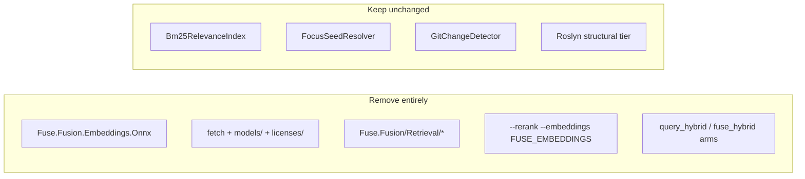

# Drop ONNX and hybrid retrieval

## Goal

Remove all hybrid retrieval code and packaging added for ONNX semantic rerank. Fuse query scoping returns to **BM25F only** (plus focus and changes modes). This drops ~90 MB bundled model weight, `Microsoft.ML.OnnxRuntime`, and maintenance surface until a future dual-recall upgrade.

## Breaking change policy

Breaking changes are intentional. **No migration, no backward compatibility, no deprecation shims.**

| Do | Do not |
|----|--------|
| Delete flags, env vars, MCP params, and dead code paths | Accept `--rerank`, `FUSE_EMBEDDINGS`, or MCP `rerank` silently |
| Remove bundled model Content from the nupkg | Ship an empty `models/` folder "for compatibility" |
| Document removals in CHANGELOG under **Breaking** | Add fallback to hashing rerank when ONNX missing |
| Delete hybrid benchmark arms and regenerate BM25-only results | Keep `query_hybrid` columns "for comparison" |
| Leave orphan `vectors` rows in existing `.fuse/fuse.db` on disk | Build a DB migration or purge tool |

Users on old MCP configs passing removed parameters will get normal MCP/CLI errors. That is expected.

## Scope (user choice: full hybrid removal)



**Out of scope:** BM25, dependency graph, symbol-level query packing, persistent analysis index (minus `vectors` namespace docs).

---

## 1. Delete ONNX project and bundling

**Remove directories/projects:**

- [`src/Core/Fuse.Fusion.Embeddings.Onnx/`](src/Core/Fuse.Fusion.Embeddings.Onnx/) (entire project)
- [`tests/Fuse.Fusion.Embeddings.Onnx.Tests/`](tests/Fuse.Fusion.Embeddings.Onnx.Tests/)
- [`licenses/all-MiniLM-L6-v2/`](licenses/all-MiniLM-L6-v2/) if present

**Remove scripts and CI wiring:**

- [`build/fetch-embedding-model.ps1`](build/fetch-embedding-model.ps1)
- [`tests/benchmarks/harness/fetch-embedding-model.ps1`](tests/benchmarks/harness/fetch-embedding-model.ps1)
- Fetch steps in [`.github/workflows/publish.yml`](.github/workflows/publish.yml), [`.github/workflows/release.yml`](.github/workflows/release.yml), [`.github/workflows/ci.yml`](.github/workflows/ci.yml)
- Fetch call in [`build/pack-tool.ps1`](build/pack-tool.ps1)

**Solution and packages:**

- Remove both projects from [`Fuse.slnx`](Fuse.slnx)
- Remove project reference and Content items (`models/`, `licenses/`) from [`src/Host/Fuse.Cli/Fuse.Cli.csproj`](src/Host/Fuse.Cli/Fuse.Cli.csproj)
- Remove `Microsoft.ML.OnnxRuntime` from [`Directory.Packages.props`](Directory.Packages.props) (only used by ONNX project)

**Optional cleanup:** add `artifacts/models/` to [`.gitignore`](.gitignore) if not already ignored.

---

## 2. Remove core hybrid retrieval (`Fuse.Fusion`)

**Delete entire folder:** [`src/Core/Fuse.Fusion/Retrieval/`](src/Core/Fuse.Fusion/Retrieval/)

- `IEmbeddingModel.cs`, `HashingEmbeddingModel.cs`, `VectorReranker.cs`, `IVectorStore.cs`, `SqliteVectorStore.cs`

**Edit [`FusionOrchestrator.cs`](src/Core/Fuse.Fusion/FusionOrchestrator.cs):**

- Remove `_embeddingModel` field and constructor parameter
- Remove rerank block in query filter path (~lines 562-565)
- Delete `RerankCandidates` private method

**Edit [`QueryOptions.cs`](src/Core/Fuse.Fusion/Scoping/QueryOptions.cs):**

- Remove `Rerank` property; record becomes `(Query, TopFiles, Depth)` only

**Edit [`ServiceCollectionExtensions.cs`](src/Core/Fuse.Fusion/Extensions/ServiceCollectionExtensions.cs):**

- Remove `HashingEmbeddingModel` registration and XML remark about embedding model

**Search and fix:** any `QueryOptions(..., Rerank: ...)` or `.Rerank` references in `FusionRequestBuilder`, validators, tests.

**SQLite `vectors` namespace:** delete `SqliteVectorStore` with the rest of `Retrieval/`; no code reads or writes vectors after this change. Existing `.fuse/fuse.db` files may contain stale vector rows; ignore them (no purge script). Remove `vectors` from [`site/content/docs/internals/caching-internals.mdx`](site/content/docs/internals/caching-internals.mdx).

---

## 3. Simplify CLI and MCP host

**Delete:**

- [`src/Host/Fuse.Cli/EmbeddingsModeDetector.cs`](src/Host/Fuse.Cli/EmbeddingsModeDetector.cs)

**Edit [`Program.cs`](src/Host/Fuse.Cli/Program.cs):** call `AddFuse()` with no embeddings pre-scan.

**Edit [`FuseServiceCollectionExtensions.cs`](src/Host/Fuse.Cli/Extensions/FuseServiceCollectionExtensions.cs):**

- Remove `using Fuse.Fusion.Embeddings.Onnx.Extensions`
- Remove `explicitEmbeddingsFlag` parameter and `AddFuseOnnxEmbeddings` call
- Restore single-parameter `AddFuse()` composition root

**Edit [`McpServeCommand.cs`](src/Host/Fuse.Cli/Commands/McpServeCommand.cs):**

- Revert to `AddFuse()` (no `explicitEmbeddingsFlag: true`)
- Remove hybrid rerank language from server instructions

**Remove CLI flags:**

- [`CommandBase.cs`](src/Host/Fuse.Cli/Commands/CommandBase.cs): delete `--embeddings` / `Embeddings` property
- [`DotNetCommand.cs`](src/Host/Fuse.Cli/Commands/DotNetCommand.cs): delete `--rerank` / `Rerank` property and `QueryOptions` rerank pass-through

**Edit [`FuseTools.cs`](src/Host/Fuse.Cli/Mcp/FuseTools.cs):**

- Remove `rerank` parameter from `fuse_search` and `fuse_dotnet` (breaking MCP tool schema change)
- Revert `fuse_ask` Search path to `QueryOptions(task, 10, plan.Depth)` without rerank
- Restore tool descriptions to BM25-only wording

**Edit [`McpInstallService.cs`](src/Host/Fuse.Cli/Services/McpInstallService.cs):** remove hybrid rerank guidance from managed rules.

---

## 4. Tests

**Delete:**

- [`tests/Fuse.Fusion.Tests/FusionOrchestratorRerankTests.cs`](tests/Fuse.Fusion.Tests/FusionOrchestratorRerankTests.cs)
- [`tests/Fuse.Fusion.Tests/Retrieval/VectorRerankerTests.cs`](tests/Fuse.Fusion.Tests/Retrieval/VectorRerankerTests.cs) (includes `SqliteVectorStoreTests` in same file)

**Remove or rewrite:**

- [`tests/Fuse.Cli.Tests/Mcp/McpServeRegistrationTests.cs`](tests/Fuse.Cli.Tests/Mcp/McpServeRegistrationTests.cs): drop ONNX/`AddFuse(true)` assertions
- [`tests/Fuse.Cli.Tests/Mcp/McpQueryOptionsDefaultsTests.cs`](tests/Fuse.Cli.Tests/Mcp/McpQueryOptionsDefaultsTests.cs): delete rerank-default tests (or entire file if empty)

**Grep cleanup:** `Rerank`, `Embeddings`, `IEmbeddingModel`, `VectorReranker` across `tests/`.

---

## 5. Benchmark harness and results

**Edit harness scripts:**

- [`layer2a.ps1`](tests/benchmarks/harness/layer2a.ps1), [`layer2b.ps1`](tests/benchmarks/harness/layer2b.ps1), [`layer4-scenario.ps1`](tests/benchmarks/harness/layer4-scenario.ps1): remove `query_hybrid` / `fuse_hybrid` modes and summary columns
- [`run-all.ps1`](tests/benchmarks/harness/run-all.ps1): remove fetch-embedding-model call
- [`common.ps1`](tests/benchmarks/harness/common.ps1): remove `Test-BundledEmbeddingModel` / `Assert-BundledEmbeddingModel`

**Edit [`tests/benchmarks/README.md`](tests/benchmarks/README.md):** remove embedding model prerequisite.

**Regenerate and commit** (verify group):

- [`tests/benchmarks/results/layer2a.json`](tests/benchmarks/results/layer2a.json), `layer2a.md`
- `layer2b.json`, `layer2b.md`
- `layer4-scenario.json`, `layer4-scenario.md`, `.csv`

Layer 2A/4 numbers should match pre-hybrid BM25-only baselines (query 49%, Layer 4 fuse ~44k tok / 52% recall).

---

## 6. Documentation and changelog

**Remove hybrid/ONNX prose from:**

| File | Action |
|------|--------|
| [`AGENTS.md`](AGENTS.md) | Remove embedding/bundling invariant; restore "no model download" |
| [`CHANGELOG.md`](CHANGELOG.md) | **Breaking** section: list all removals; delete or replace recent 2.4.0 bundled-ONNX/hybrid entries (no "deprecated, use X instead" prose) |
| [`README.md`](README.md) | Remove "hybrid-retrieval reranker" line |
| [`site/content/docs/reference/options.mdx`](site/content/docs/reference/options.mdx) | Remove `--rerank`, `--embeddings` |
| [`site/content/docs/reference/configuration-keys.mdx`](site/content/docs/reference/configuration-keys.mdx) | Remove `FUSE_EMBEDDINGS*` keys |
| [`site/content/docs/reference/mcp-tools.mdx`](site/content/docs/reference/mcp-tools.mdx) | Remove `rerank` param and MCP ONNX defaults |
| [`site/content/docs/reference/commands.mdx`](site/content/docs/reference/commands.mdx) | Remove rerank mention |
| [`site/content/docs/concepts/precision-tier.mdx`](site/content/docs/concepts/precision-tier.mdx) | Remove hybrid retrieval section |
| [`site/content/docs/concepts/glossary.mdx`](site/content/docs/concepts/glossary.mdx) | Remove "Hybrid retrieval" entry |
| [`site/content/docs/internals/scoping-internals.mdx`](site/content/docs/internals/scoping-internals.mdx) | Remove "Hybrid Retrieval" section |
| [`site/content/docs/internals/operator.mdx`](site/content/docs/internals/operator.mdx) | Remove embedding env vars |
| [`site/content/docs/project/benchmarks.mdx`](site/content/docs/project/benchmarks.mdx) | Remove "Hybrid retrieval (ONNX rerank)" section; restore Layer 2B lexical-ceiling note |
| [`site/content/docs/project/roadmap.mdx`](site/content/docs/project/roadmap.mdx) | Keep hybrid retrieval as **future** intent only |
| [`site/src/app/(home)/page.tsx`](site/src/app/(home)/page.tsx) | Remove hybrid rerank marketing if present |

---

## 7. Verification

```bash
dotnet build Fuse.slnx -c Release
dotnet test Fuse.slnx -c Release --no-build
dotnet format Fuse.slnx --verify-no-changes
pwsh -File tests/benchmarks/harness/run-all.ps1
```

Confirm:

- No `Fuse.Fusion.Embeddings.Onnx` in solution
- No `Microsoft.ML.OnnxRuntime` in dependency graph
- NuGet/tool output has no `models/` folder
- All tests pass; benchmark results lack hybrid modes

---

## Breaking changes (CHANGELOG only; no compat layer)

- Removed `--rerank` and `--embeddings` CLI flags
- Removed `FUSE_EMBEDDINGS` and `FUSE_EMBEDDINGS_MODEL_PATH`
- Removed MCP tool parameter `rerank` on `fuse_search` and `fuse_dotnet`
- Removed bundled ONNX model from NuGet/runtime packages
- Removed entire hybrid retrieval stack (`IEmbeddingModel`, hashing rerank, vector cache)
- Query scoping is BM25F-only again

---

## Parallel Execution Plan

**Stack:** dotnet | docs | mixed

### Group 1 — Write (parallel)

- **Group 1 Subagent 1** — Scope: delete ONNX project + tests; `Fuse.slnx`, `Directory.Packages.props`, `Fuse.Cli.csproj`, `build/`, `.github/workflows/`, `licenses/`; Goal: remove ONNX assembly, fetch scripts, CI fetch steps, bundling Content items, package reference
- **Group 1 Subagent 2** — Scope: `src/Core/Fuse.Fusion/` (`Retrieval/` delete, `FusionOrchestrator.cs`, `QueryOptions.cs`, `ServiceCollectionExtensions.cs`, any request builders); Goal: remove all hybrid retrieval from core pipeline

### Group 2 — Write (parallel, depends on Group 1)

- **Group 2 Subagent 1** — Scope: `src/Host/Fuse.Cli/` (Program, Extensions, McpServeCommand, FuseTools, DotNetCommand, CommandBase, McpInstallService; delete EmbeddingsModeDetector); Goal: remove CLI/MCP flags and revert MCP to plain `AddFuse()`
- **Group 2 Subagent 2** — Scope: `tests/Fuse.Fusion.Tests/`, `tests/Fuse.Cli.Tests/Mcp/`; Goal: delete rerank/ONNX tests; fix remaining compile references
- **Group 2 Subagent 3** — Scope: `tests/benchmarks/harness/`, `tests/benchmarks/README.md`; Goal: remove hybrid arms and bundled-model asserts
- **Group 2 Subagent 4** — Scope: `AGENTS.md`, `CHANGELOG.md`, `README.md`, `site/content/docs/**`, `site/src/app/(home)/page.tsx`; Goal: doc cleanup and breaking-change entry (no benchmark numbers yet)

### Group 3 — Verify (sequential)

- **Group 3 Subagent 1:** `dotnet build Fuse.slnx -c Release`
- **Group 3 Subagent 2:** `dotnet test Fuse.slnx -c Release --no-build`
- **Group 3 Subagent 3:** `dotnet format Fuse.slnx --verify-no-changes`
- **Group 3 Subagent 4:** `pwsh -File tests/benchmarks/harness/run-all.ps1`

### Group 4 — Write (parallel, depends on Group 3 Subagent 4)

- **Group 4 Subagent 1** — Scope: `tests/benchmarks/results/`; Goal: commit regenerated JSON/MD/CSV without hybrid columns
- **Group 4 Subagent 2** — Scope: `site/content/docs/project/benchmarks.mdx`; Goal: remove hybrid section; confirm Layer 2A/2B/4 prose matches regenerated BM25-only results

---

## Risks (accepted)

- **MCP/CLI callers using removed params:** fail at invoke time; users update configs or agent rules (document in CHANGELOG only)
- **Stale `.fuse/fuse.db` vector rows:** inert; no action required
- **NuGet size drop:** positive; users who pinned on bundled model re-download the lighter package on next `dotnet tool update`
