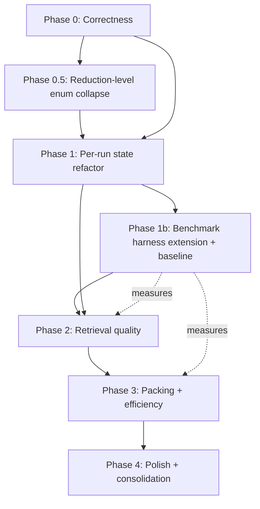

# Fuse Improvement Implementation Roadmap

A self-contained implementation plan for handoff to a fresh Claude Code session. It has been
validated against the codebase at `main` (commit 56e616a). Every "Problem" below was confirmed
against real source; exact file paths and line ranges are inlined so the implementing agent does
not need to rediscover them.

Backward compatibility and breaking changes are explicitly out of scope; prefer the cleanest
design over preservation of existing surface. The only hard constraint that remains is the
`PublishAot` build path: the regex-based C# tier and the hashing-embeddings fallback must keep
working without Roslyn or ONNX dependencies.

## How to use this document

- Each item is a self-contained unit of work with a Problem, Approach, Tests, Docs, Benchmarks,
  and Acceptance section. Land items in the Delivery order at the bottom.
- "Tests", "Docs", and "Benchmarks" are mandatory deliverables for each item, not optional. An item
  is not done until all three are addressed (even if the answer is "no doc change needed", state it).
- Verified file paths are given relative to the repo root `c:\Projects\Fuse`.

## Validation notes (read first)

This roadmap was checked against source. Corrections from the original draft:

1. **Phase 0.1 was wrong and is rewritten.** `ApiSurfaceAnalyzerFactory` already uses the correct
   `#if FUSE_ROSLYN` pattern with both `Create()` and `BackendName`. There is no dead code to
   repair. 0.1 is now a verification + test-coverage task only.
2. **Phase 1b is mostly already built.** A three-layer benchmark harness exists. 1b is now an
   *extension* of that harness (body-integrity, round-trip model, compare/gate), not a greenfield build.
3. **`--semantic` is the Roslyn switch, not the rerank switch.** Rerank is `QueryOptions.Rerank`
   (no CLI flag today). Phase 2.1 adds a distinct `--embeddings` / `FUSE_EMBEDDINGS` switch.
4. **`ReductionOptions` has 18 flags, not 14.** Full list is in Phase 0.5.

---

## Working conventions

The implementing agent should observe these rules, derived from the existing codebase, on every item.

- Target `net10.0`, nullable enabled, file-scoped namespaces.
- Language behavior is added by implementing a capability interface (`IContentReducer`,
  `ISkeletonExtractor`, `IDependencyExtractor`, `ITypeNameLocator`, `ISymbolOutlineExtractor`,
  `ISymbolSliceExtractor`) and registering it in the relevant `ServiceCollectionExtensions`. Do not
  branch on language inside `FusionOrchestrator`.
- Preserve the two-tier C# strategy: regex plugins (`Fuse.Plugins.Languages.CSharp`) are the
  AOT-safe default; Roslyn (`Fuse.Plugins.Languages.CSharp.Roslyn`) lives behind the `FUSE_ROSLYN`
  compile constant and the `--semantic` / `FUSE_SEMANTIC` switch. Every Roslyn-dependent feature
  needs a regex fallback.
- Each item ships with tests in the corresponding `*.Tests` project and must not regress `verify`
  output on the benchmark fixtures.
- Build, test, format gates (CLAUDE.md / AGENTS.md):
  ```bash
  dotnet build Fuse.slnx -c Release
  dotnet test Fuse.slnx -c Release --no-build
  dotnet format Fuse.slnx --verify-no-changes
  ```
  Build first, then test with `--no-build`. CI also verifies a Native AOT publish for win-x64 and
  linux-x64.
- Branch off `main`; open a PR via `gh` when verified. Do not merge, self-approve, or enable
  auto-merge. New public API without XML docs is incomplete (see the Code Documentation Standard in
  AGENTS.md).
- Writing style for all prose (docs, comments, PR text): plain ASCII only, no em dashes, no emoji.
  Measured numbers are exact and sourced from `tests/benchmarks/results`; never fabricate or weaken
  a number, and label any illustrative claim as illustrative.

### Test project map (verified)

```
tests/Fuse.Cli.Tests
tests/Fuse.Collection.Tests
tests/Fuse.Emission.Tests
tests/Fuse.Fusion.Tests
tests/Fuse.GoldenOutput.Tests                       # golden/verify fixtures, expected/ snapshots
tests/Fuse.Plugins.Formats.Web.Tests
tests/Fuse.Plugins.Languages.CSharp.Roslyn.Tests
tests/Fuse.Plugins.Languages.CSharp.Tests
tests/Fuse.Reduction.Tests
tests/fixtures/SampleShop                            # multi-project .NET fixture, planted secrets, routes
```

### Benchmark harness map (verified, already exists)

```
tests/benchmarks/corpus.json        # 5 repos pinned by commit: MediatR, FluentValidation, AutoMapper, NewtonsoftJson, SampleShop; o200k_base
tests/benchmarks/prs.json           # 24 real merged PR change sets (scoping ground truth)
tests/benchmarks/questions.json     # 12 localization questions with answer files
tests/benchmarks/harness/run-all.ps1    # orchestrator
tests/benchmarks/harness/layer1.ps1     # token reduction, fidelity, speed; arms: default, --all, --skeleton, Repomix
tests/benchmarks/harness/layer2a.ps1    # scoping recall + precision on 24 PRs (50k budget) vs grep
tests/benchmarks/harness/layer2b.ps1    # single-turn localization accuracy (20k budget)
tests/benchmarks/harness/common.ps1
tests/benchmarks/harness/setup-corpus.ps1
tests/benchmarks/harness/gen-prs.ps1
tests/benchmarks/results/           # layer1.{json,csv,md}, layer2a.json, layer2b.json
```

### Docs map (verified, Diataxis under `site/content/docs`)

```
start/        install, quickstart, what-is-fuse, why-fuse, connect-your-ai
scenarios/    ask-one-question, context-for-an-agent, cut-tokens-dotnet, keep-secrets-out, scope-a-pr, stay-under-a-budget, survey-cheaply
concepts/     glossary, how-fuse-works, precision-tier, reduction-levels, scoping
reference/    commands, configuration-keys, mcp-resources, mcp-tools, options, output-specification, pattern-detectors, reducers, secret-redaction-kinds, templates, tokenizers
internals/    caching-internals, capability-model, options-model, pipeline, scoping-internals, extending/*
project/      benchmarks, changelog, contributing, performance, roadmap
```

---

## Sequencing



Binding dependency edges:
- The reduction-level enum collapse (0.5) precedes anything that touches reduction options.
- The harness extension (1b) precedes all Phase 2 and Phase 3 measurement.
- Phase 1 precedes 3.2. Phase 2.2 precedes 3.1.

Every phase after 1b reports a measured delta against the captured baseline.

---

## Phase 0: Correctness fixes

Defects (or alleged defects) in shipped behavior. Lowest risk, do first. Three independent PRs.

### 0.1 Verify and test `ApiSurfaceAnalyzerFactory` (was: repair)

**Status correction.** The original plan claimed this file had stranded dead statements and was
hard-bound to Roslyn. That is false. `src/Host/Fuse.Cli/Verification/ApiSurfaceAnalyzerFactory.cs`
(lines 15-30) already uses the correct pattern:

```csharp
public static IApiSurfaceAnalyzer Create() =>
#if FUSE_ROSLYN
    new RoslynApiSurfaceAnalyzer();
#else
    new RegexApiSurfaceAnalyzer();
#endif

public static string BackendName =>
#if FUSE_ROSLYN
    "roslyn";
#else
    "regex";
#endif
```

The `FUSE_ROSLYN` constant is set in `src/Host/Fuse.Cli/Fuse.Cli.csproj` (lines 53-57, conditional
on `PublishAot != 'true'`).

**Approach.** No source change. Confirm both branches compile (with and without `FUSE_ROSLYN`) and
that the regex path is reachable. If a test asserting this does not already exist, add one. This
item exists only to close the question the draft raised, not to change code.

**Tests.** Add a test in `tests/Fuse.Cli.Tests` that calls `ApiSurfaceAnalyzerFactory.Create()` and
asserts non-null, and that `BackendName` returns one of `"regex"`/`"roslyn"`. If feasible, add a
compile-matrix note to CI rather than a runtime branch test (the constant is compile-time).

**Docs.** None expected. If `reference/commands.mdx` documents `verify` backends, confirm it states
that the AOT build reports `backend: regex`.

**Benchmarks.** None.

**Acceptance.** Solution compiles with and without `FUSE_ROSLYN`. `verify --json` reports
`"backend":"regex"` in an AOT build, `"roslyn"` otherwise. Test asserts factory produces a non-null
analyzer. If everything already passes, the PR is the test plus this note.

### 0.2 Protect raw string literals in `CSharpReducer`

**Problem (verified).** `CSharpReducer.CompressSyntax` in
`src/Plugins/Fuse.Plugins.Languages.CSharp/Reducers/CSharpReducer.cs` (StringLiteralRegex at lines
174-177) masks `$@"..."`, `@$"..."`, `@"..."`, `$"..."`, and `"..."` via the `__FUSE_STR_n__`
placeholder mechanism, but has no case for raw string literals (`"""..."""`). Aggressive whitespace
compression therefore corrupts embedded JSON, SQL, or templates inside raw strings. The correct
scanner already exists in
`src/Plugins/Fuse.Plugins.Languages.CSharp/Dependencies/CSharpSourceSanitizer.cs`
(`CountRawStringQuotes` lines 207-222, `BlankRawString` lines 224-257) but is not on the reduction
path.

**Approach.** Extract the raw-string boundary logic from `CSharpSourceSanitizer` into a shared
internal helper (for example `CSharpStringScanner` in `Fuse.Plugins.Languages.CSharp`). In
`CompressSyntax`, mask raw-string spans into the existing `__FUSE_STR_n__` placeholder mechanism
before applying `SyntaxWhitespaceRegex` / `CollapseWhitespaceRegex`, then restore. Both the
sanitizer and the reducer call the one helper.

**Tests.** In `tests/Fuse.Plugins.Languages.CSharp.Tests`: round-trip a method containing a
raw-string JSON block through aggressive reduction and assert it survives byte-identical. Cover
`"""`, `""""` (four-quote), and `$"""` interpolated raw. Refactor existing
`CSharpSourceSanitizerTests` so they exercise the shared helper (avoid duplicate divergent logic).

**Docs.** Update `reference/reducers.mdx` to state that raw string literals are preserved under all
reduction levels. If `concepts/reduction-levels.mdx` describes what aggressive reduction touches,
note string-literal safety there.

**Benchmarks.** This is guarded by the new body-integrity check in Phase 1b (reduced C# must parse
and string literals must be byte-intact). Note in the PR that the body-integrity gate is the
regression guard for this fix; until 1b lands, rely on the unit round-trip tests.

**Acceptance.** A method containing a raw-string JSON block survives aggressive reduction
byte-identical. Round-trip tests for the three raw-string forms pass. No `verify` regression on
fixtures.

### 0.3 Tighten connection-string redaction

**Problem (verified).** `DefaultSecretRedactor.ConnectionStringRegex` in
`src/Core/Fuse.Reduction/Security/DefaultSecretRedactor.cs` (line 111) is
`(?:Server|Data Source|Host|User ID|Password|Pwd)\s*=\s*[^;\s"']+`, which also matches ordinary C#
assignments such as `Server = GetServer()`. Redaction is on by default
(`ReductionOptions.EnableRedaction = true`), so false positives alter code bodies invisibly, and
`verify` (names/routes only) does not catch it.

**Approach.** Require the match to sit inside a string literal and contain at least two
semicolon-delimited `key=value` pairs, the signature of a real connection string. Reuse the
string-literal detection from the 0.2 shared scanner (`CSharpStringScanner`). Apply the stricter
pattern only to literal contents.

**Tests.** In `tests/Fuse.Reduction.Tests` (`SecretRedactorTests`): assert `Server = GetServer();`
in code is untouched; assert `"Server=db;Database=app;User ID=sa;Password=secret"` is redacted. Add
a fixture-wide fidelity assertion across `tests/fixtures/SampleShop` for zero code-body false
positives.

**Docs.** Update `reference/secret-redaction-kinds.mdx`: clarify the `connection-string` kind now
requires a multi-pair literal, reducing false positives on code assignments.

**Benchmarks.** Pairs with the Phase 1b body-integrity check and the Phase 4.2 redaction reporting.
No new benchmark arm; rely on the fidelity assertion.

**Acceptance.** Code assignment untouched; real connection string redacted; zero code-body false
positives across fixtures.

---

## Phase 0.5: Reduction-level enum collapse

Do this immediately after Phase 0 and before everything else, because every later phase touches
`ReductionOptions`. With compatibility off the table, this is a one-time mechanical edit rather than
a deprecation path.

**Problem (verified).** `ReductionOptions`
(`src/Plugins/Fuse.Plugins.Abstractions/Options/ReductionOptions.cs`) exposes **18** boolean flags:

```
1  TrimContent              7  AggressiveCSharpReduction  13 EnableRedaction
2  UseCondensing            8  MinifyXmlFiles             14 IncludeRedactReport
3  RemoveCSharpComments     9  MinifyHtmlAndRazor         15 IncludeRouteMap
4  RemoveCSharpUsings       10 SkeletonMode               16 PublicApiMode
5  RemoveCSharpNamespaces   11 IncludeSemanticMarkers     17 IncludeProjectGraph
6  RemoveCSharpRegions      12 IncludePatternSummary      18 CollapseGeneratedCode
```

`ReductionHasher.HashReductionOptions` (`src/Core/Fuse.Reduction/Caching/ReductionHasher.cs`, lines
24-49) hashes all 18 into the cache key. Nine call sites set overlapping combinations with `all`,
`all || x`, or hardcoded-true patterns:

```
FuseTools.FuseSkeletonAsync, FuseFocusAsync, FuseSearchAsync, FuseChangesAsync, FuseDotNetAsync   (src/Host/Fuse.Cli/Mcp/FuseTools.cs)
FuseResources.ReadSkeletonResourceAsync                                                            (src/Host/Fuse.Cli/Mcp/FuseResources.cs)
DotNetCommand.RunAsync, VerifyCommand.RunAsync, ExplainCommand.RunAsync                            (src/Host/Fuse.Cli/Commands/*)
```

This bloats the cache key, multiplies the decision surface for the MCP agent, and complicates every
reduction-touching change.

**Approach.**
1. Introduce a primary `ReductionLevel` enum: `None | Standard | Aggressive | Skeleton | PublicApi`.
   Define each level's effect on C# transforms in one place.
2. Keep orthogonal flags that are not a linear intensity scale as separate booleans:
   `EnableRedaction`, `IncludeRedactReport`, `CollapseGeneratedCode`, `IncludeSemanticMarkers`,
   `IncludePatternSummary`, `IncludeRouteMap`, `IncludeProjectGraph`, `MinifyXmlFiles`,
   `MinifyHtmlAndRazor`, `TrimContent`, `UseCondensing`.
3. Map the level to the underlying C# transform decisions inside `CSharpReducer` and the reduction
   pipeline (`ContentReductionPipeline` / `ReductionGate`), so the per-transform booleans
   (`RemoveCSharpComments`, `RemoveCSharpUsings`, `RemoveCSharpNamespaces`, `RemoveCSharpRegions`,
   `AggressiveCSharpReduction`, `SkeletonMode`, `PublicApiMode`) become internal implementation
   detail or are removed.
4. Replace the `all`, `removeCSharp*`, `aggressive`, `skeleton`, `publicApi` parameters across the
   nine CLI command / MCP tool call sites with a single `--level` / `level` parameter (`standard`
   default for scoped tools, see 4.4).
5. Update `ReductionHasher.HashReductionOptions` to hash the level plus the orthogonal flags. Fewer
   fields, more stable cache keys.

**Tests.**
- New tests in `tests/Fuse.Reduction.Tests`: assert each `ReductionLevel` produces the expected
  transform set (a table-driven test mapping level to which C# transforms fire).
- `tests/Fuse.GoldenOutput.Tests`: regenerate/confirm golden snapshots under `expected/` for each
  level; assert no unexpected output diff versus the prior equivalent boolean combination.
- `tests/Fuse.Cli.Tests`: assert `--level` parsing for each command, and that omitting it yields the
  documented default per surface.
- Cache test: assert hit rate on repeated identical runs is unchanged or better (hash of equivalent
  config is stable).
- Per-level `verify` API-surface preservation matches the prior equivalent boolean combination.

**Docs.**
- Rewrite `concepts/reduction-levels.mdx` around the enum (this is the canonical concept page).
- Rewrite `reference/options.mdx`: replace the boolean cluster with `ReductionLevel` + the retained
  orthogonal flags; document the transform table per level.
- Update `reference/commands.mdx` and `reference/mcp-tools.mdx` to show `--level` / `level`.
- Update `internals/options-model.mdx` to reflect the new options shape.
- Update any scenario page that shows `--all` / `--skeleton` flags
  (`scenarios/cut-tokens-dotnet.mdx`, `scenarios/survey-cheaply.mdx`) to use `--level`.
- Add a `project/changelog.mdx` entry: breaking change, boolean cluster replaced by `--level`.

**Benchmarks.**
- Update `tests/benchmarks/harness/layer1.ps1` arms: `default`, `--all`, `--skeleton` become
  `--level standard`, `--level aggressive`, `--level skeleton` (and `--level publicApi`).
- Re-run the harness and refresh `tests/benchmarks/results/layer1.{json,csv,md}` so the recorded
  numbers reflect the new flag surface (the underlying reduction is unchanged, so headline numbers
  should match within noise; if they move, investigate before committing).
- Update `project/benchmarks.mdx` arm names to match.

**Acceptance.** A single `ReductionLevel` drives C# reduction intensity end to end. All commands and
MCP tools expose `level` instead of the boolean cluster. Cache hit rate on repeated identical runs
is unchanged or better. Per-level transform tests and per-level `verify` preservation pass. Layer-1
headline numbers match the prior baseline within noise.

**Risk.** Touches many call sites in one edit. Mitigated because it is mechanical and lands before
the phases that would otherwise reason about the old surface.

---

## Phase 1: Per-run state refactor

**Problem (verified).** `FusionOrchestrator` (`src/Core/Fuse.Fusion/FusionOrchestrator.cs`) is
registered singleton (`ServiceCollectionExtensions` line 63) and holds
`private readonly SemaphoreSlim _runGate = new(1, 1)`, serializing every `FuseAsync` call
process-wide (WaitAsync/Release wrap `FuseCoreAsync`). The gate exists because:
- `Bm25RelevanceIndex` (registered singleton, mutable `_termFrequencies`, `_fieldLengths`,
  `_documentFrequencies`, `_paths`, `_averageFieldLength`; `Clear()`-then-`Index()` lifecycle at
  `src/Core/Fuse.Fusion/Scoping/Bm25RelevanceIndex.cs`).
- `SourceContentProvider` (singleton, `ConcurrentDictionary` cache cleared at the top of
  `FuseCoreAsync` via `_contentProvider.Clear()`,
  `src/Core/Fuse.Collection/FileSystem/SourceContentProvider.cs`).

On the MCP server this caps throughput at one fusion regardless of cores. `DependencyGraphBuilder`,
`DefaultSecretRedactor`, and `BoilerplateDeduplicator` were verified stateless. Pattern detectors
(`PatternDetectorBase`) are stateful *within* a run but reset via `ResetAccumulation()` and run
serially.

**Approach.**
1. Make `IRelevanceIndex` per-run. Construct it inside the run (in `FilterByQueryAsync` or via an
   injected factory). It holds no cross-run state worth sharing.
2. Make content caching per-run. Replace the singleton `SourceContentProvider` with a run-scoped
   instance passed through `FuseCoreAsync`; the top-of-run `Clear()` is the signal this state is
   run-local.
3. Confirm the stateless singletons stay stateless after the refactor; ensure pattern detectors are
   constructed/reset per run if they move off the serialized path.
4. Remove `_runGate`. Since the public shape need not be preserved, restructure `FuseCoreAsync` to
   construct run-scoped collaborators directly where that reads cleaner.

**Tests.**
- New concurrency test in `tests/Fuse.Fusion.Tests`: issue N simultaneous `FuseAsync` calls against
  *different* directories and assert correct, isolated, non-interleaved results with the gate
  removed. This test is the merge gate for the PR.
- Add a same-directory concurrent test to confirm the per-run index/content cache do not collide.
- Keep `tests/Fuse.GoldenOutput.Tests/SourceContentReadOnceTests.cs` green (read-once invariant must
  survive the content-provider change).

**Docs.**
- Update `internals/caching-internals.mdx` and `internals/pipeline.mdx` to describe run-scoped index
  and content cache (no process-wide gate).
- If `project/performance.mdx` mentions single-flight/serialized fusion, update it to reflect
  concurrent runs scaling toward core count.

**Benchmarks.**
- No new metric, but add a concurrency throughput note to `project/performance.mdx` measured
  informally (N concurrent runs wall-clock vs serialized). Label it illustrative unless you wire a
  reproducible harness arm; do not present it as a benchmarked figure otherwise.

**Acceptance.** Concurrency test passes with the gate removed; results isolated and correct. Server
throughput scales toward core count on independent requests. No golden-output regression.

**Risk.** Medium; touches DI lifetimes. Land with the concurrency test as the gate.

---

## Phase 1b: Benchmark harness extension and baseline

Cross-cutting. Must land before Phase 2 and Phase 3 so every subsequent item reports a measured
delta.

**Status correction.** A three-layer harness already exists (see the harness map above): layer 1
(token reduction, fidelity via a Roslyn oracle, speed, memory), layer 2a (scoping recall + precision
over 24 real PRs vs a grep baseline), layer 2b (single-turn localization accuracy over 12
questions), with pinned `corpus.json`, `prs.json`, `questions.json`. 1b is the set of *additions*
that are genuinely missing.

**Components.**
1. **Fixtures (exists).** Reuse `corpus.json` / `prs.json` / `questions.json`. If you need
   member-level ground truth for Phase 2.2, extend `questions.json` (or add a sibling manifest) to
   map a task to the specific members a correct answer must touch, not just files.
2. **Retrieval metrics (mostly exists, extend).** Layer 2a already computes recall and precision.
   Add recall@budget at *several* token budgets (not just the single 50k), computed from
   `FusionResult.EmittedFileTokens` against ground-truth paths. This is needed to measure Phase 2/3
   deltas across budgets.
3. **Fidelity metrics (extend).** Layer 1 already has `verify` API-surface preservation. Add a new
   **body-integrity check**: reduced C# still parses (via the Roslyn oracle) and string literals are
   byte-intact. This is the regression guard for Phases 0.2 and 0.3 and the Phase 2.2/3.3 emission
   changes. Add it as a layer-1 column and a hard pass/fail.
4. **Round-trip model (new).** A simulated multi-turn agent recording K (round-trips) and cumulative
   prefill tokens for three strategies: naive exploration, `fuse_toc` then `fuse_focus`, and
   `fuse_ask`. Operationalizes the quadratic-accumulation argument. Output K and cumulative tokens
   per strategy per task. Label results illustrative (this is a model, not a measured agent).
5. **Downstream task success (new, optional, flag-gated, needs an API key).** Feed fused context to
   a fixed model on a fixed question set and measure answer correctness. Gate behind an env flag so
   CI without a key skips it.
6. **Compare + gate (new).** A `--compare baseline.json` mode that diffs two runs and fails CI on
   regression of recall@budget, precision, fidelity, or body-integrity beyond a tolerance.

**Approach.** Add `layer3.ps1` (round-trip model) and `layer4.ps1` (optional downstream task) under
`tests/benchmarks/harness`, wire both into `run-all.ps1`. Add the body-integrity check and
multi-budget recall to the existing `layer1.ps1` / `layer2a.ps1`. Add `--compare` to `run-all.ps1`
or `common.ps1`. Capture and commit the current-tool baseline JSON before Phase 2 begins.

**Tests.** The harness is PowerShell, not a `*.Tests` project. Add a smoke test that runs the
harness against `tests/fixtures/SampleShop` only (fast, no corpus clone) and asserts the JSON report
has the expected shape and the compare-gate logic flags an injected regression.

**Docs.**
- Update `project/benchmarks.mdx` to document the new layers (body-integrity, round-trip model,
  optional downstream, compare/gate) and clearly label the round-trip and downstream numbers as
  illustrative/model-based.
- Note the multi-budget recall methodology.
- Keep `AGENTS.md` "Measured Results" section accurate; do not change headline numbers here, only
  add methodology.

**Benchmarks.** This item *is* the benchmark work; the deliverable is the extended harness plus a
committed baseline.

**Acceptance.** Harness runs headless in CI, emits the current-tool baseline, supports
`--compare baseline.json` regression gating, and includes the body-integrity check and multi-budget
recall. The SampleShop smoke test passes.

---

## Phase 2: Retrieval quality

The largest round-trip and wall-clock gains. Measure every item against the 1b baseline.

### 2.1 Real local embeddings for rerank

**Goal.** Replace the lexical `HashingEmbeddingModel`
(`src/Core/Fuse.Fusion/Retrieval/HashingEmbeddingModel.cs`, documented as a dependency-free lexical
signal) with a genuine semantic encoder, turning rerank from marginal re-weighting into real
semantic retrieval.

**Problem context (verified).** `IEmbeddingModel`, `DiskVectorStore`, and `VectorReranker` all live
under `src/Core/Fuse.Fusion/Retrieval`. Rerank is controlled by `QueryOptions.Rerank` (a boolean,
default false) and there is **no** `--semantic`-style CLI flag for it today (`--semantic` /
`FUSE_SEMANTIC` gates the Roslyn tier, a different concern). Vector cache keys already incorporate
`_embeddingModel.Dimensions` (`AnalysisHasher.Key(text, "vec:" + _embeddingModel.Dimensions)` in
`FusionOrchestrator`). There is currently zero ONNX usage in the repo.

**Decisions (settled, see "Settled decisions" at the bottom).** Model distribution: downloaded on
first use, not bundled. Default: semantic rerank becomes the non-AOT default once 1b confirms the
recall win, with an off switch.

**Approach.**
1. Add an ONNX-backed `IEmbeddingModel` in `src/Core/Fuse.Fusion/Retrieval` using
   `Microsoft.ML.OnnxRuntime`, loading a small sentence encoder (`bge-small-en` or
   `all-MiniLM-L6-v2`).
2. **Model distribution: download on first use, do not bundle.** On first semantic query, fetch the
   model into a per-machine cache (under the user profile, for example `~/.fuse/models/<model>/`,
   not the per-repo `.fuse/`), keyed by model name and a content hash so an interrupted download is
   re-fetched. Print a single one-line notice ("fuse: downloading embedding model <name> (~NN MB),
   one time") to stderr. If the model is absent and cannot be fetched (offline), fall back to
   `HashingEmbeddingModel` rather than failing the run.
   - Sideload escape hatch: honor `FUSE_EMBEDDINGS_MODEL_PATH`. When set, load the model from that
     path and skip all network access (for air-gapped and CI use).
   - Pin the download URL and expected SHA-256 in config; verify the hash after download and refuse a
     mismatched file.
3. Keep `HashingEmbeddingModel` as the AOT/no-dependency fallback. Select via DI on a *new* dedicated
   switch `--embeddings` / `FUSE_EMBEDDINGS` (do not overload `--semantic`). Tri-state resolution
   order: explicit flag/env wins; else the build default (see step 5); a forced
   `--embeddings false` / `FUSE_EMBEDDINGS=0` always selects the hashing model even on non-AOT.
4. Reuse `DiskVectorStore` and `VectorReranker` unchanged; only the model behind
   `IEmbeddingModel.Embed` changes. Cache keys already vary by `Dimensions`, so the ONNX model's
   vectors will not collide with hashing vectors.
5. **Default: on for non-AOT, gated on the 1b measurement.** Land the feature opt-in first. Flip the
   non-AOT build default to the ONNX model only after layer 2a/2b shows a recall@budget improvement
   and cold-call latency stays within an agreed bound. The AOT build default stays the hashing model
   unconditionally (ONNX is excluded from the AOT package). `--embeddings false` / `FUSE_EMBEDDINGS=0`
   forces the hashing model in either build, for latency-sensitive or offline use.

**Tests.**
- `tests/Fuse.Fusion.Tests`: ranking-stability test (repeated identical query yields identical
  order). Test DI selection tri-state: `FUSE_EMBEDDINGS` unset yields the build default,
  `FUSE_EMBEDDINGS=0` always yields `HashingEmbeddingModel`, `FUSE_EMBEDDINGS=1` yields the ONNX
  model when available.
- Sideload test: with `FUSE_EMBEDDINGS_MODEL_PATH` set to a fixture model, the model loads from that
  path and no network call is attempted (assert via an injectable downloader spy).
- Offline-fallback test: ONNX requested but model absent and download disabled, the run completes
  using `HashingEmbeddingModel` rather than throwing.
- Hash-verification test: a downloaded file whose SHA-256 does not match the pinned value is
  rejected.
- Guard the ONNX test so it skips when the model asset is absent (CI without the download).
- AOT-path test: confirm the hashing fallback is selected when ONNX is unavailable.

**Docs.**
- New/updated `reference/configuration-keys.mdx` and `reference/commands.mdx`: document
  `--embeddings` / `FUSE_EMBEDDINGS` (tri-state), `FUSE_EMBEDDINGS_MODEL_PATH` for sideloading, the
  per-machine cache location, the pinned model URL plus SHA-256, and the AOT fallback.
- Update `concepts/scoping.mdx` and/or `concepts/precision-tier.mdx` to explain semantic rerank vs
  lexical rerank, and that semantic rerank is the non-AOT default with `--embeddings false` as the
  off switch.
- Add an install note in `start/install.mdx`: first semantic query downloads the model once
  (~NN MB) to the per-machine cache; air-gapped users set `FUSE_EMBEDDINGS_MODEL_PATH`.
- `project/changelog.mdx` entry (semantic rerank added; becomes non-AOT default once measured).

**Benchmarks.**
- Add a rerank arm to layer 2a/2b (or a dedicated layer) comparing hashing vs ONNX embeddings on
  recall@budget for natural-language tasks. Record cold-call vs warm-call latency.
- Update `project/benchmarks.mdx` once measured; the page currently notes a "lexical ceiling" for
  `--rerank`, so this is the item that should move that number. Do not publish a number until the
  harness produces it.

**Acceptance.** Recall@budget on natural-language tasks improves measurably versus the hashing
model. Cold-call latency increase is bounded; warm calls neutral (vectors cached). Ranking-stability
test passes. AOT build still uses the hashing fallback and compiles clean.

**Risk.** Medium; ONNX dependency and model asset. Mitigated by optional install and intact fallback.

### 2.2 Symbol-level retrieval and packing (new default)

**Goal.** Move the unit of selection from file to member. A focused question pulls relevant methods
plus a thin skeleton of their host file rather than whole files.

**Problem context (verified).** `Bm25RelevanceIndex` indexes at **file** granularity with three
fields: `Body` (file content), `Symbols` (declared type/member names), `PathField` (normalized
path). `InclusionChain` (`src/Core/Fuse.Reduction/Models/FusedContent.cs`) is
`IReadOnlyList<string>` of file paths only. Outline/slice extractors exist:
`RoslynOutlineExtractor`, `RoslynSymbolSliceExtractor`
(`src/Plugins/Fuse.Plugins.Languages.CSharp.Roslyn`), and the regex fallback
`CSharpOutlineExtractor` (`src/Plugins/Fuse.Plugins.Languages.CSharp/Outline`).

**Approach.**
1. Define a chunk model (for example `SymbolChunk { Path, SymbolKind, SymbolName, ParentType,
   Content }`) in `Fuse.Reduction` or `Fuse.Fusion`. Build chunks from `RoslynOutlineExtractor`
   (boundaries) and `RoslynSymbolSliceExtractor` (bodies); regex fallback uses
   `CSharpOutlineExtractor`.
2. Extend or wrap `Bm25RelevanceIndex` to index at chunk granularity (symbol name, signature, body
   map onto the existing three fields).
3. In `FilterByQueryAsync`, rank chunks, select to budget, then emit per file a thin host-type
   skeleton with selected members inlined and non-selected members collapsed to signatures.
4. Extend `InclusionChain` provenance to reference a symbol, not just a file.
5. Remove the file-granular selection path rather than gating it behind a flag. Land in two
   reviewable steps: (a) chunk model plus chunk indexing, (b) the emission change.

**Tests.**
- `tests/Fuse.Fusion.Tests`: chunk extraction correctness (Roslyn and regex fallback produce the
  same boundaries for a known fixture).
- Body-integrity: selected members parse standalone (uses the Phase 1b check).
- Provenance: `InclusionChain` references the selected symbol.
- `tests/Fuse.GoldenOutput.Tests`: new expected snapshots for symbol-level emission on SampleShop.
- AOT/regex-fallback path produces a coherent (if coarser) chunking when Roslyn is absent.

**Docs.**
- Rewrite `concepts/scoping.mdx` and `concepts/how-fuse-works.mdx` to describe member-level
  selection and thin host skeletons.
- Update `reference/output-specification.mdx` for the new emission shape (inlined members + collapsed
  signatures).
- Update `internals/scoping-internals.mdx` for chunk indexing.
- Update `scenarios/ask-one-question.mdx` and `scenarios/context-for-an-agent.mdx` examples.
- `project/changelog.mdx` entry (default selection granularity changed).

**Benchmarks.**
- This is the headline retrieval item. Measure precision (relevant-tokens / total-tokens) at fixed
  budget vs the file-granular baseline using layer 2a/2b multi-budget recall. Recall must hold or
  improve. Round-trip count in the layer-3 simulated agent must not increase.
- Update `project/benchmarks.mdx` and `AGENTS.md` "Measured Results" once numbers are recorded.

**Acceptance.** On focused tasks at fixed budget, precision rises versus the old file-granular
baseline, recall held or improved. Body-integrity passes. Round-trip count does not increase.

**Risk.** High complexity. Largest item. Sequenced after the harness and 2.1 so it is measured.
Two-step landing.

### 2.3 Graph-centrality ranking prior

**Goal.** A cheap, query-independent prior for architectural importance, improving cold-start
`fuse_skeleton` and `fuse_ask` overview ordering.

**Problem context (verified).** `DependencyGraph`
(`src/Core/Fuse.Fusion/Scoping/DependencyGraph.cs`) exposes `TypeReferences`
(`IReadOnlyDictionary<string, IReadOnlyList<string>>`). `FocusSeedResolver.Expand`
(`src/Core/Fuse.Fusion/Scoping/FocusSeedResolver.cs`) takes a `seedScores` map.
`EmissionPipeline.OrderEntries` (`src/Core/Fuse.Emission/EmissionPipeline.cs`, lines 151-171)
orders by `RelevanceScore` descending.

**Approach.** Compute in-degree or a few PageRank iterations over `DependencyGraph.TypeReferences`.
Blend a small normalized centrality weight into `seedScores` in `FocusSeedResolver.Expand` and into
BM25 seed selection, so at equal relevance the more depended-upon file ranks higher. Weight
configurable, conservative default. Flows through `EmissionPipeline.OrderEntries`.

**Tests.**
- `tests/Fuse.Fusion.Tests`: on a fixture with a clearly central type, assert it ranks earlier with
  centrality on than off, and that the weight=0 case reproduces the prior ordering exactly
  (revertibility).
- Determinism test (centrality computation is stable across runs).

**Docs.**
- Update `concepts/scoping.mdx` and `internals/scoping-internals.mdx` to document the centrality
  prior and its weight key.
- Add the weight to `reference/configuration-keys.mdx`.

**Benchmarks.**
- Layer 2b overview tasks: assert the most central files appear earlier; confirm no regression on
  focused-task precision in layer 2a.

**Acceptance.** Overview tasks show the most central files appearing earlier. No regression on
focused-task precision. Weight=0 reproduces prior ordering.

**Risk.** Low; additive signal, revertible via the weight.

---

## Phase 3: Packing and efficiency

### 3.1 Reduction-aware single-pass packing

**Goal.** Make the include/exclude decision on the most accurate cost signal (real reduced token
count) rather than the byte heuristic, eliminating the dual-budget mismatch.

**Problem (verified).** `BuildTokenCosts` (`src/Core/Fuse.Fusion/FusionOrchestrator.cs`, lines
648-662) estimates cost as `Math.Max(1, file.FileInfo.Length / 4)` (raw bytes) while
`EmissionPipeline` enforces `MaxTokens` on reduced content with the real tokenizer (`TokenBudget`,
consuming `tokenCounter.Count(content)`). Reduction cuts 40 to 70 percent, so expansion stops
including files prematurely.

**Approach.** Reorder the focus/query path so candidate chunks (from 2.2) are reduced first, their
real token cost measured with the configured tokenizer, then a greedy budgeted selection
(relevance-per-token, approximating 0/1 knapsack) picks the final set ordered by `RelevanceScore`.
Reuse the reduction cache (keyed via `ReductionHasher`) so reducing later-dropped candidates is
cheap on repeat runs. This is a clean rewrite of the pack path; the old byte heuristic in
`BuildTokenCosts` is removed.

**Tests.**
- `tests/Fuse.Fusion.Tests`: assert emitted tokens land within 85-100 percent of `MaxTokens` across
  several budgets on a fixture (the core acceptance metric).
- Assert greedy selection is deterministic and orders output by `RelevanceScore`.
- Cache test: reducing a candidate that is later dropped is served from cache on a second run.

**Docs.**
- Update `internals/pipeline.mdx` and `internals/scoping-internals.mdx` to describe single-pass
  reduction-aware packing (remove the dual-budget description).
- Update `concepts/scoping.mdx` if it describes the byte heuristic.

**Benchmarks.**
- Layer 2a/2b: emitted tokens vs budget (target band 85-100 percent) across the corpus; precision
  improvement from spending budget on highest density-per-token chunks. Compare against baseline.

**Acceptance.** Emitted tokens land tightly under budget (85-100 percent of `MaxTokens`) across the
harness; precision improves. No fidelity regression.

### 3.2 Persist the BM25 index

**Goal.** `FilterByQueryAsync` rebuilds the entire BM25 index on every `fuse_search` / `fuse_ask`
call (`_relevanceIndex.Index(documents)` runs each call). Persist it like the existing
`DiskAnalysisIndex` so repeated scoped queries against an unchanged tree skip re-indexing.

**Problem context (verified).** `DiskAnalysisIndex`
(`src/Core/Fuse.Fusion/Indexing/DiskAnalysisIndex.cs`) already persists analysis data under
`.fuse/index` and is wired via `FusionRequest.UsePersistentIndex` / `WithPersistentIndex`. The BM25
index has no such persistence and is rebuilt fresh per call.

**Approach.** Add a disk-backed relevance index keyed by content hash under `.fuse/index`, mirroring
`DiskAnalysisIndex`. Load postings for unchanged files (hash match), re-index only changed files,
invalidate per file by content hash. Wire through the existing `WithPersistentIndex`. Cleaner now
that index state is per-run from Phase 1 (depends on Phase 1).

**Tests.**
- `tests/Fuse.Fusion.Tests`: results from the persisted index are identical to the in-memory index.
- Editing one file re-indexes only that file (assert via a spy/counter on the indexer).
- Stale-cache invalidation by content hash.

**Docs.**
- Update `internals/caching-internals.mdx` to document the persisted relevance index alongside the
  analysis index.
- Update `reference/configuration-keys.mdx` / `reference/commands.mdx` if `--persistent-index`
  scope changes.

**Benchmarks.**
- Layer 1 / a warm-call timing arm: warm `fuse_search` latency drops from O(files) to
  O(changed files + query). Record cold vs warm. Update `project/performance.mdx`.

**Acceptance.** Warm `fuse_search` latency drops to O(changed files + query). Results identical to
the in-memory index. Editing one file re-indexes only that file.

### 3.3 Near-duplicate body deduplication

**Goal.** Extend `BoilerplateDeduplicator` beyond identical comment headers to near-identical member
bodies (generated/templated members, EF scaffolding beyond `GeneratedCodeCollapser`).

**Problem context (verified).** `BoilerplateDeduplicator`
(`src/Core/Fuse.Fusion/Enrichment/BoilerplateDeduplicator.cs`) only considers leading comment
blocks (its `SplitHeader` scans from the top until the first non-comment line; code is never
touched). `GeneratedCodeCollapser`
(`src/Plugins/Fuse.Plugins.Languages.CSharp/Reducers/GeneratedCodeCollapser.cs`) collapses EF-style
generated method bodies only.

**Approach.** Add a normalized-hash bucketing pass over member bodies. Members whose normalized form
collides across files are emitted once with markers referencing the canonical instance, reusing the
existing header-marker mechanism. Conservative first version: require exact normalized-hash match,
not fuzzy similarity.

**Tests.**
- `tests/Fuse.Fusion.Tests`: two files with an identical normalized member body emit one canonical +
  a marker; a member with a unique body is untouched.
- Body-integrity (Phase 1b) passes for non-deduplicated members.
- `verify` API-surface preservation unchanged (the dedup marker must not drop a public signature).

**Docs.**
- Update `reference/reducers.mdx` to document body-level dedup and the marker format.
- Update `reference/output-specification.mdx` for the canonical-reference marker.

**Benchmarks.**
- Layer 1 token reduction on corpus repos with significant generated/templated code (NewtonsoftJson,
  AutoMapper are candidates). Confirm `verify` preservation unchanged. Update `project/benchmarks.mdx`
  if reduction numbers move.

**Acceptance.** Measurable token reduction on generated/templated repos, `verify` API-surface
preservation unchanged, body-integrity intact for non-deduplicated members.

---

## Phase 4: Polish, calibration, and surface consolidation

### 4.1 Calibrate non-OpenAI tokenizers

**Problem (verified).** `TokenizerFactory`
(`src/Core/Fuse.Emission/Tokenization/TokenizerFactory.cs`) uses fixed constants
`AnthropicCharsPerToken = 3.5` and `GeminiCharsPerToken = 4.0` via `ApproximateTokenCounter`. OpenAI
uses an exact Tiktoken encoding (`o200k_base` default, `TikTokenCounter`). The fixed constants drift
on code.

**Approach.** Calibrate the chars-per-token constants against a corpus of real C# run through the
providers' tokenizers, or integrate an actual tokenizer where available. Store calibrated constants
per family in `TokenizerFactory`. Use the Claude API token-counting endpoint for Anthropic
calibration where feasible (see the `claude-api` skill / Decision: this needs a key, gate it).

**Tests.**
- `tests/Fuse.Emission.Tests`: predicted vs actual token counts on held-out C# stay within a tighter
  error band per family. Assert the calibration constants are the committed values.

**Docs.**
- Update `reference/tokenizers.mdx` with the calibrated constants and the calibration methodology.

**Benchmarks.**
- Add a tokenizer-accuracy check (predicted vs actual on held-out code) to the harness or as a unit
  metric. Report the error band in `reference/tokenizers.mdx`.

**Acceptance.** `MaxTokens` budgets for Claude and Gemini targets are honored within a tighter error
band (predicted vs actual on held-out code).

### 4.2 Redaction fidelity reporting

**Goal.** Surface when redaction touched code rather than config, since `verify` does not detect
body changes.

**Problem context (verified).** `RedactionSummary`
(`src/Core/Fuse.Reduction/Security/RedactionSummary.cs`) tracks `CountsByKind` (by secret kind only:
`aws-access-key`, `aws-secret-key`, `jwt`, `pem-private-key`, `connection-string`, `api-token`,
`high-entropy`). It does not distinguish code-literal redactions from config-file redactions.
Aggregated and emitted as a trailing `<!-- fuse:redactions -->` comment in `FusionOrchestrator`
(lines 820-842).

**Approach.** Extend the redaction report to count bytes modified inside code literals versus total
(reuse the 0.2/0.3 `CSharpStringScanner` to classify a redaction's location). Pairs with 0.3 as a
guardrail against future false positives.

**Tests.**
- `tests/Fuse.Reduction.Tests`: a redaction inside a code literal increments the code-literal count;
  a config-file redaction does not. A precision regression (0.3-style false positive) shows up as a
  non-zero code-literal modification count.

**Docs.**
- Update `reference/secret-redaction-kinds.mdx` to document the code-literal vs config breakdown in
  the report.
- Update `reference/output-specification.mdx` for the extended `fuse:redactions` comment.

**Benchmarks.**
- Add the code-literal redaction count as a layer-1 fidelity column so a future false-positive
  regression is visible in the compare-gate.

**Acceptance.** Report distinguishes literal-redactions from config-redactions; a precision
regression appears as a non-zero code-literal modification count.

### 4.3 Consolidate the MCP tool set

**Goal.** Reduce surface area to keep correct.

**Problem context (verified).** Eight tools in `src/Host/Fuse.Cli/Mcp/FuseTools.cs`: `fuse_toc`,
`fuse_ask`, `fuse_skeleton`, `fuse_focus`, `fuse_search`, `fuse_changes`, `fuse_dotnet` (full-control
superset, ~22 params), `fuse_generic`. `FuseToolHelpers` already factors out `ApplyCommonFilters`,
`ApplyOptionalFilters`, `ExecuteDotNetAsync`, `ExecuteInMemoryAsync`, but each preset still repeats
identical exclude/`all`/`maxTokens` parameter plumbing.

**Approach.** Keep the presets for agent ergonomics but route all of them through one shared path in
`FuseToolHelpers`, deleting redundant per-tool parameter plumbing. Replace the reduction boolean
cluster on every tool with the single `level` parameter from Phase 0.5.

**Tests.**
- `tests/Fuse.Cli.Tests`: behavior parity test - each preset produces the same output as the
  equivalent `fuse_dotnet` invocation routed through the shared path.
- Schema test: the MCP tool schema exposes `level` rather than the boolean cluster.

**Docs.**
- Rewrite `reference/mcp-tools.mdx` to reflect the consolidated parameter set and `level`.
- Update `reference/mcp-resources.mdx` if resource presets share the path.
- Update `scenarios/context-for-an-agent.mdx` (recommended call order) if parameters change.

**Benchmarks.**
- Confirm behavior parity on the harness (presets vs `fuse_dotnet` shared path produce identical
  scoping/recall).

**Acceptance.** All scoped tools share one configuration path. The MCP tool schema exposes `level`
rather than the boolean cluster. Behavior parity with prior presets on the harness.

### 4.4 Default reduction profile for scoped MCP tools

**Goal.** Remove a decision the agent currently has to make.

**Approach.** If 1b shows it rarely hurts fidelity, set `level = standard` (or `aggressive` where
justified) as the default for the scoped MCP tools, so the agent gets good reduction without
specifying flags. Validate per-level fidelity with `verify` on the fixtures before changing the
default.

**Tests.**
- `tests/Fuse.Cli.Tests`: scoped tools default to `level = standard` when `level` is omitted.
- Per-level `verify` API-surface preservation on fixtures meets the agreed threshold.

**Docs.**
- Update `reference/mcp-tools.mdx` and `scenarios/context-for-an-agent.mdx` to state the default
  level for scoped tools.
- `project/changelog.mdx` entry.

**Benchmarks.**
- Layer 1 / fidelity: default-level scoped output meets the API-surface preservation threshold on
  the fixtures. Record the chosen default and its measured fidelity in `project/benchmarks.mdx`.

**Acceptance.** Default-level scoped tool output meets a fidelity threshold (for example API-surface
preservation above an agreed percentage) on the fixtures.

---

## Delivery order

1. Phase 0: 0.1 (verify + test), 0.2 (raw strings), 0.3 (connection strings) as three PRs.
2. Phase 0.5 reduction-level enum collapse.
3. Phase 1 per-run state refactor with concurrency test.
4. Phase 1b harness extension and captured baseline.
5. Phase 2.1 embeddings and 2.3 centrality (lower risk), then 2.2 symbol-level default as two steps.
6. Phase 3.1 packing, 3.2 persistence, 3.3 dedup.
7. Phase 4: 4.1 calibration, 4.2 redaction reporting, 4.3 tool consolidation, 4.4 default profile.

Binding edges: 0.5 before anything touching reduction options; 1b before all 2.x/3.x measurement;
Phase 1 before 3.2; 2.2 before 3.1.

## Cross-cutting deliverable checklist (per item)

For every item, the PR must include:
- Code change with XML docs on new public API and `//` comments on non-obvious private logic.
- Tests in the matching `*.Tests` project; new golden snapshots regenerated where output changes.
- Doc updates in `site/content/docs` (state explicitly if none are needed).
- Benchmark impact: re-run the relevant harness layer, refresh `tests/benchmarks/results`, and update
  `project/benchmarks.mdx` and `AGENTS.md` "Measured Results" if any published number moves. Never
  fabricate or weaken a number; label illustrative claims as illustrative.
- Green `dotnet build`, `dotnet test --no-build`, `dotnet format --verify-no-changes`, and the AOT
  publish path.

## Settled decisions

Both Phase 2.1 decisions are settled. They are recorded here so the implementing session proceeds
without re-asking. Both remain reversible if 2.1 measurement contradicts them.

- **Embedding model distribution (2.1): download on first use, do not bundle.** The model is fetched
  once into a per-machine cache (under the user profile, not per-repo `.fuse/`), keyed by model name
  and verified against a pinned SHA-256. A missing model with no network falls back to
  `HashingEmbeddingModel` rather than failing. `FUSE_EMBEDDINGS_MODEL_PATH` sideloads the model and
  skips all network access for air-gapped and CI use. Rationale: the ~100 MB asset would dominate
  package size for an opt-in, non-AOT-only feature, and the AOT build cannot use ONNX at all.
- **Embedding default (2.1): semantic rerank becomes the non-AOT default, gated on the 1b
  measurement.** Land opt-in first; flip the non-AOT build default to ONNX only after layer 2a/2b
  confirms a recall@budget win and bounded cold-call latency. The AOT build default stays the
  hashing model unconditionally. `--embeddings false` / `FUSE_EMBEDDINGS=0` forces the hashing model
  in either build. Rationale: defaults are where the recall win actually reaches users; the off
  switch and the measurement gate keep it safe.

Implementation details for both are in the Phase 2.1 Approach (steps 2, 3, and 5).
