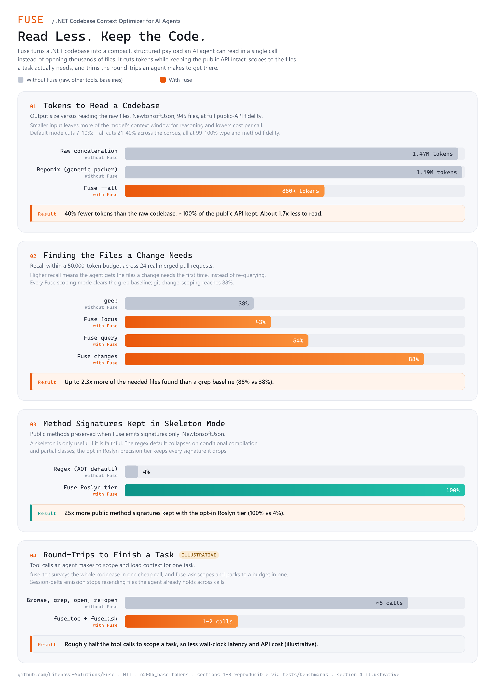

# Fuse

Fuse is a deep .NET-native context optimizer for AI-assisted development. It collects source files, reduces them for token efficiency, and emits a single structured output that agents can consume in one call instead of reading thousands of files individually.

Unlike generic repo packers (Repomix, Code2Prompt, Gitingest), Fuse understands C# structure: dependency graphs, skeleton extraction, BM25 query scoping, git change detection, and convention patterns. An opt-in Roslyn precision tier and a hybrid-retrieval reranker raise accuracy further, and a table-of-contents survey, the `fuse_ask` auto-scope tool, and session-delta emission cut the number of round-trips an agent needs. It ships as a .NET global tool (`fuse`) and as an MCP server with eight tools for Cursor, Claude Code, and GitHub Copilot.

Maintained by [Litenova Solutions](https://github.com/Litenova-Solutions).

## Why Fuse

Measured over a pinned corpus of four real .NET libraries (MediatR, FluentValidation, AutoMapper, Newtonsoft.Json), counted with the `o200k_base` tokenizer. Reduction ratios transfer across models even though absolute token counts do not. Every figure is reproducible with one command and reported in full, including the arms where Fuse ties or loses, on the [benchmarks page](docs/project/benchmarks.md).

<p align="center">
  
</p>

- **Cuts tokens without dropping API.** Default reduction removes 7 to 10 percent and `--all` removes 21 to 40 percent of tokens while keeping 99 to 100 percent of public types and methods. `--skeleton` removes 66 to 93 percent for an architecture map.
- **Smaller than the generic packers.** Repomix output runs 1.3 to 3.9 percent larger than raw concatenation on these repositories; Fuse is smaller than raw in every mode.
- **Finds the files a change touches.** Change scoping recalls 88 percent of the files in 24 real merged pull requests at 61 percent precision, and all three scoping modes beat an agent-style grep baseline.
- **Trustworthy skeletons on hard code.** The opt-in Roslyn tier keeps 100 percent of method signatures on all four libraries, including Newtonsoft.Json, where the regex skeleton kept 4 percent.
- **Cheap repeated calls.** The on-disk analysis index roughly halves warm-call wall-clock across a session, so a multi-call task pays the analysis cost once.
- **Native AOT and no runtime reflection on the default path.** The fast path ships as an ahead-of-time-compiled binary; Roslyn and the vector reranker are opt-in tiers isolated from it.

Reproduce every number with `pwsh -File tests/benchmarks/harness/run-all.ps1`.

## Install

**Prerequisites:** [.NET SDK 10.0](https://dotnet.microsoft.com/download) or later.

### From NuGet

```bash
dotnet tool install -g Fuse
```

Run without a global install via the .NET 10 SDK:

```bash
dnx Fuse -- serve
```

### From source (Windows)

```cmd
install.bat
```

### From source (any OS)

```bash
dotnet pack src/Host/Fuse.Cli/Fuse.Cli.csproj -c Release
dotnet tool install -g Fuse --add-source src/Host/Fuse.Cli/nupkg
```

Verify:

```bash
fuse --help
```

## CLI quick start

Fuse a .NET project with the DotNet template:

```bash
fuse dotnet --directory ./src
```

Maximum C# token reduction:

```bash
fuse dotnet --directory ./src --all
```

Architectural overview (signatures only):

```bash
fuse dotnet --directory ./src --all --skeleton
```

Cheap survey before fetching files (tree, symbol outline, per-file token costs):

```bash
fuse dotnet --directory ./src --toc
```

Accurate skeletons and dependency edges with the opt-in Roslyn precision tier:

```bash
fuse dotnet --directory ./src --skeleton --semantic
```

PR-scoped fusion, with diff hunks and the callers of each changed file:

```bash
fuse dotnet --directory ./src --changed-since main --review
```

Query-scoped fusion:

```bash
fuse dotnet --directory ./src --query "payment gateway" --query-top 10
```

Initialize a project config file:

```bash
fuse init
```

Output defaults to `Documents/Fuse`. Use `--output` and `--name` to control the destination.

## Commands

| Command | Purpose |
|---------|---------|
| `fuse` | Generic fusion. All extensions unless you set `--only-extensions`. |
| `fuse dotnet` | .NET projects: C# reduction, structural maps, dependency-aware scoping. |
| `fuse wiki` | Azure DevOps wikis: Markdown only. |
| `fuse init` | Create `fuse.json` in the current directory. |
| `fuse serve` | Start the MCP server on stdio. |

Full option lists: [Commands](docs/reference/commands.md) and [Options](docs/reference/options.md).

## Recommended agent workflow

Use MCP tools in this order for large .NET codebases:

1. **Survey** with `fuse_toc` (directory tree, symbol outline, per-file token costs) or `fuse_skeleton` for a low-token architecture map.
2. **Drill down** with `fuse_focus` (type/file seed) or `fuse_search` (natural-language query, with `rerank` for hybrid retrieval).
3. **PR review** with `fuse_changes` (git diff scoping, `review=true` for diff hunks plus direct callers).
4. **Full control** with `fuse_dotnet` when you need every option combined.

Or skip the orchestration: call `fuse_ask` with a task and a token budget and Fuse picks the strategy and packs the context to budget. Across calls in one task, pass a `session` id so files already returned are not sent again.

See [agent workflows](docs/agent-integration/workflows.md) for token budgets and composition rules.

## MCP setup

Run `fuse serve` and connect from your AI client.

### Claude Code

Add to `.mcp.json` in your project root:

```json
{
  "mcpServers": {
    "fuse": {
      "type": "stdio",
      "command": "fuse",
      "args": ["serve"]
    }
  }
}
```

Or: `claude mcp add fuse --scope project -- fuse serve`

### Cursor

Add to `.cursor/mcp.json`:

```json
{
  "mcpServers": {
    "fuse": {
      "command": "fuse",
      "args": ["serve"]
    }
  }
}
```

### GitHub Copilot (VS Code)

Add to `.vscode/mcp.json`:

```json
{
  "servers": {
    "fuse": {
      "type": "stdio",
      "command": "fuse",
      "args": ["serve"]
    }
  }
}
```

Tool catalog and parameters: [Tools Reference](docs/agent-integration/tools.md) and [Resources Reference](docs/agent-integration/resources.md). Client setup details: [MCP Overview and Setup](docs/agent-integration/overview.md). MCP Registry manifest: [docs/mcp-registry/server.json](docs/mcp-registry/server.json).

## What Fuse does

Fusion is a four-stage pipeline:

1. **Collection** - Scan the source directory, apply filters (extensions, `.gitignore`, binary detection, test projects, globs).
2. **Filtering** - Optional scoping: focus, git changes, or BM25 query with dependency expansion.
3. **Reduction** - Normalize whitespace, run language and format reducers, apply skeleton/markers/redaction.
4. **Emission** - Write fused output with token counting, manifest header, optional splitting, and size-based ordering.

Architecture details: [Architecture](docs/architecture/pipeline.md). Feature reference: [Guides](docs/guides/index.md) and [Reference](docs/reference/index.md).

## Output format

Each file is wrapped in a path-tagged block (default XML):

```xml
<file path="src/Services/OrderService.cs">
public class OrderService { }
</file>
```

Also supported: `--format markdown` and `--format json`. A manifest header (file tree and token costs) is prepended by default; use `--no-manifest` to disable.

Disk output filenames include a token estimate, for example `MyProject_2026-06-19_0130_22k.txt`.

## Repository layout

```
src/
  Core/                               Pipeline libraries
    Fuse.Collection/                  File discovery, filters, templates
    Fuse.Reduction/                   Content pipeline, caching, redaction
    Fuse.Emission/                    Output writers, token budget, manifest
    Fuse.Fusion/                      Orchestration, scoping, analysis, enrichment, DI
  Host/
    Fuse.Cli/                         CLI and MCP server
  Plugins/                            Extension-keyed capability providers
    Fuse.Plugins.Abstractions/        Capability interfaces (shared contract)
    Fuse.Plugins.Languages.CSharp/    C# language plugin (regex, AOT-clean default)
    Fuse.Plugins.Languages.CSharp.Roslyn/  Opt-in Roslyn precision tier (excluded from the AOT build)
    Fuse.Plugins.Formats.Web/         Format reducers (HTML, JSON, YAML, SQL, TS/JS, etc.)
tests/                                Unit and integration tests
docs/                                 Full documentation
```

## Development

```bash
dotnet build Fuse.slnx --configuration Release
dotnet test Fuse.slnx --configuration Release --no-build
dotnet format Fuse.slnx --verify-no-changes
```

Contribution workflow: [Contributing](docs/project/contributing.md). Agent instructions: [AGENTS.md](AGENTS.md).

## Documentation

| Section | Contents |
|---------|----------|
| [Documentation home](docs/index.md) | Map of the full documentation |
| [Getting started](docs/getting-started/introduction.md) | Install, first run, core concepts |
| [Guides](docs/guides/index.md) | Reduction, scoping, formats, configuration |
| [Agent integration](docs/agent-integration/overview.md) | MCP server, tools, resources, workflows |
| [Reference](docs/reference/index.md) | Commands, options, templates, reducers, output |
| [Architecture](docs/architecture/pipeline.md) | Pipeline, capability model, internals |
| [Extending Fuse](docs/extending/language-plugin.md) | Language plugins, templates, reducers |
| [Project](docs/project/performance.md) | Performance, roadmap, contributing |
| [Benchmarks](docs/project/benchmarks.md) | Reproducible token reduction, fidelity, and scoping recall vs raw and Repomix |
| [CHANGELOG](CHANGELOG.md) | Version history and migration notes |

## License

MIT. Copyright (c) 2026 Litenova Solutions. See [LICENSE](LICENSE).
