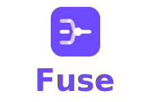
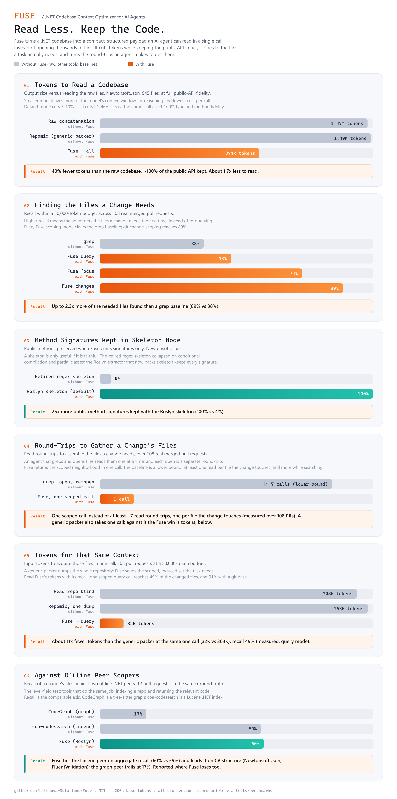

<!-- mcp-name: io.github.Litenova-Solutions/fuse -->

<p align="center">
  
</p>

<p align="center">
  <b>The MCP server that collapses an AI coding agent's explore phase on .NET into one scoped call.</b>
</p>

<p align="center">
  <a href="https://fuse.codes">Website</a> .
  <a href="https://fuse.codes/docs">Documentation</a> .
  <a href="https://fuse.codes/docs/start/connect-your-ai">Connect your agent</a> .
  <a href="https://fuse.codes/docs/project/benchmarks">Benchmarks</a>
</p>

<p align="center">
  <a href="https://www.nuget.org/packages/Fuse"></a>
  <a href="https://www.nuget.org/packages/Fuse"></a>
  <a href="https://github.com/Litenova-Solutions/Fuse/actions/workflows/ci.yml"></a>
  <a href="https://codecov.io/gh/Litenova-Solutions/Fuse"></a>
  <a href="https://registry.modelcontextprotocol.io"></a>
  <a href="https://dotnet.microsoft.com/download"></a>
  <a href="LICENSE"></a>
</p>

---

Fuse is a Model Context Protocol server for AI-assisted development on .NET. It hands your coding agent (Claude Code, Cursor, GitHub Copilot) the right code, scoped and reduced, in a single call, instead of letting it burn its context window opening thousands of files during the explore phase. It cuts input tokens while keeping the public API intact, scopes to the files a task needs, and trims the round-trips an agent makes. The same engine is also a `fuse` CLI.

Unlike generic repo packers (Repomix, Code2Prompt, Gitingest), Fuse understands C# structure: dependency graphs, skeleton extraction, BM25 query scoping, git change detection, and convention patterns. Roslyn structural analysis raises accuracy on hard C# codebases. The MCP server exposes eleven tools; see [Connect your agent](https://fuse.codes/docs/start/connect-your-ai).

Full documentation lives at **[fuse.codes](https://fuse.codes/docs)**.

## Why Fuse

Measured over a pinned corpus of five real .NET libraries (MediatR, FluentValidation, AutoMapper, Newtonsoft.Json, Serilog) and one ASP.NET Core application (eShopOnWeb), counted with the `o200k_base` tokenizer. Reduction ratios transfer across models even though absolute token counts do not. Every figure is reproducible with one command and reported in full, including the arms where Fuse ties or loses, on the [benchmarks page](https://fuse.codes/docs/project/benchmarks).

<p align="center">
  
</p>

- **One scoped call instead of an explore loop.** Over 108 real merged pull requests, one `fuse --query` call delivers the files a change needs in about 32,000 tokens at 49 percent recall, against a generic-packer dump of about 363,000 tokens (about 11 times more) at the same single call, and about 348,000 tokens to read the repository blind. Fuse ties a packer at one call and wins on tokens; with a git base the change-scoping mode reaches 91 percent recall. Read the token number with its recall.
- **Cuts tokens without dropping API.** `--level none` removes 6 to 10 percent and `--level aggressive` removes 21 to 46 percent of tokens while keeping 99 to 100 percent of public types and methods. `--level skeleton` removes 39 to 56 percent for an architecture map at full signature fidelity.
- **Smaller than the generic packers.** Repomix output runs 1.3 to 6.4 percent larger than raw concatenation on these repositories; Fuse is smaller than raw in every mode.
- **Finds the files a change touches.** Change scoping recalls 89 percent of the files in 108 real merged pull requests at 53 percent precision, and all three scoping modes beat an agent-style grep baseline.
- **Trustworthy skeletons on hard code.** Roslyn structural analysis keeps 100 percent of method signatures on all five benchmark libraries and the application, including Newtonsoft.Json, where the retired regex skeleton kept 4 percent.
- **Cheap repeated calls.** The SQLite-backed analysis index roughly halves warm-call wall-clock across a session, so a multi-call task pays the analysis cost once.
- **Self-contained distribution.** Release binaries bundle the .NET runtime; the global tool remains the recommended install when you already have the SDK.

Reproduce every number with `pwsh -File tests/benchmarks/harness/run-all.ps1`.

## Install

Fuse is a developer tool for .NET developers, so the recommended install is the
.NET global tool ([.NET SDK 10.0](https://dotnet.microsoft.com/download) or later):

```bash
dotnet tool install -g Fuse
```

Or run it on demand without installing: `dnx Fuse -- serve`.

If you do not have the .NET SDK, install a self-contained binary (no separate runtime
required) with the script for your platform:

```bash
# Linux
curl -fsSL https://fuse.codes/install.sh | sh
```

```powershell
# Windows
irm https://fuse.codes/install.ps1 | iex
```

On Windows you can also use `winget install Litenova.Fuse`, or download a binary
from [Releases](https://github.com/Litenova-Solutions/Fuse/releases). Verify with
`fuse --help`. Full notes: [fuse.codes/docs/start/install](https://fuse.codes/docs/start/install).

## Connect your agent

Register Fuse once; your AI client launches `fuse mcp serve` automatically when MCP is enabled:

```bash
fuse mcp install --rules
```

That writes MCP config for Claude Code, Cursor, and GitHub Copilot in the current project,
and `--rules` (recommended) writes a short rule into each client's instruction file
(`CLAUDE.md`, `.cursor/rules/fuse.mdc`, `.github/copilot-instructions.md`) so the agent
reaches for the `fuse_*` tools instead of grepping blindly. Use `fuse mcp install --scope user`
to register for every project on this machine, or `--client cursor` to configure one client only.

Manual registration is also supported. For Claude Code, add `.mcp.json` to your project root:

```json
{
  "mcpServers": {
    "fuse": {
      "type": "stdio",
      "command": "fuse",
      "args": ["mcp", "serve"]
    }
  }
}
```

Or register with the Claude CLI: `claude mcp add fuse --scope project -- fuse mcp serve`
(use `--scope user` for all projects). Cursor uses `.cursor/mcp.json` and GitHub Copilot
uses `.vscode/mcp.json`; see [Connect to your AI](https://fuse.codes/docs/start/connect-your-ai) for both.

A recommended agent flow on a large codebase: survey with `fuse_toc` or `fuse_skeleton`, drill in with `fuse_focus` or `fuse_search`, then review a branch with `fuse_changes`. Or call `fuse_ask` with a task and a token budget and let Fuse pick the strategy. See [Context for an agent](https://fuse.codes/docs/scenarios/context-for-an-agent).

Tool catalog and parameters: [MCP Tools](https://fuse.codes/docs/reference/mcp-tools) and [MCP Resources](https://fuse.codes/docs/reference/mcp-resources). MCP Registry manifest: [mcp-registry/server.json](mcp-registry/server.json).

## Command-line quickstart

The same engine runs as a CLI:

```bash
# fuse a .NET project with the DotNet template
fuse dotnet --directory ./src

# maximum C# reduction, public API intact
fuse dotnet --directory ./src --level aggressive

# architecture overview, signatures only
fuse dotnet --directory ./src --level skeleton

# cheap survey before fetching files (tree, symbol outline, token costs)
fuse dotnet --directory ./src --toc

# PR-scoped fusion with diff hunks and the callers of each changed file
fuse dotnet --directory ./src --changed-since main --review

# query-scoped fusion
fuse dotnet --directory ./src --query "payment gateway" --query-top 10
```

Output defaults to `Documents/Fuse`; use `--output` and `--name` to control the destination. Walkthrough: [fuse.codes/docs/start/quickstart](https://fuse.codes/docs/start/quickstart).

## Commands

| Command | Purpose |
|---------|---------|
| `fuse` | Generic fusion. All extensions unless you set `--only-extensions`. |
| `fuse dotnet` | .NET projects: C# reduction, structural maps, dependency-aware scoping. |
| `fuse wiki` | Azure DevOps wikis: Markdown only. |
| `fuse init` | Create `fuse.json` in the current directory. |
| `fuse mcp install` | Register Fuse with MCP clients (Claude Code, Cursor, Copilot). |
| `fuse mcp serve` | MCP server entry point on stdio (launched by your client, not run manually). |

Full option lists: [Commands](https://fuse.codes/docs/reference/commands) and [Options](https://fuse.codes/docs/reference/options).

## How it works

A fusion is a four-stage pipeline:

1. **Collection** - scan the source directory and apply filters (extensions, `.gitignore`, binary detection, test projects, globs).
2. **Filtering** - optional scoping: focus, git changes, or BM25 query with dependency expansion.
3. **Reduction** - normalize whitespace, run language and format reducers, apply skeleton, markers, and best-effort secret redaction (regex and entropy heuristics).
4. **Emission** - count tokens, build the manifest, apply the output format, and write within a token budget.

The concept in plain terms is at [How Fuse works](https://fuse.codes/docs/concepts/how-fuse-works); the internals are at [The pipeline](https://fuse.codes/docs/internals/pipeline).

## Repository layout

```
src/
  Core/                               Pipeline libraries
    Fuse.Collection/                  File discovery, filters, templates
    Fuse.Reduction/                   Content pipeline, caching, redaction
    Fuse.Emission/                    Output writers, token budget, manifest
    Fuse.Fusion/                      Orchestration, scoping, analysis, enrichment, DI
  Host/
    Fuse.Cli/                         CLI and MCP server
  Plugins/                            Extension-keyed capability providers
    Fuse.Plugins.Abstractions/        Capability interfaces (shared contract)
    Fuse.Plugins.Languages.CSharp/    C# lexer reduction, project graph, pattern detectors
    Fuse.Plugins.Languages.CSharp.Roslyn/  Roslyn structural analysis (skeleton, dependency, routes, markers)
    Fuse.Plugins.Formats.Web/         Format reducers (HTML, JSON, YAML, SQL, TS/JS, etc.)
tests/                                Unit, golden-output, and integration tests; benchmarks
site/                                 The fuse.codes website and documentation (Next.js + Fumadocs)
assets/                               Benchmark figure and the chart-generating script
mcp-registry/                         MCP Registry server manifest
```

## Development

```bash
dotnet build Fuse.slnx --configuration Release
dotnet test Fuse.slnx --configuration Release --no-build
dotnet format Fuse.slnx --verify-no-changes
```

Contribution workflow: [Contributing](https://fuse.codes/docs/project/contributing). Agent instructions: [AGENTS.md](AGENTS.md). The documentation site is in [site/](site/); see [site/README.md](site/README.md) to run it locally.

## License

MIT. Copyright (c) 2026 Litenova Solutions. See [LICENSE](LICENSE).
