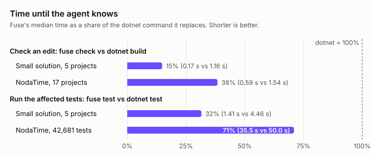

# Fuse

Fuse keeps a warm Roslyn compilation of your .NET repository and plugs it into coding agents through hooks. After every edit, the agent learns which compiler errors that edit introduced, including breaks in projects that depend on it. When the agent runs `dotnet test`, only the tests the change can reach run, and only failures are printed.

```bash
dotnet tool install -g Fuse
cd your-repo
fuse init
```

That is the setup. The hooks run on their own, so the agent needs no instructions and no tool to remember.



## What the agent sees

After an edit that renames `Calc.Add` to `Calc.Plus` in a library, the post-edit hook wakes the agent with:

```text
App/Program.cs(2,28): error CS1061: 'Calc' does not contain a definition for 'Add' and no accessible extension method 'Add' accepting a first argument of type 'Calc' could be found (are you missing a using directive or an assembly reference?)
Lib.Tests/UnitTest1.cs(4,65): error CS1061: 'Calc' does not contain a definition for 'Add' and no accessible extension method 'Add' accepting a first argument of type 'Calc' could be found (are you missing a using directive or an assembly reference?)
fuse: 2 new error(s) in 2 file(s) (App, Lib.Tests); Lib declarations changed, 2 dependent project(s) checked
```

An edit that introduces no error produces no output. Errors that exist at the last commit are never reported.

When the agent runs `dotnet test`, the command runs as `fuse test`:

```text
FAILED Lib.Tests.CalcTests.Multiplies
  Assert.Equal() Failure: Values differ
  Expected: 6
  Actual:   7
  at Lib.Tests.CalcTests.Multiplies() in Lib.Tests/UnitTest1.cs:line 5
fuse: 1 failed, 0 passed in 1.3 s; ran 1 test(s) affected by your changes out of 2; fuse test --all runs everything; fast path
```

When the agent tries to finish while its changes leave errors that are not at the last commit, the stop hook sends it back once with the list.

## Commands

| Command | What it does |
|---|---|
| `fuse init` | Registers the hooks with every agent harness the repository uses |
| `fuse check [files...]` | Errors the working tree has that HEAD does not, in the changed files and everything that depends on them |
| `fuse test` | Runs the tests affected by the working-tree changes and prints failures |
| `fuse test [dotnet test args]` | Runs the scope `dotnet test` would run with those arguments, printing failures |
| `fuse test --all` | Runs every test, printing failures |
| `fuse build [dotnet build args]` | The real `dotnet build`, printing its errors (or the end of its output when no error line parses) |
| `fuse mcp` | Stdio MCP server with `fuse_check`, `fuse_test` and `fuse_build` |

Exit codes: 0 clean, 1 errors or failed tests, 2 Fuse could not answer (the message says why and what to run).

There is no configuration file and there are no environment variables. Fuse finds every `.csproj` git knows about and needs the projects to be restored. In a repository without a `.csproj`, every command and hook returns at once without starting anything.

## Harnesses

`fuse init` looks for each harness's folder and writes its hooks there. With none found, it sets up Claude Code.

| Harness | Detected by | Hooks written |
|---|---|---|
| Claude Code | `.claude/` or `CLAUDE.md` | `.claude/settings.json`: post-edit check (in the background, wakes the agent only on new errors), `dotnet build` and `dotnet test` rewrite, stop check |
| Cursor | `.cursor/` | `.cursor/hooks.json`: post-edit check, stop follow-up |
| Gemini CLI | `.gemini/` or `GEMINI.md` | `.gemini/settings.json`: post-edit check, `dotnet` rewrite, stop check |
| Codex | `.codex/` | `.codex/hooks.json`: post-`apply_patch` check, `dotnet` rewrite, stop check |
| GitHub Copilot CLI | `.github/copilot-instructions.md` or `.github/hooks/` | `.github/hooks/fuse.json`: post-edit check, stop check |
| OpenCode | `.opencode/`, `opencode.json` or `opencode.jsonc` | `.opencode/plugins/fuse.js`: post-edit check, `dotnet` rewrite, stop check |
| VS Code agent mode | `.vscode/` | `.vscode/mcp.json`: the MCP server |

Running `fuse init` again replaces Fuse's entries in shared settings files and keeps the other entries (comments in those JSON files are not kept); `.github/hooks/fuse.json` and `.opencode/plugins/fuse.js` belong to Fuse and are written whole. OpenCode runs plugins rather than commands, so its plugin passes each tool event to `fuse hook opencode`; it supports OpenCode 1 and 2 plugin formats. If your Claude Code settings allow `dotnet build` or `dotnet test` without asking, `init` adds the same allowance for `fuse build` and `fuse test`. Any other MCP host can run `fuse mcp` from the repository directory.

The Claude Code integration is tested end to end with Claude Code 2.1.282, and the OpenCode plugin with OpenCode 2.0.15. The Cursor, Gemini CLI, Codex and Copilot CLI adapters, and the OpenCode 1 plugin format, follow each harness's documented hook format and are covered by payload tests.

## How it works

One `fuse engine` process runs per repository. The first command or hook starts it, and it exits after 30 minutes without a request. It evaluates every project with MSBuild, without building, and loads a project's compilation only when a change touches it.

- **Checking.** Fuse binds each changed file in the working tree and at HEAD and reports only the difference. When a file's declarations change, it finds the code that uses them with Roslyn's symbol search, in the owning project and every dependent project, and checks that code too. Analyzers run when the project configures one of their diagnostics as an error. Warnings are not reported.
- **Testing.** Fuse walks from the changed code to the test classes that can reach it, and refines that to test methods when the set is small. Application code (controllers, handlers, hosted services, top-level statements) runs behind a host, so reaching it selects every test project that depends on the application. When the test projects have build output and only C# sources changed since, Fuse emits the changed assemblies from memory into a copy of that output and runs the tests there without MSBuild.
- **Staying current.** A file watcher and a content comparison against HEAD track what changed. Project files, props, targets, `global.json` and `.editorconfig` re-evaluate the projects. A commit or branch switch moves the baseline.

[docs/design.md](docs/design.md) describes each part in detail.

## Measured

From the evals in `evals/Fuse.Evals`, run through the `fuse` executable on one Windows machine. Results are in `evals/results`.

| Eval | Fixture (5 projects, 22 tests) | NodaTime (17 projects, 42,681 tests) |
|---|---|---|
| Correctness: generated edits compared with a real `dotnet build` | 30 cases: 0 missed, 0 contradicted | 20 cases: 0 missed, 0 contradicted |
| `fuse check` vs `dotnet build`, median | 0.17 s vs 1.16 s | 0.59 s vs 1.54 s |
| Warm check after a body edit, P50 / P95 | 166 / 278 ms | 526 / 666 ms |
| Warm check after a signature edit, P50 / P95 | 196 / 2,617 ms | 1,463 / 7,971 ms |
| Test selection: failing tests missed | 0 in 10 cases | 0 in 5 cases |
| Tests run by `fuse test` | 15 percent | all (the changes reach core types) |
| `fuse test` vs `dotnet test`, median | 1.41 s vs 4.46 s | 35.5 s vs 50.0 s |
| Engine memory | 241 MB | 832 MB |

"Contradicted" means Fuse reported an error the build does not have. Errors Fuse reports in projects the build skips after an earlier failure cannot be compared; the result files count them separately. The signature-edit P95 includes the first such edit after the engine starts, which loads every dependent project. NodaTime builds with `TreatWarningsAsErrors`, so each check there also runs the analyzers that can report a warning.

## Limits

- C# only. Fuse needs the .NET 10 SDK and restored projects.
- A check compiles what MSBuild's evaluation describes. Custom targets that change compilation inputs, source generators that read files outside the project's additional files, and IL weaving are invisible to it; `fuse build` runs the real build.
- Compilation-end analyzers do not run in a check.
- Test selection is static. Tests that reach code only through reflection are selected when the walk reaches an application's host, not otherwise.
- Test projects on Microsoft.Testing.Platform (opted in through `global.json`) run whole, without selection or the fast path.
- The fast test path takes resources and content files from the last real build; when any of them changed, Fuse builds with MSBuild instead.

## Troubleshooting

- **`restore needed`**: run `dotnet restore`. Fuse never restores on its own.
- **Logs**: `engine.log` and `hook.log` in `%LOCALAPPDATA%\fuse\repos\<id>` on Windows, `~/.local/share/fuse/repos/<id>` on Linux, `~/Library/Application Support/fuse/repos/<id>` on macOS.
- **Stopping the engine**: it exits on its own after 30 idle minutes; ending the `fuse` process is safe.

## License

Apache-2.0. See [LICENSE](LICENSE).
