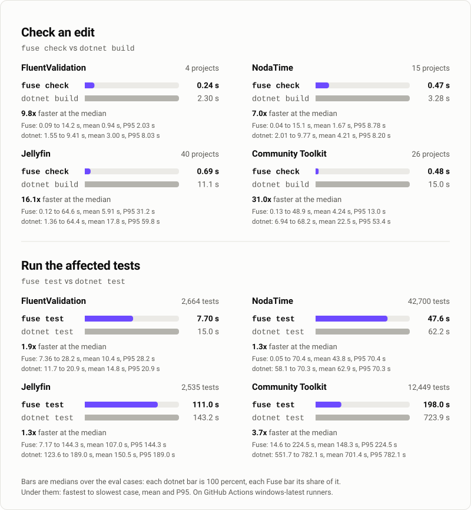

#  Fuse

[](https://www.nuget.org/packages/Fuse)
[](https://www.nuget.org/packages/Fuse)
[](https://github.com/Litenova-Solutions/Fuse/actions/workflows/ci.yml)
[](https://dotnet.microsoft.com/download/dotnet/10.0)
[](https://github.com/Litenova-Solutions/Fuse/blob/main/LICENSE)

Faster .NET build and test loop for AI coding agents.

AI agents check their work by running `dotnet build` and `dotnet test`, often dozens of times in one task. Each run is slow and prints far more than the agent needs. With several subagents, the builds also use a lot of memory and fail on each other's locked files.

Fuse fixes that. It keeps your solution loaded in the background, and after each edit it tells the agent:

- which compiler errors the edit caused, up to 24.6x faster than `dotnet build`
- which affected tests fail, up to 5.7x faster than `dotnet test`

Run `fuse init` once. After that, the agent's tool (Claude Code, Cursor, Codex and others) runs Fuse by itself.

[Website](https://fuse.codes) | [Documentation](https://fuse.codes/docs/) | [Getting started](https://fuse.codes/docs/getting-started) | [Benchmarks](https://fuse.codes/docs/benchmarks) | [Changelog](https://github.com/Litenova-Solutions/Fuse/blob/main/CHANGELOG.md)



## What you get

- **Only new errors.** Errors that were already in the last commit are not reported, so the agent does not chase problems it did not cause.
- **Breaks in other projects.** Rename a method and Fuse lists every broken caller, in every project, with the change that broke it.
- **Only affected tests.** Tests the change cannot reach do not run. When only `.cs` files changed, the tests run without a rebuild.
- **Short output.** At most 20 errors or 10 test failures, plus one summary line. Nothing at all when the edit is clean.
- **Made for subagents.** All agents in a repository share one Fuse process, so the solution is loaded once. Builds through Fuse take turns, so parallel builds do not fail on locked files. Each git worktree gets its own process.
- **Safe.** If Fuse fails, the hook stays silent and the agent carries on. Fuse never edits your code, runs locally and has no telemetry.
- **No configuration.** `fuse init` is the only setup.

## What it costs

- **Memory.** Fuse keeps the loaded projects in memory until it has been idle for 30 minutes: 256 MB to 795 MB in the [benchmarks](https://fuse.codes/docs/benchmarks), and more on a machine with more memory. Each git worktree uses its own.
- **A slow first check across projects.** The first edit that affects other projects has to load them. On Jellyfin (40 projects) that took up to 92.2 s; the median signature edit took 85 ms.
- **One check at a time.** Agents in the same repository wait for each other's checks.
- **Not a full build.** Fuse checks C# only and picks tests by reading the code, so a few cases still need `fuse build` or `fuse test --all`. [Limits](https://fuse.codes/docs/limits) lists them.

## Supported harnesses

| Harness | Integration |
| --- | --- |
| Claude Code | Hooks |
| Cursor | Hooks |
| Gemini CLI | Hooks |
| Codex | Hooks |
| GitHub Copilot CLI | Hooks |
| OpenCode | Plugin |
| VS Code agent mode | MCP server, since VS Code runs no hooks |

`fuse init` detects each one by its folder or file in the repository root and sets up Claude Code when it finds none. [Connect your agent](https://fuse.codes/docs/harnesses) lists what it writes for each one.

## Getting started

### Requirements

- The .NET 10 SDK
- A git repository with at least one commit
- Restored projects: Fuse never runs `dotnet restore` on its own

### Install

```bash
dotnet tool install -g Fuse
```

This puts `fuse` in `~/.dotnet/tools` (`%USERPROFILE%\.dotnet\tools` on Windows). That folder must be on your `PATH` and your agent's.

### Set up a repository

In the root of your repository:

```bash
fuse init
```

```text
wrote .claude/settings.json
wrote .gitignore
fuse: hooks registered; after each edit your agent gets the compiler errors the edit introduced, `dotnet test` runs the affected tests, and `dotnet build` prints only its errors
```

That is the whole setup. The agent now hears from Fuse only when an edit caused an error.

### Try it from the command line

The commands print exactly what the agent receives, so you can try Fuse in a terminal. For example, after renaming `Calc.Add` in a library, `fuse check` lists the callers it broke in other projects:

```text
$ fuse check
App/Program.cs(3,30): error CS1061: 'Calc' does not contain a definition for 'Add' and no accessible extension method 'Add' accepting a first argument of type 'Calc' could be found (are you missing a using directive or an assembly reference?)
  removed: public int Add(int a, int b)
Lib.Tests/CalcTests.cs(6,54): error CS1061: 'Calc' does not contain a definition for 'Add' and no accessible extension method 'Add' accepting a first argument of type 'Calc' could be found (are you missing a using directive or an assembly reference?)
  removed: public int Add(int a, int b)
fuse: 2 error(s) introduced in 2 file(s) (App, Lib.Tests); Lib declarations changed, 2 dependent project(s) checked
```

| Command | What it does |
| --- | --- |
| `fuse init` | Registers Fuse's hooks with the harnesses this repository uses |
| `fuse check [files...]` | Reports the errors your changes caused since the last commit, in every project |
| `fuse test [args...]` | Runs the tests affected by your changes |
| `fuse test --all` | Runs every test |
| `fuse build [args...]` | Runs `dotnet build` and prints its errors |
| `fuse mcp` | Serves `fuse_check`, `fuse_test` and `fuse_build` over stdio to an MCP host |

[Getting started](https://fuse.codes/docs/getting-started) shows each command's output and what the hooks send the agent.

## Documentation

- [Getting started](https://fuse.codes/docs/getting-started): set Fuse up in your repository and see what it reports.
- [Commands](https://fuse.codes/docs/commands): every command, its output and its exit codes.
- [Messages and fixes](https://fuse.codes/docs/messages): what each message means when Fuse cannot answer, and the fix.
- [Connect your agent](https://fuse.codes/docs/harnesses): what `fuse init` sets up for each harness, and how an MCP host runs Fuse.
- [How it works](https://fuse.codes/docs/how-it-works): how Fuse checks an edit, selects tests and runs them.
- [Limits](https://fuse.codes/docs/limits): what a check cannot see, and what to do about it.
- [Troubleshooting](https://fuse.codes/docs/troubleshooting): why Fuse is silent, slow or failing, and where its logs are.
- [Benchmarks](https://fuse.codes/docs/benchmarks): benchmarked speed and accuracy on four repositories.
- [All documentation](https://fuse.codes/docs/)

## Contributing

Bug reports, feature requests and pull requests are welcome on [GitHub](https://github.com/Litenova-Solutions/Fuse/issues), and questions in [Discussions](https://github.com/Litenova-Solutions/Fuse/discussions). [Contributing](https://github.com/Litenova-Solutions/Fuse/blob/main/CONTRIBUTING.md) describes how to build, test and submit a change, and every commit needs a Developer Certificate of Origin sign-off. AI-assisted contributions are welcome under the [AI policy](https://fuse.codes/docs/ai-policy), and everyone follows the [code of conduct](https://github.com/Litenova-Solutions/Fuse/blob/main/.github/CODE_OF_CONDUCT.md).

To report a vulnerability, follow [Security](https://github.com/Litenova-Solutions/Fuse/blob/main/SECURITY.md) instead of opening a public issue.

## License

Fuse is licensed under the [Apache License 2.0](https://github.com/Litenova-Solutions/Fuse/blob/main/LICENSE).
