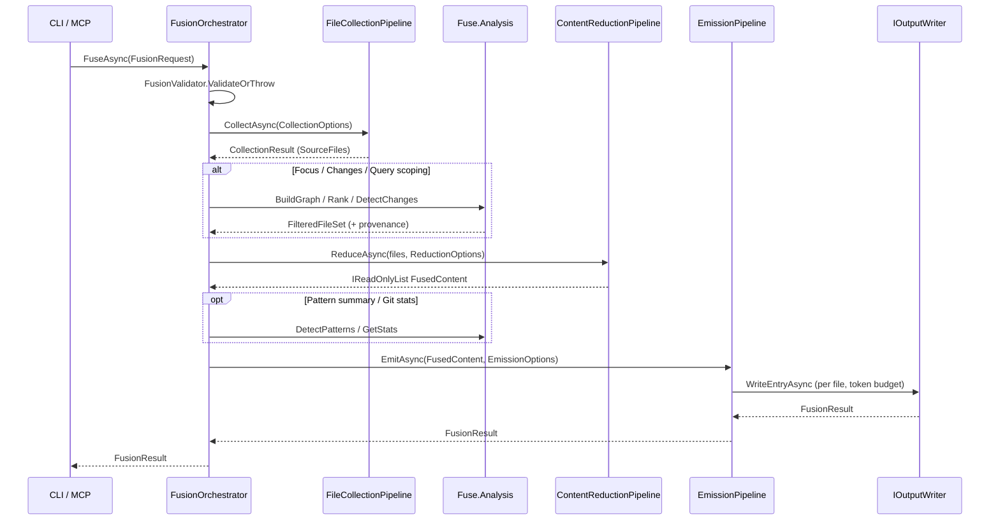
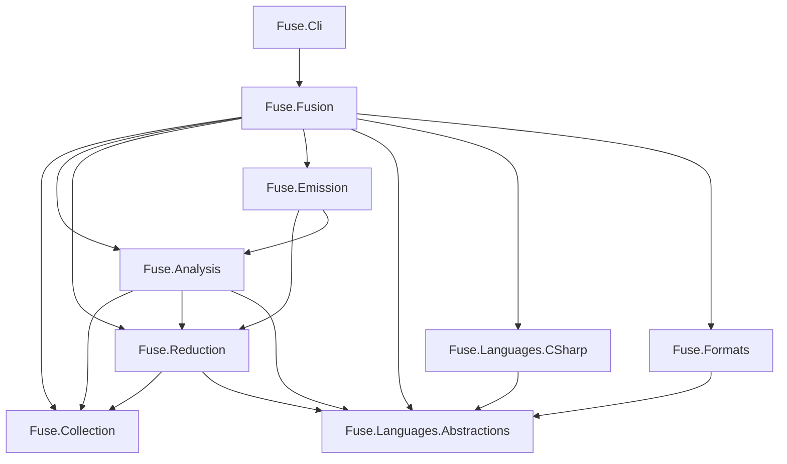

# Fuse Architecture

**Version:** 2.0

Fuse 2.0 is a four-stage fusion pipeline with a language-plugin boundary. Each stage has its own project, object model, and reason to change. This document is authoritative when it conflicts with older code or docs.

---

## Four-stage pipeline

Fusion is not a single "process files" loop. It is four distinct stages orchestrated by `FusionOrchestrator.FuseAsync`:

| Stage | Project | Responsibility |
|-------|---------|----------------|
| 1. Collection | `Fuse.Collection` | Enumerate candidates, apply file filters, resolve template extensions |
| 2. Filtering | `Fuse.Analysis` + orchestrator | Optional scoping: focus, git changes, or BM25 query with dependency expansion |
| 3. Reduction | `Fuse.Reduction` + language plugins | Read content, normalize, reduce, skeleton, markers, redact, filter trivial |
| 4. Emission | `Fuse.Emission` | Token budget, manifest, format adapters, disk or in-memory output |

Stages 1 and 2 produce a file set. Stage 3 produces `FusedContent` entries. Stage 4 writes them within a token budget.

### Sequence diagram



### Pipeline flow (ASCII)

```
FusionRequest
    |
    v
FusionValidator
    |
    v
[1] FileCollectionPipeline     enumerate, filter, template extensions
    |
    v
[2] FilterFilesAsync           focus | changes | query (mutually exclusive)
    |                          DependencyGraphBuilder + FocusSeedResolver
    v
[3] ContentReductionPipeline   read, normalize, reduce, skeleton, redact
    |
    v
[4] EmissionPipeline             manifest, token budget, format, write
    |
    v
[Optional] Structural maps       route map, project graph (prepend)
[Optional] Redact / pattern report (append)
    |
    v
FusionResult
```

Focus, change, and query modes are mutually exclusive. `FusionValidator` rejects any combination of two or more.

---

## Language plugin model

Language-specific behavior lives in plugin assemblies, not in the core pipeline. Each plugin registers capabilities via DI extension methods:

```csharp
services.AddCSharpLanguage();   // Fuse.Languages.CSharp
services.AddFormatReducers();   // Fuse.Formats (HTML, JSON, YAML, etc.)
```

### Capability interfaces

All capabilities extend `ILanguageCapability`, which declares `SupportedExtensions`:

| Interface | Purpose | Example implementation |
|-----------|---------|------------------------|
| `IContentReducer` | Extension-specific content reduction | `CSharpReducer`, `HtmlReducer` |
| `ISkeletonExtractor` | Structural skeleton (signatures only) | `CSharpSkeletonExtractor` |
| `ISemanticMarkerGenerator` | Type-level annotation comments | `CSharpSemanticMarkerGenerator` |
| `IDependencyExtractor` | Type references for dependency graph | `CSharpDependencyExtractor` |
| `ITypeNameLocator` | Resolve type names to defining files | `CSharpTypeNameLocator` |
| `IRouteMapGenerator` | ASP.NET endpoint table | `CSharpRouteMapGenerator` |
| `IProjectGraphGenerator` | Solution/project reference graph | `CSharpProjectGraphGenerator` |
| `IPatternDetector` | Cross-codebase convention detection | `CqrsPatternDetector`, etc. |

Pattern detectors register separately as `PatternDetectorBase` for batch execution after reduction.

### CapabilityRegistry

`CapabilityRegistry<TCapability>` builds an extension-to-capability map at startup. Resolution is by file extension; last registration wins for a given extension (allowing specialized plugins to override defaults):

```csharp
var reducer = _reducers.TryResolve(sourceFile.Extension);
if (reducer is not null)
    content = reducer.Reduce(content, options);
```

The orchestrator and pipelines never switch on extension strings directly. They resolve capabilities from registries injected via DI.

Four registries are registered in `AddFuseCore()`:

- `CapabilityRegistry<IContentReducer>`
- `CapabilityRegistry<ISkeletonExtractor>`
- `CapabilityRegistry<ISemanticMarkerGenerator>`
- `CapabilityRegistry<IDependencyExtractor>`
- `CapabilityRegistry<ITypeNameLocator>`

---

## Assembly dependency graph



NuGet dependencies: `DotNet.Glob` (Collection), `Microsoft.ML.Tokenizers` with `Data.O200kBase` / `Data.Cl100kBase` satellites (Emission tokenization).

---

## Project responsibilities

### Fuse.Collection

File discovery, filtering, templates, gitignore parsing. No internal Fuse dependencies.

```
Fuse.Collection/
  Filters/           IFileFilter implementations
  Templates/         IProjectTemplate, 26 definition classes
  FileSystem/        IFileSystem, GitIgnoreParser
  Models/            FileCandidate, SourceFile, CollectionResult
  FileCollectionPipeline.cs
```

### Fuse.Analysis

Regex-based code analysis for agentic features. Depends on Collection and Reduction models.

```
Fuse.Analysis/
  Dependencies/      DependencyGraphBuilder, FocusSeedResolver
  Changes/           GitChangeDetector
  Search/            Bm25RelevanceIndex
  Git/               GitStatsProvider
  Patterns/          Pattern detection batch runner
```

Dependency graphs are best-effort (no Roslyn). They may miss dynamic dispatch or produce false positives from type names in comments.

### Fuse.Reduction

Content normalization, capability-driven reduction, caching, secret redaction.

```
Fuse.Reduction/
  ContentReductionPipeline.cs
  Caching/           IReductionCache (XXHash64 keys in .fuse/cache)
  Security/          ISecretRedactor
  Models/            FusedContent
```

### Fuse.Emission

Token counting, output writing, manifest, format adapters.

```
Fuse.Emission/
  Writers/           DiskOutputWriter, InMemoryOutputWriter
  Tokenization/      TokenizerFactory, TikTokenCounter (Microsoft.ML.Tokenizers backend)
  Manifest/          ManifestBuilder
  Entry formatters:  XmlEntryFormatter, MarkdownEntryFormatter, JsonEntryFormatter
  EmissionPipeline.cs
```

### Fuse.Fusion

Orchestration, validation, DI registration (`AddFuse()`, `AddFuseCore()`).

### Fuse.Languages.CSharp

C# plugin: reducer, skeleton, markers, dependencies, type locator, route map, project graph, six pattern detectors.

### Fuse.Formats

Format reducers for non-language-specific file types: CSS, HTML, JavaScript, JSON, Markdown, Razor, SCSS, XML, YAML.

### Fuse.Cli

CLI commands, MCP server (`fuse serve`), config discovery (`fuse.json`, `.fuserc`), `fuse init`.

---

## Options model

The monolithic `FuseOptions` from 1.x is replaced by scoped records composed in `FusionRequest`:

```
FusionRequest
  CollectionOptions     Collection
  ReductionOptions      Reduction
  EmissionOptions       Emission
  FocusOptions?         Focus scoping
  ChangeOptions?        Git change scoping
  QueryOptions?         BM25 query scoping
  bool InMemory           true for MCP tools
  int Parallelism         0 = processor count
  bool UseReductionCache
  bool ClearReductionCache
```

CLI commands construct requests via `FusionRequestBuilder`. Config file values merge with precedence: explicit CLI flag > `fuse.json`/`.fuserc` > built-in default.

Key defaults (2.0):

| Option | Default | Notes |
|--------|---------|-------|
| `EnableRedaction` | `true` | `--no-redact` to disable |
| `IncludeManifest` | `true` | `--no-manifest` to disable |
| `TokenizerModel` | `o200k_base` | `--tokenizer` to override |
| `SplitTokens` | `800000` | Multi-part output threshold |
| `UseReductionCache` | `true` | `--no-cache` to disable |

---

## Key types

**SourceFile** wraps a discovered file with extension booleans (`IsCSharp`, `IsRazor`, etc.) and `NormalizedRelativePath`.

**FusedContent** holds reduced content, token count, triviality flag, optional redaction counts, and optional inclusion provenance chain.

**TokenBudget** tracks consumption against `MaxTokens` and `SplitTokens`, returning continue, split, or halt per entry.

**FusionResult** contains generated paths or in-memory content, token totals, file counts, duration, top token files, pattern summary, and cache hit/miss stats.

**IOutputWriter** implementations receive an `IEntryFormatter` and write entries in descending token-count order.

---

## Dependency injection

All services register in `ServiceCollectionExtensions.AddFuse()`:

| Lifetime | Types |
|----------|-------|
| Singleton | `FusionOrchestrator`, `FusionValidator`, `TokenizerFactory`, all `CapabilityRegistry<T>`, `ProjectTemplateRegistry` |
| Transient | `FileCollectionPipeline`, `ContentReductionPipeline`, `EmissionPipeline`, all `IFileFilter` |
| Plugin registration | `AddCSharpLanguage()`, `AddFormatReducers()` |

Filter registration order equals evaluation order in `RegisterFileFilters()`.

---

## Implementation notes

| Concern | Approach |
|---------|----------|
| Binary detection | First 8000 bytes; any `0x00` byte classifies as binary |
| File reads | `ISourceContentProvider` caches per run; no duplicate reads across graph/reduction |
| Temp files | GUID-based names; safe for concurrent MCP invocations |
| Parallelism | Configurable via `--parallelism`; no `.AsParallel()` in filters |
| Whitespace | Normalized once in `ContentReductionPipeline` before reducers |
| MCP stdio | All logging to stderr; watch mode disabled when stdout is redirected |

Catch-and-swallow is permitted only in `AutoGeneratedFileFilter` and `BinaryFileFilter` when file read fails, with an inline comment explaining why.
