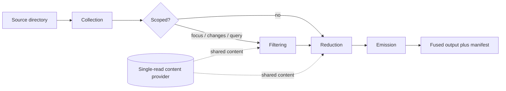

A fusion is not a single loop over files. It is four ordered stages, each with one responsibility, run by the fusion orchestrator and handed from one to the next. The orchestrator validates the request, then drives collection, optional filtering, reduction, and emission in that fixed order. This page traces that flow and names the project that owns each stage.

This page is for engineers building a mental model of the runtime and for maintainers who need to know where a given concern lives.

## Architectural Rationale

Each stage exists because it changes for a different reason. Collection changes when file discovery rules change. Filtering changes when scoping strategies change. Reduction changes when a language reducer changes. Emission changes when an output format or token budget changes. Keeping them in separate projects means a change to one does not force a rebuild of the reasoning in another, and the orchestrator stays a thin sequence rather than a place where every concern accumulates.

The orchestrator never reads file content directly to do stage work, and it never switches on file extension strings. It resolves capabilities from registries and reads content through a single shared provider, described below.

## The Four Stages

| Stage | Project | Responsibility |
|-------|---------|----------------|
| Collection | Fuse.Collection | Enumerate candidate files, apply filters, resolve template extensions |
| Filtering | Fuse.Fusion | Optional scoping by focus, git changes, or query, with dependency expansion |
| Reduction | Fuse.Reduction plus language plugins | Read content once, normalize, reduce, skeleton, mark, redact |
| Emission | Fuse.Emission | Apply token budget, build manifest, format entries, write output |

Collection produces a set of candidate source files. Filtering optionally narrows that set; without scoping, every collected file passes through unchanged. Reduction turns each file into a reduced content entry. Emission writes those entries within a token budget and returns the result.

### Collection

The collection pipeline scans the source directory and applies an ordered chain of filters: extension matching from the resolved template, gitignore rules, excluded directories, test-project exclusion, file-size limits, binary detection, empty-file removal, auto-generated-file detection, excluded file names, and glob patterns. Filter registration order equals evaluation order. The stage resolves the template's default extensions before scanning so that only relevant file types are enumerated.

### Filtering

Filtering is optional and applies only when the request carries a scoping mode. The three modes are focus (a type, file, or directory seed plus its dependencies), changes (files changed since a git ref plus their first-degree dependents), and query (the files a search query ranks highest plus their dependencies). Each mode resolves a seed set and expands it through the dependency graph to a configured depth.

The three modes are mutually exclusive. The fusion validator rejects any request that sets more than one, so a single fusion narrows by at most one strategy. The internals of seed resolution, ranking, and expansion are covered in [Scoping Internals](scoping-internals.md).

### Reduction

The reduction stage reads each file's content, normalizes whitespace once, resolves the reducer registered for the file's extension, and applies it. It then optionally extracts a structural skeleton, prepends semantic markers, and redacts secrets before token counting. Per-file reduced output is optionally cached on disk so that an unchanged file with unchanged options is not reduced twice across runs; see [Caching Internals](caching-internals.md).

### Emission

The emission stage counts tokens with the configured tokenizer, builds the manifest, applies the output format, and writes entries in descending token-count order within a token budget. When a fusion exceeds the split threshold it is written as multiple parts. After the primary write, the orchestrator optionally prepends structural maps (route map, project graph) and appends a redaction report or pattern summary.

## Data Flow

## The Single-Read Content Provider

Several stages need the same file content. Filtering reads files to build the dependency graph and to index them for query ranking; reduction reads them to transform them. A single shared content provider reads each file once per run and serves that content to every consumer, so a file is not read from disk three times. The provider is cleared at the start of each fusion.

This per-run sharing is distinct from the persistent reduction cache, which stores reduced output across runs. The content provider holds raw content for the duration of one run; the reduction cache holds reduced output between runs.

## What This Does Not Cover

This page describes stage ordering and ownership. It does not document the scoping algorithms, the capability resolution mechanism, the request object model, or the cache key scheme; those have dedicated pages. It does not give command syntax or option reference detail.

## Next

Read the [Capability and Plugin Model](capability-model.md) to see how reduction and scoping resolve language behavior, the [Options Model](options-model.md) for how a request is described, or [Scoping Internals](scoping-internals.md) for the filtering algorithms. For the conceptual overview, see [Core Concepts](../getting-started/core-concepts.md).
