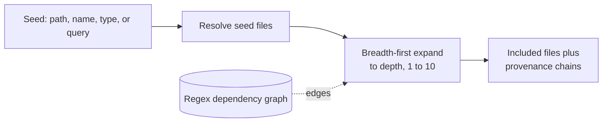

Scoping narrows a fusion to the files relevant to a task. Three modes drive it: focus from a named seed, changes from a git ref, and query from a search string. All three rest on the same two mechanisms, a relevance index and a dependency graph, plus a seed resolver that maps a seed to starting files and expands outward. This page documents those mechanisms, the constants they use, and where their accuracy ends.

This page is for maintainers working on scoping behavior and for engineers who need to know why a scoped fusion includes or omits a given file.

## Implementation Context

Scoping is best-effort by design. The dependency graph is built from regular expressions over file text, not from a compiled semantic model, so it approximates the real reference structure rather than reproducing it. Every mode that expands through the graph inherits that approximation. The honest ceiling on scoping accuracy is the regex graph: it is the largest source of both missed edges and false edges, and no amount of seed-resolution precision compensates for an edge the graph never recorded.

## BM25 Relevance Index

Query scoping ranks files by lexical relevance to a query using BM25, a standard ranking function, with constants K1 = 1.2 and B = 0.75. The index tokenizes content by splitting on non-word characters, then splits each identifier on camelCase, PascalCase, and snake_case boundaries. The identifier `OrderService` is therefore indexed under `order` and `service` as well as the whole token, so a query for either word reaches it. Matching is case-insensitive.

The index is rebuilt on each run and is not thread-safe; indexing must complete before ranking. Ranking is lexical and best-effort. It rewards shared vocabulary, which means it can surface a file that merely happens to share a word with the query, and it can miss a conceptually related file that shares no vocabulary at all. It has no semantic understanding of the code.

## Dependency Graph

The dependency graph maps each file to the type names it references and each type name to the files that define it. Both directions are built from regular expressions; there is no Roslyn or compiler involvement. The graph is best-effort: it may miss references that arrive through dynamic dispatch or reflection, and it may record false positives from type names that appear in comments or strings rather than in real references. A file whose extension has no registered dependency extractor contributes an empty reference list.

The graph is built in parallel across files, and its output ordering is made deterministic by reordering the result to follow the input file order regardless of how the parallel work completed.

## Focus Seed Resolution

Focus scoping resolves a seed string to one or more starting files by trying strategies in a fixed order and stopping at the first that yields any match:

1. Exact relative path.
2. Exact file name.
3. Type name, resolved through the type-name locator capability to the files that define that type.
4. Directory prefix, matching every file under that path.

Only the type-name strategy reads file content. If no strategy matches, the fusion fails with a diagnostic rather than producing an empty result silently.

## Path Expansion

From the resolved seed set, expansion is breadth-first through the dependency graph to the configured depth, which ranges from 1 to 10. At each hop the expansion follows a file's referenced type names to the files that define them and adds any not yet included. Each file is included once, on the shortest hop on which it is first reached, and the expansion records a provenance chain for every included file: the hop sequence from a seed to that file, inclusive. That chain is surfaced when provenance annotation is requested with the provenance flag.

Query scoping reuses the same expansion from its ranked seed files. Change scoping resolves its seeds from the git change set and, when dependents are requested, expands one hop to first-degree dependents.

## What This Does Not Cover

This page documents the scoping algorithms. It does not give command syntax for selecting a mode or setting depth; see the [Scoping guide](../guides/scoping.md). It does not cover the reduction or emission of the files scoping selects.

## Next

See [Scoping To What Matters](../guides/scoping.md) for task-oriented use of the three modes, and [The Fusion Pipeline](pipeline.md) for where filtering sits in the run.
