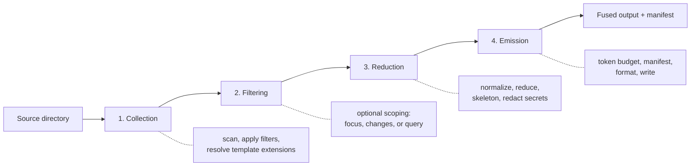

Fuse has a small vocabulary that recurs across every guide and reference page. This page defines those terms once and shows how the pieces fit together as a pipeline. Understanding this model makes the rest of the documentation a lookup exercise rather than a discovery exercise.

This page is for engineers building a mental model of how Fuse works and for anyone who wants to understand the terms before reading task-oriented guides.

## Fusion

A fusion is one run of Fuse: it takes a source directory and produces a single output, either a file on disk or an in-memory payload returned to an MCP client. The verb "to fuse" means to perform that run. Everything Fuse does is in service of producing one fusion.

## Tokens

A token is the unit a language model reads. Models have a fixed context window measured in tokens, so the token count of a fusion determines how much of that window it consumes and how much it costs. Fuse counts tokens with a real tokenizer rather than estimating from character counts, so the figure it reports matches what the target model will see. The [Tokenizers reference](../reference/tokenizers.md) lists the supported models.

## The Four-Stage Pipeline

A fusion runs as four distinct stages, in order. Each stage has one responsibility and hands its result to the next.

1. **Collection** scans the source directory and applies filters: file extensions from the template, `.gitignore` rules, binary detection, test-project exclusion, and glob patterns. It produces the set of candidate files.
2. **Filtering** is optional. When you scope a fusion, this stage narrows the candidate set to the files relevant to a type, a git change set, or a search query, expanding through the dependency graph. Without scoping, every collected file passes through.
3. **Reduction** reads each file's content once, normalizes whitespace, applies the reducer for the file's type, and optionally extracts a skeleton, adds semantic markers, and redacts secrets.
4. **Emission** counts tokens, builds the manifest, applies the output format, and writes the result within a token budget, splitting into multiple parts if a fusion exceeds the split threshold.

## Reduction

Reduction is how Fuse shrinks content without changing what it means. For C#, that ranges from removing comments and usings up to aggressive compression and skeleton extraction, which keeps signatures and drops method bodies. For web and configuration formats such as JSON, HTML, and YAML, format-specific reducers strip comments and collapse whitespace. The [Reducing Tokens](../guides/reducing-tokens.md) guide covers the levels; the [Reducers reference](../reference/reducers.md) documents each transform.

## Scoping

Scoping selects a subset of the codebase relevant to a task, rather than fusing everything. Fuse offers three scoping modes, and they are mutually exclusive: a single fusion uses at most one.

| Mode | Selects | Use when |
|------|---------|----------|
| Focus | A type, file, or directory plus its dependencies | You know the area by name |
| Changes | Files changed since a git ref plus dependents | Reviewing a branch or pull request |
| Query | The files a search query ranks highest plus dependencies | You have a topic but not a file name |

Each mode starts from a seed set and expands through the dependency graph to a configurable depth. The [Scoping to What Matters](../guides/scoping.md) guide explains all three.

## The Manifest

The manifest is a header prepended to every fusion. It lists each included file with its token cost, and optionally git churn statistics and detected code patterns. The manifest is the orientation layer: a reader or agent consults it to understand the fusion's shape and cost before reading any file body. It is on by default and disabled with `--no-manifest`.

## Capabilities And Plugins

Fuse keeps language-specific behavior in plugins rather than in the core pipeline. A capability is one unit of that behavior, such as reducing C#, extracting a skeleton, or detecting routes. The core pipeline resolves capabilities by file extension, so support for a language is a matter of registering its plugin. The [Capability and Plugin Model](../architecture/capability-model.md) page describes this design, and [Extending Fuse](../extending/language-plugin.md) shows how to add a language.

## What This Does Not Cover

This page defines concepts; it does not give command syntax or implementation detail. The dependency graph that scoping relies on is regex-based and best-effort, with the precise behavior and its limits documented in [Scoping Internals](../architecture/scoping-internals.md).

## Next

Continue to the [Guides](../guides/fusing-dotnet.md) for task-oriented walkthroughs, or jump to the [Reference](../reference/commands.md) for exact command and option detail.
