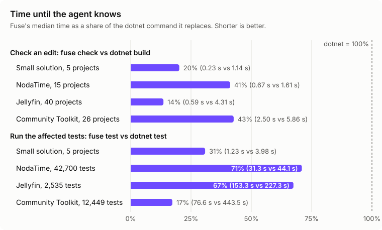

# Results

This page gives Fuse's measured speed and accuracy on four repositories, for anyone deciding whether to rely on Fuse and for contributors comparing a change with the published numbers. [Evals](evals.md) explains how the numbers are produced and how to reproduce them.

The evals in `evals/Fuse.Evals` run the `fuse` executable against a real `dotnet build` and `dotnet test` on one Windows machine. These results were measured on Fuse 5.1.0 on commit 14255ab (the result files' build ids differ only by the commit embedded in the version), on the fixture at 6c4e298, NodaTime at fcd80e1, Jellyfin at 1d7c6af and the .NET Community Toolkit at b135626.

## Measurements

| Eval | Small solution (fixture: 5 projects, 22 tests) | NodaTime (15 projects, 42,700 tests) | Jellyfin (40 projects, 2,535 tests) | .NET Community Toolkit (26 projects, 12,449 tests) |
| --- | --- | --- | --- | --- |
| Correctness: generated edits compared with a real `dotnet build` | 30 cases: 0 missed, 0 contradicted | 30 cases: 1 missed, 0 contradicted | 30 cases: 0 missed, 0 contradicted | 30 cases: 0 missed, 0 contradicted |
| Errors Fuse reported that the build could not confirm: deferred / unverifiable | 4 / 37 | 7 / 127 | 40 / 140 | 18 / 33 |
| `fuse check` vs `dotnet build`, median | 0.18 s vs 1.14 s (6.4x) | 0.63 s vs 1.45 s (2.3x) | 0.70 s vs 4.26 s (6.1x) | 0.45 s vs 4.48 s (10.0x) |
| Warm check after a body edit, P50 / P95 | 168 / 252 ms | 778 / 933 ms | 239 / 393 ms | 1,266 / 1,667 ms |
| Warm check after a signature edit, P50 / P95 | 206 / 2,241 ms | 2,326 / 10,273 ms | 184 / 52,315 ms | 568 / 35,178 ms |
| Test selection: failing tests missed | 0 in 10 cases | 0 in 10 cases | 0 in 10 cases | 0 in 10 cases |
| Cases the suite could not check name by name | 0 | 2 | 0 | 0 |
| Tests run by `fuse test` | 15 percent | 80 percent | 22.3 percent | 13.7 percent |
| `fuse test` vs `dotnet test`, median | 1.27 s vs 4.17 s (3.3x) | 32.0 s vs 44.4 s (1.4x) | 165.3 s vs 226.6 s (1.4x) | 65.1 s vs 428.5 s (6.6x) |
| Three `fuse build` runs at once, five rounds: lock collisions | 0 | 0 | 0 | 0 |
| Engine working set after the latency checks | 271 MB | 865 MB | 1,019 MB | 2,029 MB |

Every number in the table comes from these files in `evals/results`: `correctness-fixture-20260929-0115.json`, `selection-fixture-20260928-2052.json`, `latency-fixture-20260928-2053.json`, `correctness-NodaTime-20260929-0117.json`, `selection-NodaTime-20260928-2109.json`, `latency-NodaTime-20260928-2116.json`, `correctness-Jellyfin-20260929-0124.json`, `selection-Jellyfin-20260928-2237.json`, `latency-Jellyfin-20260928-2251.json`, `correctness-CommunityToolkit-20260929-0130.json`, `selection-CommunityToolkit-20260929-0031.json` and `latency-CommunityToolkit-20260929-0049.json`. The exceptions are the project counts in the header, which are the `.csproj` entries of each pinned solution whose files exist, as `evals/Fuse.Evals/PinnedRepo.cs` records them.

## Reading the numbers

- **Missed and contradicted.** The correctness suite makes generated edits that change declarations, runs `fuse check` on the edited files, and compares its errors with the errors a real `dotnet build` reports beyond the ones HEAD already has. An error the build reports and Fuse does not is missed. An error Fuse reports that the build does not have, and that the suite cannot account for, is contradicted.
- **Deferred and unverifiable.** The build reports fewer errors than exist in two situations, and the suite counts Fuse's extra errors apart. When a project has a declaration error, the compiler stops before it binds method bodies or runs analyzers, and after any compiler error it skips its documentation checks (CS1570 to CS1592); Fuse reports those errors at once, and the build reports them only once the first errors are fixed, so they are deferred. When a project fails to build, MSBuild skips every project that references it; an error Fuse reports in such a project is unverifiable, because the build has no answer there.
- **NodaTime's missed error.** One edit made `DateAdjusters.AddPeriod` private. The build compiles dependent projects against reference assemblies, which leave out private members, so it reported "does not contain a definition" at five places and a follow-on conversion error at a sixth. Fuse compiles against the source and reported "is inaccessible due to its protection level" at the same five places; the conversion error is the one it missed.
- **Medians and speedups.** A median is over the 30 correctness cases or the 10 selection cases. The speedup in parentheses is the `dotnet` median divided by the Fuse median, rounded half up to one decimal, as in the chart.
- **Warm checks.** A warm check runs against an engine that has already loaded the edited project. A body edit changes the inside of a method; a signature edit renames a method, so Fuse also checks the dependent projects that use it. P50 is the median. P95 is the value 95 percent of the checks stayed at or under, by the nearest-rank method, which with 15 body edits and 10 signature edits is the slowest one.
- **The signature-edit P95.** The slowest signature edit is the one that loads the dependent projects and searches them for the first time; the median edit loads nothing. In the signature-edit runs, the slowest `load` phase took 25,166 ms on Jellyfin, which checked 27 dependent projects, and 6,833 ms on the Community Toolkit, which checked 12; the slowest `referenceSearch` phase took 26,915 ms and 26,823 ms.
- **NodaTime's body edits.** NodaTime builds with `TreatWarningsAsErrors`, so every check there also runs the analyzers that can report a warning.
- **Tests run.** The share is the mean, over the 10 selection cases, of the tests `fuse test` ran divided by the tests in a full run. In 8 of the 10 NodaTime cases the change reached `NodaTime.TzdbCompiler`, an application, so every test project that depends on it ran whole, 42,689 of the 42,700 tests; the time saved there comes from running without MSBuild. On the Community Toolkit the cases ran between 148 and 4,497 of the 12,449 tests.
- **How the tests ran.** Every fixture and Community Toolkit case, and 9 NodaTime cases, ran without MSBuild; the tenth NodaTime case had no affected test. On Jellyfin, 1 case ran without MSBuild, 1 ran 1 of its 4 test projects without MSBuild, and 8 built with MSBuild.
- **Cases not checked name by name.** In two NodaTime cases 126 and 252 tests failed by name in a full run. `fuse test` prints details for the first 10 failures and the names of the next 100, then counts the rest, so the suite could not match those two cases name by name. In both, `fuse test` ran 42,689 of the 42,700 tests.
- **Lock collisions.** The latency suite runs three `fuse build` at once, five times, and counts output lines with MSB3021, MSB3026, MSB3027 or CS2012, the errors of two builds writing the same files.
- **Engine memory.** The working set is the engine process's, read after the latency suite's checks and test rounds, when the engine has loaded every project they reached.

The evals are in [evals/Fuse.Evals](../evals/Fuse.Evals), and every result file is in [evals/results](../evals/results).
