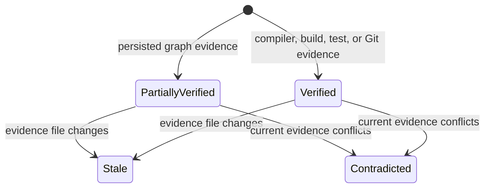

A verification grade names the class of truth behind a single verify verdict. Claim grades
extend the same idea to the statements Fuse makes inside any answer: an impact blast radius, a
resolved wiring edge, a Git-seeded review summary, a covering-test run. Each such statement
carries a **claim grade** computed from the available evidence, so a reader can separate
compiler or test verdicts from graph inferences.

The rule is one sentence: **grades are computed, never asserted.** Fuse grades only statements
it emitted itself, from evidence it can point at; it never grades prose a model wrote.

## The grades



| Grade | What it means | Evidence | Example |
| --- | --- | --- | --- |
| `verified` | Compiler- or test-grade truth | A diagnostic, a build, a test verdict | `[verified] the edit compiles clean  (evidence: check: 0 errors)` |
| `partially verified` | Real signal from the persisted graph, but not compiler-confirmed | An edge, a stored flag, a symbol id | `[partially verified] WidgetService has 3 callers  (evidence: graph: references edges)` |
| `stale` | The evidence a claim rested on has changed since the claim was computed | A watcher-known edit to the evidence file | `[stale] 3 callers  (evidence: graph: references edges (stale: evidence changed since computed))` |
| `contradicted` | An earlier session claim conflicts with the current truth, both sides cited | The session claim versus the current resolution | `[contradicted] the request resolves to OldHandler  (evidence: was: OldHandler; now: NewHandler)` |

The graph-grade cap is the load-bearing rule: an answer built only from the persisted
semantic graph caps at `partially verified`, never `verified`. The graph is real signal, but
it is not the compiler, and inflating a graph inference to compiler-grade truth is exactly the
failure the grades exist to prevent. Only a diagnostic, a build, or a test verdict lifts a
claim to `verified`.

## Where claims appear

Four tools carry a claims block, appended to the answer as a scannable text section (the read
tools return rendered text, so the block is a section like the availability header, not a new
envelope):

- `fuse_impact` - the caller/implementer count and the covering-test count, both graph-grade.
- `fuse_find` (wiring kinds: service, request, route, config) - the resolved edge, graph-grade.
- `fuse_test` - the covering tests run and their verdicts, compiler/test-grade (`verified`).
- `fuse_review` - the changed-file set supplied by the Git diff (git-truth, `verified`) and
  whether the change alters the public API surface (graph-grade). This grade confirms the
  diff seeds; it does not claim that review discovered every file needed for the task.

A claims block reads as one header plus one line per claim:

```text
claims (2, each graded and evidence-referenced):
  [verified] 1 changed file(s) are seeded as must-keep  (evidence: git diff origin/main)
  [partially verified] the change alters the public API surface (see the api-delta section)  (evidence: graph: public-API delta)
```

## The session ledger

Across a session, the claims a tool emits accumulate into a **session ledger**: the running
evidence trail for the task. It is addressable as an MCP resource
(`fuse://ledger/{path}/{session}`), so a client can read every claim made so far, each with
its current grade. As the workspace changes under the session, a claim whose evidence file was
edited is re-graded `stale`, and a claim the current truth now conflicts with is re-graded
`contradicted` - a terminal grade does not silently revert to looking fresh.

## The handoff packet

`fuse_review --handoff` turns the accumulated evidence into a paste-ready PR body: the changed
files, the public API delta, the compiler-gate status, and the named residual risk. It is
gated, not a controller: while the check session still has unresolved introduced errors, the
handoff **refuses** and returns the red summary instead of a packet. Fuse reports the gate
result and does not commit for you. A handoff packet is unavailable until the compiler gate
has no unresolved introduced errors.

## Inspect a Ledger

Reuse a `sessionId` for impact, test, and review calls, then read
`fuse://ledger/{path}/{session}`. Check each claim's grade and evidence reference before
copying it into a pull request description.
