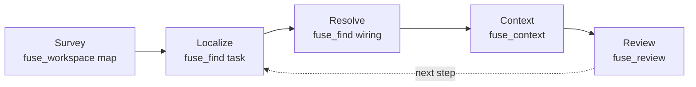

An AI coding agent does not start a task by editing. It starts by finding the right code:
which concrete type runs, which handler processes a request, what a change will break. On
a large .NET solution, doing that with directory listings and blind file reads is the
expensive part of the task. Fuse replaces it with a few cheap calls against a warm
semantic index. This page is the mental model for how an agent strings those calls
together. For what one call does internally, see [How Fuse works](/docs/concepts/how-fuse-works).

## What Blind Exploration Costs

Without a semantic index, the agent reads, decides, and reads again. Each hop is a model
call with latency, and the loop has three costs that compound on a big codebase:

- **Tokens.** Every file opened to orient burns context window that could have gone to the
  change. Much of it is comments, using directives, and boilerplate the agent does not
  need to reason about structure.
- **Round-trips.** Discovery is sequential. A **round-trip** is one read-decide cycle, and
  the agent often re-reads files it already saw because nothing kept a compact map.
- **Lost wiring.** Reading files in isolation, the agent reconstructs the DI registrations,
  the request and route handlers, and the public surface by hand. Grep finds the interface
  but not the type that runs.

## The Measured Cost

The [benchmark corpus](/docs/project/benchmarks) puts numbers on the loop over real
merged pull requests, counted with the `o200k_base` tokenizer.

A blind agent must read each file a change touches at least once before it has the
context. That is a structural lower bound, not a measured agent: a mean of 6.9 files per
change over the pull requests tested.

## The Collapse: One Scoped Call

Fuse acquires that context in one call. On the benchmark corpus, open-ended localize from a
title alone recalls 37.7 percent of changed files at a median 1,348 tokens, and change
review with a git base keeps 100 percent of changed files at 93.4 percent precision in a
median 1,026 tokens.

Against a generic packer (Repomix), which dumps the whole repository in one call, Fuse ties
on round-trips and wins on tokens because Fuse scopes and the packer dumps. Fuse does not
make fewer round-trips than a packer; both are one call. The win against a packer is tokens;
the win against no tool is the round-trip collapse.

## The Loop, in a Few Cheap Calls

Across a task, Fuse is a few cheap calls against the warm index instead of dozens of blind
reads:

Survey the workspace cheaply with `fuse_workspace` (`action=map`), localize a task to
candidate files with `fuse_find` (`kind=task`), resolve the wiring a task names with
`fuse_find` (`kind=service|request|route|config`), plan and emit the context with
`fuse_context`, and review a branch with `fuse_review`. Pass a `sessionId`
across calls so later calls do not resend files already returned. See
[Sessions and deltas](/docs/concepts/sessions-and-deltas) for the refinement step and
[Context for an agent](/docs/scenarios/context-for-an-agent) for a worked sequence.

When a git base is available, `fuse_review` is the routed default: it seeds on the changed
files and returns the blast radius and packed context in one call. When the task is
open-ended, start with `fuse_find` (`kind=task`); when it names a route, interface,
request, or config section, start with `fuse_find` (`kind=service|request|route|config`).

## Honest Boundary

The no-tool round-trip count is a lower bound from ground truth, the count of files each
real change touched, not a trace of a running agent; a real agent reads more while
discovering them. A live multi-turn agent trace and end-to-end task resolution are not
benchmarked. The token and recall figures above are measured; treat any wall-clock claim
as illustrative.

## Next

See the measured detail on the [Benchmarks](/docs/project/benchmarks) page,
the narrowing strategies in [Scoping](/docs/concepts/scoping), and the multi-turn step in
[Sessions and deltas](/docs/concepts/sessions-and-deltas).
