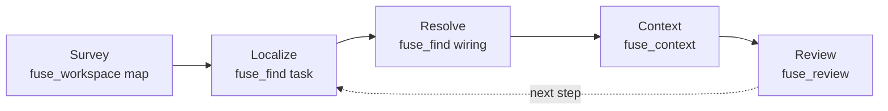

An AI coding agent does not start a task by editing. It starts by finding the right code:
which concrete type runs, which handler processes a request, what a change will break. On
a large .NET solution, directory listings and blind file reads make that search expensive.
Fuse provides targeted calls against a warm persistent index. This page is the mental
model for how an agent strings those calls
together. For what one call does internally, see [How Fuse works](/docs/concepts/how-fuse-works).

## What Blind Exploration Costs

Without a semantic index, the agent reads, decides, and reads again. Each hop is a model
call with latency, and the loop has three costs that compound on a big codebase:

- **Tokens.** Every file opened to orient burns context window that could have gone to the
  change. Much of it is comments, using directives, and boilerplate the agent does not
  need to reason about structure.
- **Round-trips.** Discovery is sequential. A **round-trip** is one read-decide cycle, and
  the agent often re-reads files it already saw because nothing kept a compact map.
- **Lost wiring.** Reading files in isolation, the agent reconstructs the DI registrations,
  the request and route handlers, and the public surface by hand. Grep finds the interface
  but not the type that runs.

## The Measured Boundary

The [benchmark corpus](/docs/project/benchmarks) measures two distinct paths. Open-ended
localization from a title alone recalls 37.7 percent of changed files at a median 1,348
tokens. Review starts from a Git diff, keeps those changed files as must-keep seeds, and
packs the branch context at 93.4 percent precision in a median 1,026 tokens. Review does
not discover the changed files.

The loop benchmark does not show fewer build and test calls. The Fuse arm records a mean
3.1 agent-visible `dotnet build` plus `dotnet test` calls, compared with 3.2 for native.
Its measured result is higher test-verified pass@1 (89 versus 82 percent) and one fewer
false-done rollout (8 versus 9), not a build-round-trip reduction.

## The Loop

Across a task, an agent can use targeted calls against the warm index:

Survey the workspace cheaply with `fuse_workspace` (`action=map`), localize a task to
candidate files with `fuse_find` (`kind=task`), resolve the wiring a task names with
`fuse_find` (`kind=service|request|route|config`), plan and emit the context with
`fuse_context`, and review a branch with `fuse_review`. Pass a `sessionId`
across calls so later calls do not resend files already returned. See
[Sessions and deltas](/docs/concepts/sessions-and-deltas) for the refinement step and
[Context for an agent](/docs/scenarios/context-for-an-agent) for a worked sequence.

When a git base is available, `fuse_review` is the routed default: it seeds on the changed
files and returns the blast radius and packed context in one call. When the task is
open-ended, start with `fuse_find` (`kind=task`); when it names a route, interface,
request, or config section, start with `fuse_find` (`kind=service|request|route|config`).

## Honest Boundary

File count is not a round-trip count: an agent can read several files in one tool call or
revisit one file across several calls. The loop suite counts actual agent-visible build and
test calls and finds no material reduction. Review metrics describe compact Git-seeded
branch context; localization metrics describe open-ended discovery.

## Next

See the measured detail on the [Benchmarks](/docs/project/benchmarks) page,
the narrowing strategies in [Scoping](/docs/concepts/scoping), and the multi-turn step in
[Sessions and deltas](/docs/concepts/sessions-and-deltas).
