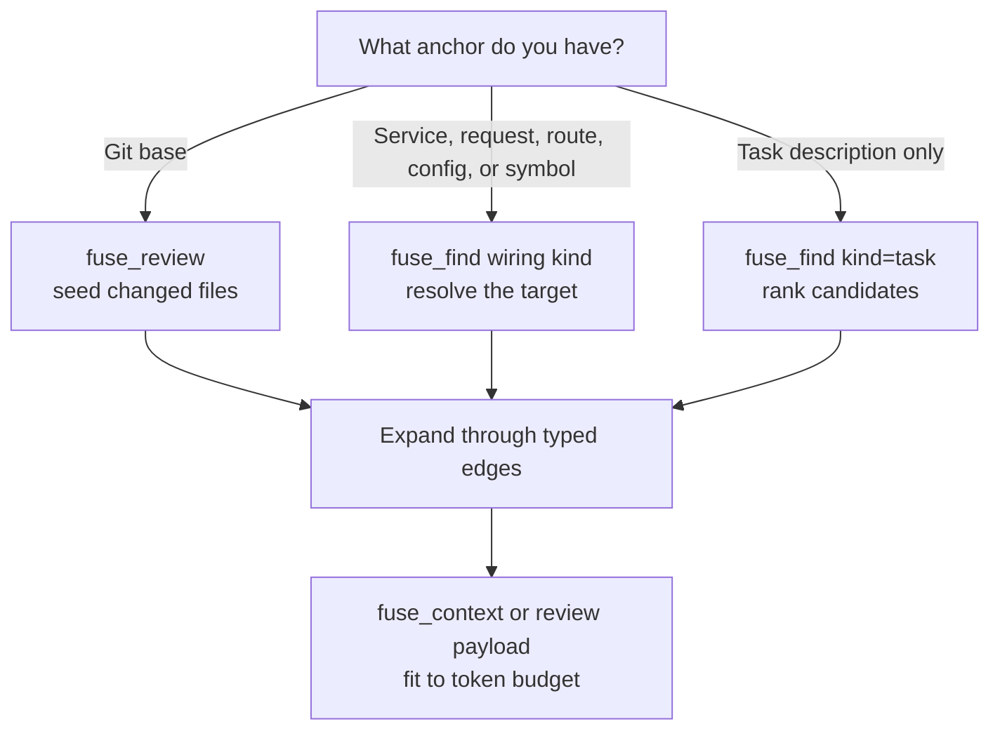

**Scoping** selects the part of the workspace a task needs instead of returning
everything. It works against the warm semantic index in two steps: pick a
**seed** set (by localizing a task, resolving named wiring, or diffing a git change), then
expand from those seeds through the typed graph to a configurable depth, so you get the
relevant neighborhood whole rather than a single file in isolation. MCP review, MCP context, and
offline fusion focus scoping all build the same `ContextPlan` type from the shared `Fuse.Scoping`
module.

There are three ways to seed a request.



| Way | Tool / flag | Seeds on | Use when |
|-----|-------------|----------|----------|
| Localize | `fuse_find` (kind=task) / `fuse localize` | The top-ranked files and symbols for a task | You have a topic but not a name |
| Resolve | `fuse_find` (kind=service\|request\|route\|config) / `fuse resolve` | The real target of a service, request, route, config, or symbol | The task names wiring |
| Review | `fuse_review` / `fuse review --changed-since` | Files changed since a git ref, plus their blast radius | Reviewing a branch or pull request |

## Localize: Scope by Task

```text
fuse localize ./src --task "discount calculation at checkout"
```

Localization ranks candidate files and symbols for a task and returns them with reasons
and token costs, no bodies. Ranking weights a node's declared type and member names and
its path, so a task lands on the file that declares a concept rather than one that merely
mentions it. Ranking is the field-weighted BM25 lexical channel whose rank is carried
through to the score (a stronger lexical match ranks higher, not just present), with one
round of pseudo-relevance feedback that pulls in files sharing the vocabulary of the top
hits, and offline subword and stem bridges so a prose word matches a compound identifier
without any model. Ranked prose localization is the fallback mode; the precise path is an
anchor (a symbol, route, service, request, config section, or git base) resolved through the
graph. Feed the candidate file paths to `fuse_context` to fetch their bodies. It
needs no prior knowledge of a change, which makes it the honest default for one-call
context: on the [benchmark corpus](/docs/project/benchmarks) open-ended localize from a
title alone recalls 37.7 percent of changed files at a median 1,348 tokens. When a git
base is available, change review below packages the Git-known changed files and their
blast radius at 93.4 percent precision in a median 1,026 tokens.

## The Signal-Sufficiency Contract: Refuse and Route

Fuse runs as an MCP server in a loop with a model, so it does not have to win a vague
one-shot query. When a request lacks a usable anchor, the honest answer is not a
low-precision list, it is to **refuse and route**: hand back the partial structure Fuse did
see and ask for a sharper input. The calling model, which is exploring the code anyway, then
issues a better-anchored query. Localization grades every request into one of three states
from the candidate score distribution, with no model:

| State | Meaning | What you get |
|-------|---------|--------------|
| Confident | A candidate or a tight cluster stands clear of the rest | The tight set; this is where precision is won |
| Partial | Some signal, no clear winner | A small best-effort set, flagged low-confidence, plus a navigation map of refinement options |
| Insufficient | No usable anchor (a no-signal title, or a near-empty, near-uniform distribution) | A navigation map and an explicit ask, not a low-precision candidate list |

The grade is computed from fixed thresholds, so the same scores always grade the same way.
A refusal is never a closed door: the **navigation map** carries the top candidate areas
(namespaces or folders), entry-point files and routes, and the nearest indexed symbols to
the request's terms, built from the language-agnostic symbol, route, and file tables. An
agent that does not yet know the right symbol uses the map to find its next probe.

Strictness is opt-in with a graceful default. The default is best-effort-plus-flag, so a
client that cannot refine still gets the partial set with a low-confidence flag. Passing
`strict` (the `--strict` flag, or `strict: true` to `fuse_find` with `kind=task`) hard-requires an
anchor: an insufficient request returns only the navigation map, no file list. The
no-signal classifier (a merge, dependency-bump, or CI title with no code reference) abstains
in both modes, because a title that names no code can only return noise.

## Resolve: Scope by Wiring

```text
fuse resolve ./src --service IOrderService
fuse resolve ./src --request CreateOrderCommand
fuse resolve ./src --route "POST /api/orders/{id}"
fuse resolve ./src --config Orders
```

Resolution is deterministic: it walks the graph to the real target rather than guessing
from vocabulary. A service interface resolves to the concrete type registered for it in
DI, a request or command to its handler, a route to its action, a config section to its
options type, and a symbol to its declaration. This is the step text search cannot do. Use
the resolved names as `fuse_context` seeds (`services`, `requests`, `routes`, `configs`,
`seeds`) to expand and emit them.

## Review: Scope by Git Diff

```text
fuse review ./src --changed-since origin/main --include-tests
```

The seed is the set of files changed since a git ref, which can be a branch, a commit, or
a relative reference like `HEAD~5`. Fuse then computes the **blast radius**: the callers,
DI consumers, route and request handlers, options consumers, and (with `--include-tests`,
on by default) the related tests. This mode needs `git` on your PATH. It is the strongest
mode by measurement: over 69 real merged pull requests, change review keeps the Git-seeded
changed files and packs them with surrounding context at 93.4 percent precision in a
median 1,026 returned tokens ([benchmarks](/docs/project/benchmarks)). The 100 percent
changed-file recall is by construction because those files are must-keep seeds; it is not
a discovery result.

## Expanding through the Typed Graph

Each seed mode then expands the same way. From the seeds, Fuse walks typed edges (calls,
implements, injects, handles, binds) outward to `--depth` (default 2). Each hop is
weighted and the score decays with distance, so the seed neighborhood ranks above distant
files. The expansion prunes low-weight branches so the result is the part a task needs,
not the whole transitive closure.

A changed file rarely stands alone. The handler that processes its request, the type its
DI registration injects, and the test that calls it can be useful review context. Graph
expansion adds that neighborhood with provenance, subject to the available index edges and
token budget.

## Spending the Token Budget

When context is planned under `--max-tokens`, Fuse picks the entries to emit by their real
reduced token cost, not a byte estimate: must-keep seeds are always included, then the
rest fill the budget by weight-per-token so the most relevant code survives and the budget
lands close to full. The render tier of each file is chosen so a budget lands near full
rather than overshooting. A budget of 0 means no limit.

## A Note on Accuracy

Resolution is as complete as the index. When the workspace loads through MSBuild and
Roslyn the graph is semantic; when a project falls back to syntax-only indexing it records
fewer edges. Resolution can still miss edges from dynamic dispatch or reflection because
those targets are not visible to static analysis. Localization ranking rests on the
indexed names, so a task that shares no vocabulary with the target can rank it low. The
shared plan shape, centrality helpers, and packing rules are detailed in
[Scoping internals](/docs/internals/scoping-internals).

## Try a Route

For a branch, run `fuse review ./src --changed-since origin/main`. For a named service,
run `fuse resolve ./src --service IOrderService`. For an open task, run
`fuse localize ./src --task "discount calculation at checkout"` and use the returned
candidate paths as context seeds.
