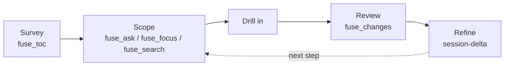

An AI coding agent does not start a task by editing. It starts by exploring: it lists
directories, runs searches, and opens file after file to learn which ones matter, reading
each result into its context window before deciding what to open next. On a large .NET
solution that explore phase is the expensive part of the task. Fuse collapses it into one
scoped call: it finds the code a task needs and hands it over already reduced, so the
agent starts work instead of hunting.

This page is the mental model for how an agent uses Fuse across a whole task. For what
happens inside a single call, see [How Fuse works](/docs/concepts/how-fuse-works).

## What the Explore Phase Costs

The agent reads, decides, and reads again. Each hop is a model call with latency, and the
loop has three costs that compound on a big codebase:

- **Tokens.** Every file opened to orient burns context window that could have gone to the
  change. Much of it is comments, using directives, and boilerplate the agent does not
  need to reason about structure.
- **Round-trips.** Discovery is sequential. A **round-trip** is one read-decide cycle, and
  the agent often re-reads files it already saw because nothing kept a compact map.
- **Lost structure.** Reading files in isolation, the agent reconstructs the dependency
  relationships and the public surface by hand.

## The Measured Cost

The [Layer 4 benchmark](/docs/project/benchmarks) puts numbers on the loop over 90 real
merged pull requests, at a 50,000-token budget, counted with the `o200k_base` tokenizer.

A blind agent must read each file a change touches at least once before it has the
context. That is a structural lower bound, not a measured agent: a mean of 6.9 files per
change, from 4.7 on FluentValidation to 11.9 on Newtonsoft.Json. Reading the repository blind to
find them averages about 409,154 tokens; the files that actually matter are about 25,809
tokens of that.

## The Collapse: One Scoped Call

Fuse acquires that context in one call. Read its token number with its recall: one scoped
`fuse --query` call delivers about 37,000 tokens at 49 percent recall of the changed
files, and the change-scoping mode reaches 89 percent recall when a git base is available.

Against a generic packer (Repomix), which dumps the whole repository in one call of about
424,511 tokens, Fuse ties on round-trips and wins on tokens, roughly 11 times fewer,
because Fuse scopes and the packer dumps. Fuse does not make fewer round-trips than a
packer; both are one call. The win against a packer is tokens; the win against no tool is
the round-trip collapse.

## The Loop, in a Few Cheap Calls

Across a task, Fuse is not only one call. It is a few cheap scoped calls instead of dozens
of blind reads:

Survey the whole codebase cheaply with `fuse_toc`, scope to the area with `fuse_ask` (or
`fuse_focus` and `fuse_search` directly), drill into the dependency neighborhood, review a
branch with `fuse_changes`, and refine across turns with a `session` id so later calls do
not resend files already returned. See
[Sessions and deltas](/docs/concepts/sessions-and-deltas) for the refinement step and
[Context for an agent](/docs/scenarios/context-for-an-agent) for a worked sequence.

## Honest Boundary

The no-tool round-trip count is a lower bound from ground truth, the count of files each
real change touched, not a trace of a running agent; a real agent reads more while
discovering them. A live multi-turn agent trace and end-to-end task resolution are not
benchmarked. The token and recall figures above are measured; treat any wall-clock claim
as illustrative.

## Next

See the measured detail on the [Benchmarks](/docs/project/benchmarks) page (Layer 4),
the narrowing strategies in [Scoping](/docs/concepts/scoping), and the multi-turn step in
[Sessions and deltas](/docs/concepts/sessions-and-deltas).
