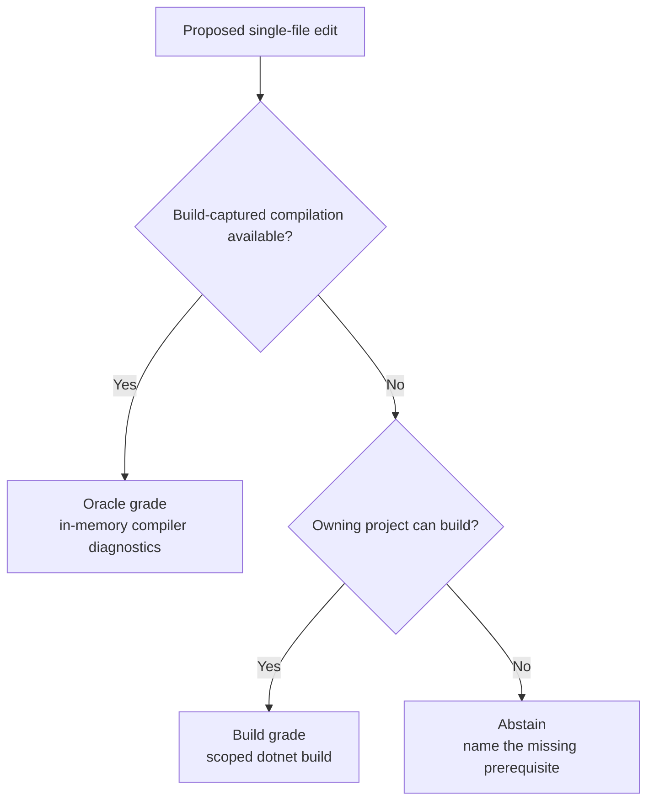

When Fuse answers a verify-class question ("would this edit compile?"), the useful thing is
not just the verdict but how that verdict was reached. A speculative typecheck and a full
`dotnet build` are both real answers, but they carry different guarantees and latencies.
Fuse names which one you got: every verify answer is stamped with a
**verification grade**.

Fuse attempts the fastest available compiler path, falls back to a scoped build, and
abstains when neither path can produce a supported result.

## The ladder

`fuse_check` walks a ladder from the fastest, highest-fidelity answer down to an honest
refusal:



- **oracle** - a speculative typecheck against the build-captured compilation. The
  proposed content is applied to the rehydrated compilation in memory, with no disk write and
  no build during the check. It is available when the repository builds and is captured with
  build capture. Build capture is on by default: the out-of-process build-capture worker ships
  inside the tool and is discovered with no configuration (opt out with
  `FUSE_BUILD_CAPTURE=0`), and a capture bundle produced elsewhere also serves it. The
  sub-second measurements apply to the live resident workspace, which is opt-in with
  `FUSE_RESIDENT=1`.
- **build** - when no oracle substrate is available, Fuse runs the real `dotnet build`
  toolchain scoped to the owning project and parses its diagnostics into the exact same shape
  the oracle path returns. The compiler itself produced this verdict. It costs build
  latency (tens of seconds), and the response reports the elapsed time so the wait is never a
  surprise.
- **abstain** - returned only when even the toolchain cannot run: no buildable project, or a
  build that exceeds the timeout. The abstention always names the missing prerequisite rather
  than guessing green.

The response opens with the grade line, so a client reads the class of truth and the expected
latency before the verdict:

```text
verification grade: build (ran dotnet build scoped to the owning project, 8.4s, no disk write)
diagnostics for OrderService.cs: 1
  Error CS1061 at line 41: 'Order' does not contain a definition for 'TotalAmount'
```

The workflow is identical at either grade - same call, same output shape - only the latency
and the stamped grade differ. An agent can distinguish an in-memory compiler result from a
real project build.

## The tree is never written

Build-grade verification checks *proposed* content, but Fuse does not write your file to run
the build. The owning project is mirrored to a temporary directory, the proposed content
replaces the one file in that copy, its `<ProjectReference>` includes are rewritten to
absolute paths pointing at the untouched original projects, and the build runs in the copy.
Your working tree is not touched, in keeping with the rule that the server only ever writes
the tree through one explicit apply path.

## How the grades are kept honest

Build-grade is ground truth by construction (the real compiler answered), so the honesty
question is whether the fast oracle path agrees with it. Fuse measures this directly: a sample
of compiler-verified mutant edits is run through both paths and their diagnostics compared.
The recorded agreement is published in the check-honesty results
(`tests/benchmarks/results/checkgate.json`), alongside the mutation-derived false-green and
false-red rates. See the [benchmarks page](/docs/project/benchmarks) for the current numbers.

The one-line availability header that store-backed tools prepend also names the grade the
workspace can currently serve ("verify serves oracle-grade" or "verify serves build-grade"),
so an agent knows the class of truth before it makes the call.

## Analyzer and nullable parity

A green compiler check is not the whole story: CI's build step also runs the repository's
configured analyzers (StyleCop, the .NET code-analysis rules, any package analyzers) and
nullable warnings, at the severities the repository's editorconfig sets. A local green
followed by a CI red on an analyzer warning is a wasted round trip. When the opt-in resident
workspace serves the root, `fuse_check` can run analyzers against the overlay compilation and
merge their diagnostics with compiler diagnostics. The recorded resident benchmark measures
raw analyzer execution against the held compilation; it does not establish editorconfig
severity mapping or full CI parity.

Analyzers cost real time (hundreds of milliseconds on the recorded 284-analyzer set). They
are off on the hot per-edit delta path; the `analyzers` parameter controls an explicit
resident check. The build-grade fallback runs the real `dotnet build`, including its
configured analyzers. Without a resident workspace the resident analyzer setting has no
effect.
