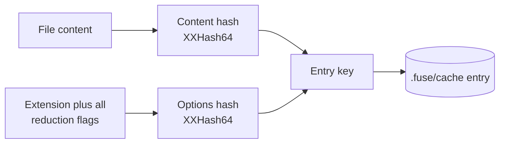

Reducing a file is repeatable work: the same content under the same options always yields the same reduced output. The reduction cache stores that output on disk so a file unchanged since the last run is read from the cache rather than reduced again. This page documents where the cache lives, how its key is computed, how it behaves under concurrency, and how it differs from the per-run content provider.

This page is for maintainers working on caching and for engineers diagnosing why a fusion did or did not reuse cached output.

## Implementation Context

The cache trades disk for compute. It is keyed so that any change to a file's content or to any reduction option produces a distinct entry, which means a stale entry cannot be served: a cache hit is only possible when both the content and the full reduction configuration match exactly. The cost is one small file per cached entry under the source root.

## Location And Layout

The cache lives in a directory named `.fuse/cache` at the source root. Each entry is a single file, named from its key. The directory is created lazily on the first write, so a read-only or never-written cache leaves no directory behind.

## The Cache Key

The key is two 64-bit hashes:

- A content hash: an XXHash64 of the UTF-8 file content.
- A reduction-options hash: an XXHash64 over the file extension plus every reduction option flag.

Because the options hash folds in redaction and every other reduction flag, changing any one of them yields a different key and therefore a distinct entry. The same file reduced under two different option sets occupies two entries, and neither can be mistaken for the other.

## Concurrency And Statistics

Within one run, cache operations are serialized under a single lock, so the cache is safe to share across the parallel reduction workers. Across concurrent runs over the same directory, each run holds its own cache instance, so safety comes from writing every entry to a unique temp file and atomically moving it into place, and from treating a read or write that loses a race as a miss. Because every entry for a given key is byte-identical, a lost write only forces a recomputation, never a wrong result. The run tracks hits and misses, reported at the end as `cache: N hit / M miss`.

## Controls

Two run-level flags govern the cache. The no-cache control bypasses it entirely for the run, so every file is reduced fresh and nothing is read or written. The clear-cache control empties the cache directory before the run begins, then proceeds normally, so the run repopulates it from scratch.

## Distinct From The Single-Read Content Provider

The single-read content provider is a separate, per-run optimization. It reads each file's raw content once per run and shares it across graph building, query indexing, and reduction, so a file is not read from disk several times within one fusion. Each run constructs its own provider, so it holds raw content only for the duration of that run and is never shared with or cleared by another run. The BM25 relevance index is likewise built per run. Because neither holds cross-run state, the orchestrator runs fusions concurrently with no process-wide gate: independent requests (for example two MCP tool calls) execute in parallel and scale toward the core count.

The reduction cache, by contrast, is persistent: it holds reduced output between runs, keyed by content and options. The provider avoids re-reading within a run; the cache avoids re-reducing across runs. They are independent and neither replaces the other.

## What This Does Not Cover

This page documents the reduction cache and its relationship to the content provider. It does not document the reduction transforms themselves or the watch workflow that drives repeated runs; those are covered elsewhere.

## Next

See [The Fusion Pipeline](/docs/internals/pipeline) for where reduction and its caching sit in a fusion, and [Performance](/docs/project/performance) for measured cold-versus-warm timings.
