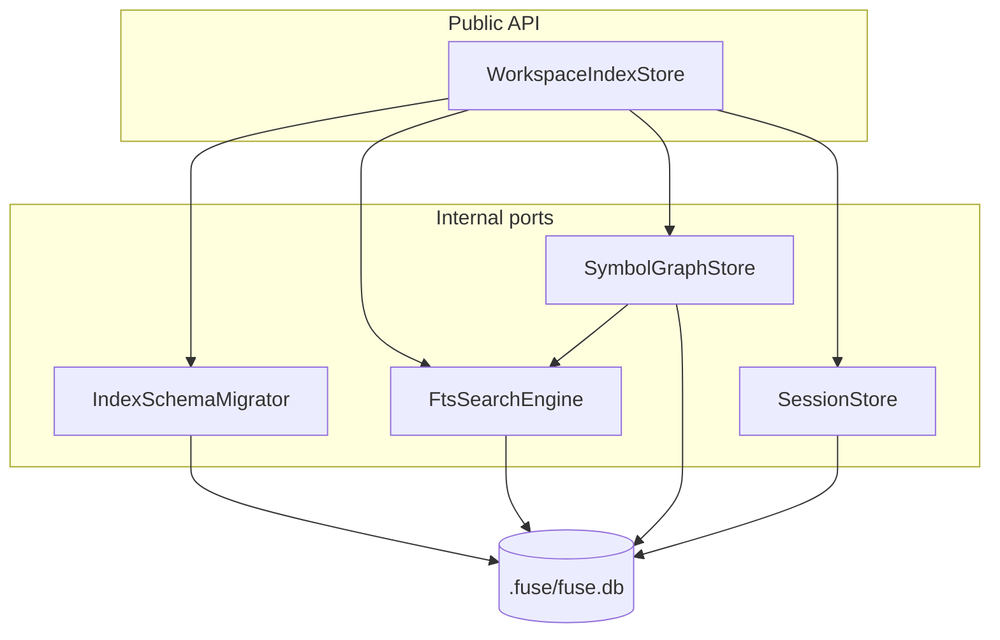
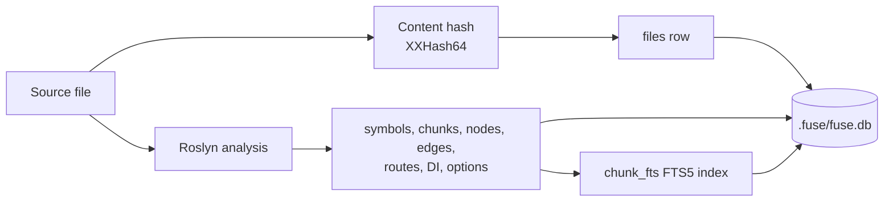

Indexing a workspace is repeatable work: the same source always yields the same symbols, chunks, and wiring edges. Fuse persists that derived graph in one SQLite file so a warm call reads precomputed structure instead of re-analyzing, and an edit re-indexes only the changed files. This page documents where the store lives, its layout, how content hashing drives incremental updates, and how the reduction cache fits in.

This page is for maintainers working on the store and for engineers diagnosing why a call did or did not see fresh data.

## Implementation context

The store trades disk for compute. File records carry a content hash, so an edited file is detected and its derived rows are replaced; an unchanged file is skipped. Because every row is derived from source, a lost or corrupt store costs only a rebuild, never a wrong answer.

## Location and layout

All semantic index data lives in a single SQLite database file named `fuse.db`. Placement depends on whether the workspace is inside a git repository:

| Context | Path |
|---------|------|
| Inside a git repo | `{repoRoot}/.fuse/fuse.db` at the directory that contains `.git`, not under the scoped subdirectory or process working directory |
| Outside a git repo | `~/.fuse/fuse.db` (override the directory with the `FUSE_USER_DATA` environment variable) |

Derived cache data (reduction output and per-run analysis index) lives in a sibling file `fuse-cache.db` in the same `.fuse/` directory (or `~/.fuse/fuse-cache.db` outside a repo). Corruption recovery on the cache file recreates only that database; it never deletes `fuse.db`.

## Store modules (R9)

`WorkspaceIndexStore` is the only public entry for host and MCP callers. Implementation is split across four internal ports in `Fuse.Indexing`; the facade wires lifecycle, delegates reads and writes, and owns the connection factory.

| Port | Responsibility |
|------|----------------|
| `IndexSchemaMigrator` | Pragmas, `schema_version` migration and rebuild, relational DDL ensure, `index_meta` read/write, row counts for state |
| `FtsSearchEngine` | FTS5 availability probe, `chunk_fts` indexing on chunk upsert/delete, BM25-ranked `SearchAsync` |
| `SymbolGraphStore` | Files, projects, symbols, chunks (relational), nodes, edges, routes, DI and options bindings, co-change, graph and symbol queries |
| `SessionStore` | `check_sessions` baselines and `claim_ledger` rows, session listing per workspace root |

The file uses WAL journal mode with `synchronous = NORMAL` and foreign keys on. It is a relational schema, not a key-value cache: separate tables hold files, projects, symbols, chunks, semantic nodes, typed edges, routes, DI registrations, and options bindings, plus an FTS5 virtual table over chunk text (path, name, declared symbols, signature, comments, body, and a subtokens field that holds the subword expansion of the chunk's identifiers so a prose query word matches a compound name). A `schema_version` row gates migration: a database older than the current version is dropped and rebuilt rather than migrated in place, so adding a full-text column (such as subtokens) is a version bump that rebuilds the index on the next run, with no incremental migration.

The `files` table carries a `language` column tagged from the provider that claims each file's extension (for example `csharp`, `python`), so retrieval can filter or blend by language over the language-agnostic tables; symbols and nodes inherit their language through their `file_id`. Adding the column is a schema version bump (currently 14), so the index rebuilds on the next run.

A `git_cochange` table holds mined file-pair couplings (path_a, path_b, count, PMI, Jaccard, last-seen date). It is populated at index time by a bounded git-history miner: one `git log --no-merges --name-only` pass over a capped commit window, counting how often each pair of source files changed in the same commit, skipping wide commits (sweeps) and dropping one-off pairs to bound the pairwise blow-up. The single git invocation has a fixed argument list (a commit cap, no variable path list), so the external-process command line is bounded by construction. Mining is best-effort: a non-repository directory or a missing git executable simply leaves the table empty, and the co-change prior is then a no-op. A re-index clears and rewrites the table, so a fresh mine is authoritative.

## Content hashing and incremental update

Each file row stores an XXHash64 of its content. When the indexer revisits a workspace, a file whose hash is unchanged is left as is; a file whose hash changed has its prior rows cleared (symbols, chunks, nodes, edges, and FTS entries for that file) and re-extracted. Because the file row is the foreign-key parent, clearing and re-inserting a single file's derived rows keeps the graph consistent without a full rebuild. A removed file's rows are deleted. This is what makes a warm re-index cost a function of the changed files rather than the whole tree.

## Symbol and chunk identity

Symbols carry a stable id so the same declaration keeps its identity across re-indexes: `symbol:{assembly}:{kind}:{hash}` from the Roslyn documentation-comment id when the workspace loads semantically, and a source-only fallback id (`symbol:fallback:{path}:{kind}:{name}:{line}`) when it does not. Chunks carry a text hash and a token estimate so the renderer can plan a budget without re-reading the file, and the FTS5 row for a chunk is maintained on every upsert and delete so full-text search never returns a stale chunk.

## Concurrency

Writes within an index batch run in one transaction; reads use pooled connections and a per-connection busy timeout. Across processes, safety comes from WAL mode and content-addressed rows: because a row is derived from a content hash, a concurrent rebuild can only recompute the same bytes, never produce a conflicting answer. The MCP server and the host hold one store open across calls so the warm graph is shared by every call in the session.

The `IndexCoordinator` (MCP host and CLI) enforces single-writer discipline per workspace root: an in-process queue serializes write paths (`InitializeAsync`, `fuse index`, background semantic upgrade), and a per-root named mutex (`fuse-index-writer-{hash}`) arbitrates cross-process contention. A second process that cannot acquire the writer mutex receives `index_busy:` instead of blocking on SQLite or surfacing an opaque exception. Foreground read tools use `OpenForReadAsync` and do not take the writer mutex, so warm reads can proceed while a background upgrade commits in chunks (per project and per 50 files).

Warm foreground reads use a read-only open path (`OpenForReadAsync`): when `fuse.db` already exists at the current schema version, the store verifies the on-disk version and reads FTS availability from `index_meta` without writing metadata. That avoids turning every read into a meta write (which contended with background semantic upgrades under WAL). Write initialization (`InitializeAsync`) runs on first create, schema migration, incompatible-version rebuild, and explicit `fuse index`; it applies migrations, probes FTS5, and stamps `index_meta` once. A background upgrade writer and multiple concurrent read opens can therefore share the same populated database without the read path acquiring a write lock for meta updates.

## What forces a rebuild

Index reuse is gated on two versions, never the product version. The relational **schema version**
(`WorkspaceIndexSchema.TargetVersion`) gates structure, and the **extraction-contract version**
(`WorkspaceIndexSchema.ExtractionContractVersion`, stamped as `index_extraction_version` in `index_meta`)
gates what the indexer extracts (symbol, edge, chunk, and route semantics). A store is reused when both
match; a mismatch rebuilds. The `fuse_version` stamp is kept for diagnostics only and no longer forces a
rebuild, so a minor or patch upgrade (auto-update is default-on) reuses a good index instead of discarding
it on every cosmetic bump. Bump `ExtractionContractVersion` in the same change as any extractor behavior
change; a forgotten bump is the only failure mode, never routine over-rebuilding. A pre-R22 store that
carries only `fuse_version` (no extraction stamp) rebuilds once to gain the stamp, then reuses thereafter.

## Rebuild to a working, searchable index

A version or schema mismatch (and corruption) rebuilds the store's derived data from scratch, and the rebuild always lands on a store that can actually answer a search. Every initialization path, including the incompatible-version rebuild, flows through the FTS5 probe and re-creates `chunk_fts`, then stamps FTS availability and the index mode; the read path returns `index_rebuilding:` until the next pass repopulates chunks. Earlier the version-mismatch path returned before the FTS probe, so a rebuilt store had indexed files but no `chunk_fts`, and the next search threw `no such table: chunk_fts`.

FTS availability is a single source of truth. Both `OpenForReadAsync` and `GetStateAsync` reconcile the stored `fts_available` stamp against the actual presence of the `chunk_fts` table, so the availability line and the status body never disagree. A store whose stamp says available but whose table is missing does not open ready: it forces a rebuild. A search issued against a store missing `chunk_fts` raises `SearchIndexUnavailableException`, which the operational-error boundary maps to `index_rebuilding:` and never to a raw `internal_error`. A store with indexed symbols but zero chunks on an FTS-available runtime is internally inconsistent and is never reported `ready`; it reports `index_rebuilding` so the read path repairs it.

## The reduction cache

Rendering a planned file to a token-reduced form is also repeatable, and that reduced output is cached so an unchanged file under the same reduction level is not reduced twice. The reduction cache is keyed by a content hash combined with a hash of the reduction options, so any change to the file or the level yields a distinct entry and a stale entry can never be served. It lives in `.fuse/fuse-cache.db` (a `kv` table), separate from the semantic index, and is derived data like the per-run analysis index.

## What this does not cover

This page documents the store and its update model. It does not document the analyzers that produce the edges (see [The Fuse pipeline](/docs/internals/pipeline)) or the retrieval that reads them (see [Retrieval internals](/docs/internals/scoping-internals)).

## Next

See [The Fuse pipeline](/docs/internals/pipeline) for where indexing and rendering sit, [Performance](/docs/project/performance) for cold-versus-warm timings, and [Operator guide](/docs/internals/operator) for reset and environment variables.
