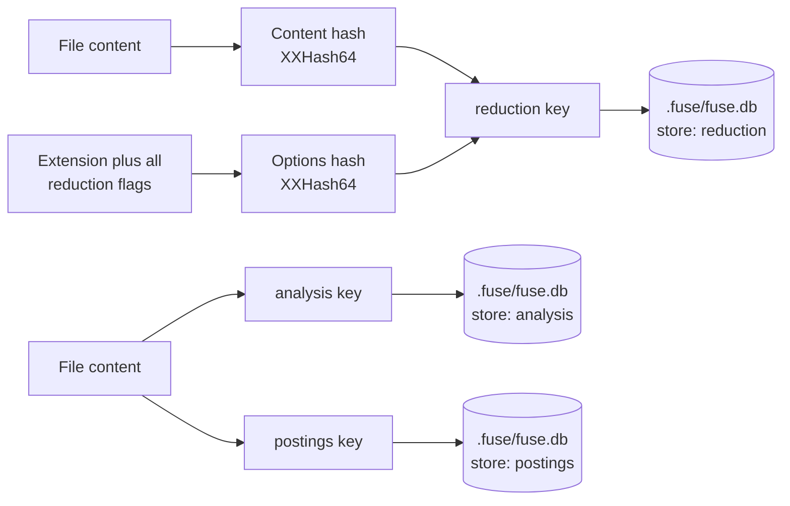

Reducing a file and analyzing it for scoping are repeatable work: the same content under the same options always yields the same reduced output, and the same source always yields the same dependency and symbol analysis. Fuse stores that derived data on disk so an unchanged file is read from the store rather than recomputed. This page documents where the store lives, how keys are computed, how the SQLite layout works, and how it differs from the per-run content provider.

This page is for maintainers working on caching and for engineers diagnosing why a fusion did or did not reuse cached output.

## Implementation Context

The store trades disk for compute. Reduction entries are keyed so that any change to a file's content or to any reduction option produces a distinct entry, which means a stale entry cannot be served: a cache hit is only possible when both the content and the full reduction configuration match exactly. Analysis and relevance entries are keyed by content hash (and, for analysis, an analyzer tag), so an edited file invalidates automatically. The cost is one SQLite database file under the source root.

## Location and Layout

All persistent cache data lives in a single SQLite database file named `fuse.db`. Placement depends on whether the fusion source directory is inside a git repository:

| Context | Path |
|---------|------|
| Inside a git repo | `{repoRoot}/.fuse/fuse.db` at the directory that contains `.git`, not under the scoped subdirectory or process working directory |
| Outside a git repo | `~/.fuse/fuse.db` (override the directory with the `FUSE_USER_DATA` environment variable) |

The file uses WAL journal mode and a single `kv` table partitioned by a `store` column. Three logical namespaces share the database:

| Store namespace | Purpose |
|-----------------|---------|
| `reduction` | Per-file reduced output |
| `analysis` | Referenced types, declared types, and declared symbols for dependency graph and ranking |
| `postings` | Tokenized body text for BM25 relevance indexing |

The database is created lazily on the first write. A corrupt file is deleted and recreated on open rather than failing the run, because every entry holds only derived data. See [Operator guide](/docs/internals/operator) for reset and purge actions.

## Reduction Cache Keys

The reduction key combines two 64-bit hashes:

- A content hash: an XXHash64 of the UTF-8 file content.
- A reduction-options hash: an XXHash64 over the file extension plus every reduction option flag.

Because the options hash folds in redaction and every other reduction flag, changing any one of them yields a different key and therefore a distinct entry. The same file reduced under two different option sets occupies two entries, and neither can be mistaken for the other.

## Analysis and Relevance Keys

The analysis store keys each file by a 32-character hex string combining the content hash with a hash of the analyzer tier tag, so an analysis entry always matches the extractor that produced it.

The postings store keys body tokens by content hash alone. Only the body field is persisted; symbol and path tokenization are cheap, and symbol analysis is already served by the analysis store.

## Concurrency and Statistics

Within one run, the SQLite store serializes writes through a pending buffer and commits them once via `FlushAsync` at the end of the run. Reads use pooled connections and are safe across parallel reduction and graph-building workers. Read-your-writes semantics apply: entries buffered in memory are visible before flush.

Across concurrent runs over the same database, safety comes from SQLite WAL mode and content-addressed keys. Because every entry for a given key is byte-identical, a lost write only forces a recomputation, never a wrong result. The reduction cache tracks hits and misses, reported at the end as `cache: N hit / M miss`.

## Controls

Two run-level flags govern the reduction cache. The no-cache control bypasses it entirely for the run, so every file is reduced fresh and nothing is read or written to the `reduction` namespace. The clear-cache control clears the `reduction` namespace before the run begins, then proceeds normally.

The `--index` flag enables the persistent analysis and postings stores. It is off by default for one-shot CLI runs and enabled automatically in watch mode and the MCP server, where a session makes several calls and the analysis cost is paid once.

## Distinct from the Single-Read Content Provider

The single-read content provider is a separate, per-run optimization. It reads each file's raw content once per run and shares it across graph building, query indexing, and reduction, so a file is not read from disk several times within one fusion. Each run constructs its own provider, so it holds raw content only for the duration of that run and is never shared with or cleared by another run. The BM25 relevance index is likewise built per run. Because neither holds cross-run state, the orchestrator runs fusions concurrently with no process-wide gate: independent requests (for example two MCP tool calls) execute in parallel and scale toward the core count.

The SQLite store, by contrast, is persistent: it holds reduced output and analysis between runs. The provider avoids re-reading within a run; the store avoids re-reducing and re-analyzing across runs. They are independent and neither replaces the other.

When the persistent index is enabled, a warm query against an unchanged tree finds every file's analysis and body tokens in the store and skips re-tokenizing and re-parsing, so the index build drops from a cost in the number of files to a cost in the number of changed files plus the query. Ranking with persisted tokens is identical to the in-memory build.

## What This Does Not Cover

This page documents the persistent store and its relationship to the content provider. It does not document the reduction transforms themselves or the watch workflow that drives repeated runs; those are covered elsewhere.

## Next

See [The Fusion Pipeline](/docs/internals/pipeline) for where reduction and its caching sit in a fusion, [Performance](/docs/project/performance) for measured cold-versus-warm timings, and [Operator guide](/docs/internals/operator) for reset and MCP environment variables.
