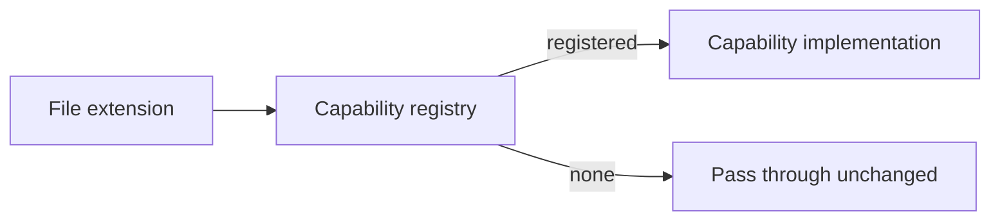

Fuse keeps language-specific behavior out of the core pipeline. Reducing C#, extracting a skeleton, detecting routes, and finding type references are not pipeline code; they are capabilities supplied by plugins and resolved by file extension at runtime. The pipeline asks a registry for the capability that handles a given extension and applies it, without knowing which language it is working with. This page describes the capability contracts, how registries resolve them, and how a plugin registers them.

This page is for engineers who want to understand the plugin boundary and for contributors adding support for a new language or format.

## Architectural Rationale

A pipeline that switches on file extension strings grows a branch for every new language and couples every stage to every language. Fuse inverts that. Each unit of language behavior implements a small interface, plugins register their implementations through dependency injection, and the pipeline resolves the right implementation by extension. Adding a language is then a registration, not an edit to the pipeline. The pipeline never names a language and never inspects an extension string directly.

## Registration Through Dependency Injection

Language behavior is registered with the service container, not hard-coded. The default composition registers the C# language plugin and the built-in format reducers:

```csharp
services.AddCSharpLanguage();   // C# reducer, skeleton, markers, dependencies, type locator, maps, detectors
services.AddFormatReducers();   // reducers for HTML, JSON, YAML, XML, and other formats
```

A host that wants a different set of languages calls the core registration directly and composes its own plugins on top.

## The Capability Contracts

Every capability extends the base contract, which declares the file extensions it handles. Resolution is by extension, matched case-insensitively, each including its leading dot.

| Interface | Responsibility |
|-----------|----------------|
| `IContentReducer` | Reduce a file's content for its extension |
| `ISkeletonExtractor` | Produce a signatures-only structural skeleton |
| `ISemanticMarkerGenerator` | Generate type-level annotation comments |
| `IDependencyExtractor` | Extract referenced type names for the dependency graph |
| `ITypeNameLocator` | Resolve a type name to the file or files that define it |
| `ISymbolOutlineExtractor` | Produce a per-file symbol outline for the table of contents |
| `ISymbolSliceExtractor` | Reduce a file to one member, keeping its body and signatures only for the rest |
| `IRouteMapGenerator` | Produce an endpoint table for the fusion |
| `IProjectGraphGenerator` | Produce a solution and project reference graph |
| `IPatternDetector` | Detect a cross-codebase convention across all fused files |

`ISymbolOutlineExtractor` and `ISymbolSliceExtractor` live in `Fuse.Plugins.Abstractions` alongside the other contracts. The outline extractor backs the table-of-contents survey; the slice extractor backs `Type.Member` focus scoping.

Pattern detectors are the exception to per-extension resolution. They derive from a batch base class that runs a reset, one accumulate call per file, and a finalize call, so a detector folds signals across the whole fused set in a single pass rather than being resolved for one file. Detectors are stateful and run one batch at a time.

## Capability Registries

A capability registry builds an extension-to-capability map at startup. It iterates every registered implementation, and for each extension that implementation declares, it records the implementation under that extension. The pipeline then resolves a capability by passing a file's extension; the registry returns the registered implementation or nothing when no capability handles that extension.

Last registration wins. When two implementations declare the same extension, the one registered later replaces the earlier one in the map. A specialized plugin can therefore override a default by registering after it. Resolution returning nothing is a normal outcome: a file whose extension has no registered reducer passes through reduction unchanged, and a file with no registered dependency extractor contributes an empty reference list to the graph.

The opt-in Roslyn precision tier is built on this rule. When enabled, it registers Roslyn implementations of the existing C# capabilities, the skeleton, dependency, type-name, and outline extractors, after the default regex ones, so the Roslyn implementations win for `.cs`. The tier is a separate assembly the Native AOT package does not reference, so the AOT build keeps the regex defaults.



## The Five Registries

The core registration builds five registries, one per resolvable-by-extension capability that the pipeline consults during collection-to-reduction work:

- `IContentReducer`
- `ISkeletonExtractor`
- `ISemanticMarkerGenerator`
- `IDependencyExtractor`
- `ITypeNameLocator`

The remaining capabilities (route map and project graph generators) are resolved as single optional services rather than through an extension-keyed registry, and pattern detectors run as a batch. The pipeline and orchestrator resolve every per-extension capability through these registries; neither switches on extension strings directly.

## What This Does Not Cover

This page describes the capability boundary and resolution. It does not document the internal algorithms of any specific capability, such as how the dependency extractor or BM25 index work; see [Scoping Internals](/docs/internals/scoping-internals). It does not give a step-by-step plugin walkthrough.

## Next

See [Extending Fuse With A Language Plugin](/docs/internals/extending/language-plugin) to implement and register a new language. See [The Fusion Pipeline](/docs/internals/pipeline) for where each capability is consulted, and [Core Concepts](/docs/concepts/how-fuse-works) for the conceptual overview.
