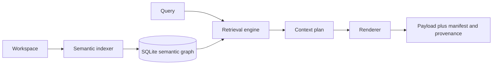

Fuse has two phases over one persistent store, not a single pass over files. The indexing phase reads a workspace through Roslyn and writes a semantic graph to SQLite. The retrieval phase reads that graph to answer a query: it localizes candidates, resolves named wiring, expands through typed edges, plans a context set under a budget, and renders it. The store is warm: the index survives between calls, so retrieval is a read against precomputed structure rather than a fresh collect-and-rank.

This page is for engineers building a mental model of the runtime and for maintainers who need to know where a given concern lives.

## Architectural rationale

The phases change for different reasons. Indexing changes when language analysis or the schema changes. Retrieval changes when candidate generation, edge weighting, or packing changes. Rendering changes when an output format or reduction tier changes. Keeping them in separate projects means a change to one does not force a rebuild of the reasoning in another, and the store is the single contract between writing the graph and reading it.

## The projects

| Phase | Project | Responsibility |
|-------|---------|----------------|
| Store | Fuse.Indexing | SQLite schema, migrations, transactional upserts, FTS5, graph edge storage, query APIs |
| Indexing | Fuse.Semantics | Project discovery, MSBuild/Roslyn load (syntax fallback), symbol and chunk extraction, the wiring analyzers |
| Retrieval | Fuse.Retrieval | Localize, resolve, typed graph expansion and pruning, context and review planning |
| Rendering | Fuse.Reduction plus Fuse.Emission and language plugins | Reduce each planned file to its render tier, build the manifest and provenance, format and budget the payload |

## Indexing phase

The semantic indexer discovers the workspace (a `.sln`, `.slnx`, the `.csproj` set, or a syntax-only fallback), loads it through MSBuild and Roslyn when possible, and walks each compilation. It writes file and project records, symbols with stable ids, chunks (with token estimates and full-text columns), and runs the wiring analyzers that emit typed edges: interface implementation and inheritance, DI registration and constructor injection, MediatR request-to-handler, ASP.NET route-to-action, and options binding and consumption. When MSBuild cannot load the workspace, the indexer falls back to syntax-level extraction so the store is still populated, and records the mode as `semantic`, `partial`, or `syntax`.

The per-project wiring-analyzer pass runs concurrently across projects (R45), bounded by processor count. Each project's graph is independent - it binds its own compilation with no shared mutable state, so distinct compilations parallelize rather than serialize - and the per-project results are merged positionally in project order, so the flattened nodes (last-writer-wins by id) and edges are byte-identical to the sequential pass. Only the pass runs concurrently, not the merge. Measured on eShopOnWeb (10 projects): the analyzer pass dropped from about 3.4s to 0.75s.

On the semantic path each C# file is parsed once and the syntax tree is shared between the chunk (symbol) extractor and the route extractor (R47), rather than each re-parsing the file's content string. Roslyn already parsed every file for the compilation, and the chunk/route pass added two more parses per file; sharing one parse removes a parse per file on the cold-index hot path with byte-identical chunk and route output. The syntax-only tier still parses once per file as before.

The store is a single SQLite file at `.fuse/fuse.db` in WAL mode. Nodes, edges, symbols, chunks, routes, DI registrations, and options bindings are relational tables; an FTS5 virtual table backs full-text search. Re-indexing a changed file clears its prior rows and re-extracts, so the graph stays consistent without a full rebuild.

Cold start serves the syntax tier first, then upgrades to the semantic graph in the background. Because the cold index time is dominated by the MSBuild load, a first read runs a syntax-first pass (parallel per-file extraction, no MSBuild) that produces a usable full-text and symbol index in a few-to-twenty seconds, flags `semantic_pending`, and serves the call; the host then runs the full semantic pass (MSBuild and the wiring analyzers) on a background store and clears the flag when the graph lands. The explicit `fuse index` command stays a synchronous full pass. See [Performance](/docs/project/performance) for the measured cold-start split.

The syntax tier is provider-driven. A language-provider seam (`ILanguageSyntaxProvider`) claims a set of file extensions and extracts symbols and chunks with no compiler, and the indexer selects a provider by extension and drives the file scan from the registered providers' extensions, rather than hardwiring one language. C# is one provider (the Roslyn-syntax extractor behind the seam), and other languages register a provider without changing the shared indexer: a Python provider and a JavaScript/TypeScript provider (bounded, offline line lexers) ship today, and a tree-sitter-backed extractor can later replace a regex provider behind the same seam without touching the indexer or the retrieval features. The typed-graph (semantic) tier remains C#/Roslyn. Each file is tagged with its provider's language, so retrieval can filter or blend by language. This is what lets a non-C# file index, full-text-search, and localize through the same pipeline.

## Retrieval phase

A query enters as a localization, resolve, context, or review request. The retrieval engine generates candidates from several sources (exact resolution of a named route, service, request, or config; full-text hits; path matches; changed files from a git base), normalizes their scores, and expands the seed set through the typed edges with per-edge weights and pruning. The result is a context plan: an ordered set of files, each with a role, a render tier, a token estimate, and a provenance chain explaining why it was included.

Resolve is the deterministic core: it looks up a node by name or constructed id and follows one typed edge (for example `di_resolves_to`, `di_decorates`, `mediatr_handles`, `route_handles`, `hosted_service`, `pipeline_behavior`, `ef_entity`, `ef_configures`, `grpc_endpoint`, or `signalr_endpoint`) to its target, with no source bodies. Review seeds the plan with the changed files as must-keep and expands the blast radius (callers, DI consumers, route and request handlers, options consumers, tests).

## Rendering phase

The context renderer turns a plan into a payload. Each file is reduced to its planned tier (full source, reduced, skeleton, or public API), the manifest and per-file provenance are prepended, secrets are redacted, and the whole is formatted (XML, Markdown, or JSON) within the token budget. Must-keep seeds are always included even when the budget is tight.

## Data flow

## The warm host

The same engine runs behind a long-lived host so the index stays warm across calls and a file watcher keeps it current. The CLI and the MCP server build or reuse the index on first use; the host promotes that to a persistent service. See [Caching internals](/docs/internals/caching-internals) for the store lifecycle.

## What this does not cover

This page describes phase ordering and ownership. It does not document the candidate-generation and edge-weighting algorithms (see [Scoping internals](/docs/internals/scoping-internals)), the capability resolution mechanism (see [Capability and plugin model](/docs/internals/capability-model)), or the request object model (see [Options model](/docs/internals/options-model)).

## Next

Read [Scoping internals](/docs/internals/scoping-internals) for candidate generation and graph expansion, the [Capability and plugin model](/docs/internals/capability-model) for how language behavior resolves, or [How Fuse works](/docs/concepts/how-fuse-works) for the conceptual overview.
