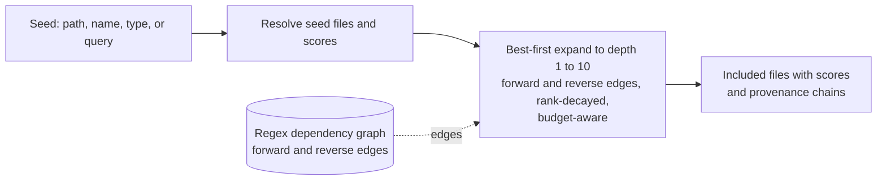

Scoping narrows a fusion to the files relevant to a task. Three modes drive it: focus from a named seed, changes from a git ref, and query from a search string. All three rest on the same two mechanisms, a relevance index and a dependency graph, plus a seed resolver that maps a seed to starting files and expands outward. This page documents those mechanisms, the constants they use, and where their accuracy ends.

This page is for maintainers working on scoping behavior and for engineers who need to know why a scoped fusion includes or omits a given file.

## Implementation Context

Scoping is best-effort by design. The dependency graph is built from regular expressions over file text, not from a compiled semantic model, so it approximates the real reference structure rather than reproducing it. Every mode that expands through the graph inherits that approximation. The honest ceiling on scoping accuracy is the regex graph: it is the largest source of both missed edges and false edges, and no amount of seed-resolution precision compensates for an edge the graph never recorded.

The regex graph is the AOT-clean default. An opt-in precision tier (see [Precision Tier](#precision-tier-roslyn)) replaces the regex extractors with Roslyn syntax analysis, which lifts the parts of that ceiling caused by lexical extraction, at the cost of pulling in a non-AOT dependency. The two tiers produce the same graph shape and feed the same expansion; only the per-file extraction differs.

## BM25F Relevance Index

Query scoping ranks files by lexical relevance to a query using BM25F, the fielded form of BM25, with K1 = 1.2. Each document carries three fields with independent length-normalization (B) and boost weights: the body (B 0.75, boost 1.0), the declared symbol names (B 0.5, boost 5.0), and the path tokens (B 0.5, boost 3.0). Field contributions are combined before the term-frequency saturation, per the BM25F model. The effect is that a query term matched in a file's declared types or members, or in its name, counts for more than the same term buried in its body, so the file that declares or is named after a concept ranks above files that merely mention it. The declared symbol field is populated from the type-name locator capability, which for C# contributes declared type and member names.

Tokenization and normalization come from a single tokenizer shared by indexing and querying, so both sides use the same vocabulary. It splits on non-word characters, then splits each identifier on camelCase, PascalCase, and snake_case boundaries, so `OrderService` is indexed under `order` and `service` as well as the whole token. It then drops a small set of English and code stopwords and applies a light suffix stemmer that folds common plural and verb endings, so `validators` and `validator` reduce to one term and a natural-language query lands on the same stems as the code. Matching is case-insensitive.

The index is rebuilt on each run and is not thread-safe; indexing must complete before ranking. Ranking is lexical and best-effort. It rewards shared vocabulary, which means it can surface a file that merely happens to share a word with the query, and it can miss a conceptually related file that shares no vocabulary at all. It has no semantic understanding of the code.

## Dependency Graph

The dependency graph maps each file to the type names it references, each type name to the files that define it, each file to the type names it declares, and each type name to the files that reference it. The last two are the reverse edges: joined together they reach a file's dependents, the files that reference the types it declares. All directions are built from regular expressions; there is no Roslyn or compiler involvement. Before extraction, comments and string and character literals are blanked by the language extractor (the C# extractor uses a single-pass sanitizer that preserves character positions), so a type name that appears only in prose or text no longer records a false edge. The graph remains best-effort: it may still miss references that arrive through dynamic dispatch or reflection. A file whose extension has no registered dependency extractor contributes an empty reference list.

The graph is built in parallel across files, and its output ordering is made deterministic by reordering the result to follow the input file order regardless of how the parallel work completed.

## Focus Seed Resolution

Focus scoping resolves a seed string to one or more starting files by trying strategies in a fixed order and stopping at the first that yields any match:

1. Exact relative path.
2. Exact file name.
3. Type name, resolved through the type-name locator capability to the files that define that type.
4. Directory prefix, matching every file under that path.

Only the type-name strategy reads file content. If no strategy matches, the fusion fails with a diagnostic rather than producing an empty result silently.

## Path Expansion

From the resolved seed set, expansion is a best-first traversal through the dependency graph to the configured depth, which ranges from 1 to 10. Each seed starts with a score: 1.0 for a focus or change seed, and its BM25F relevance for a query seed. A neighbour's score is its parent's score multiplied by a per-hop decay (0.5), so files near a strong seed rank well above files several hops out or off a weak seed. The traversal admits the highest-scoring candidate first; seeds are always admitted. Each file is included once, with the highest score and shortest chain by which it is reached, and the expansion records a provenance chain for every included file: the hop sequence from a seed to that file, inclusive. That chain is surfaced when provenance annotation is requested with the provenance flag.

Expansion can follow forward edges, reverse edges, or both. Focus follows both, so a focus seed pulls in the files it depends on and the files that depend on it (its dependents). Query follows forward edges only, expanding ranked seeds to their dependencies without broadening to every file that uses a matched type. Change scoping follows reverse edges one hop when dependents are requested, reaching the files that reference the changed files.

When a token budget is set, expansion is budget-aware: it keeps admitting candidates in score order until a rough pre-reduction token estimate of the admitted set would exceed the budget, then stops. Because admission is by score, the seeds and their nearest neighbourhood survive and the weakest, most distant files are the first to be cut. The per-file score that ordered the traversal is carried forward to emission, where entries are written most-relevant first so the closest files also survive the exact token budget applied after reduction.

### The Centrality Prior

A query-independent importance prior is blended into the rank score so that, at equal relevance, the more depended-upon file ranks earlier. The prior is normalized in-degree centrality computed from the already-built graph: a file's score is the count of distinct other files that reference any type it declares, divided by the largest such count, giving a value in the range 0 to 1. It is computed once per run and adds no extra file reads. The rank score is relevance plus weight times centrality, where the weight is the `FUSE_CENTRALITY_WEIGHT` environment variable (default 0.15). The blend is additive and is applied only to the recorded and admission-ordering score, never to the score propagated to neighbours, so it cannot compound across hops; a weight of 0 reproduces the pre-centrality ordering exactly.

Query scoping reuses the same traversal from its ranked seed files.

## Precision Tier (Roslyn)

The default dependency, type-name, skeleton, and outline capabilities for C# are regex-based and Native AOT clean. An opt-in precision tier registers Roslyn implementations of the same capability interfaces, selected at process start by the `--semantic` flag or the `FUSE_SEMANTIC` environment variable. Because each capability registry resolves an extension to its last registration, registering the Roslyn implementations after the defaults makes them win for `.cs` while the regex implementations stay the fallback for any capability the tier does not provide.

The Roslyn extractors work from the parsed syntax tree rather than line-based regex, so conditional compilation, partial classes, and braces inside strings no longer desynchronize the skeleton extractor (the cause of the skeleton collapse on heavily conditional code), and the dependency extractor captures references the regex misses, such as return types, generic arguments, and object creations. The tier is syntax-level, not full semantic binding: it identifies type-position identifiers without resolving them across a compilation, so it is a more accurate approximation than regex, not a guaranteed-complete call graph. Roslyn is not trim or AOT compatible, so the tier lives in a separate assembly that the Native AOT package does not reference; the AOT build always uses the regex tier.

## Symbol-Level Scoping

With the precision tier active, a focus seed of the form `Type.Member` scopes the seed file to a single member. The resolver first tries the seed as a whole; when that does not resolve and a symbol-slice capability is registered, it splits the seed at the last dot, resolves the type, and records the member. After reduction, the seed file's content is replaced by a slice that keeps the named member's body in full and reduces every other member of the file to its signature, so a large file costs only the member plus its type shell. When no slice capability handles the extension or the member is not found, the whole file is emitted unchanged, so the regex default is never altered.

## Persistent Analysis Index

The per-file analysis the graph build and the relevance index need (referenced types, declared types, declared symbols) can be cached on disk under `.fuse/index`, keyed by a hash of the file content and the analyzer tier. An unchanged file is a hit; a changed file is a miss that overwrites its entry; switching between the regex and Roslyn tier uses a different key. One index instance is shared across a run, so the query relevance pass warms entries that the graph build then reuses. The index is off by default for one-shot CLI runs and enabled automatically in watch mode and the MCP server, where a session makes several calls and the analysis cost is paid once. It mainly amortizes the cost of the Roslyn parse; the regex extraction is already cheap.

## Hybrid Retrieval (Vector Rerank)

Query scoping can rerank its BM25 candidates with embedding-vector similarity before expansion. BM25 stays the recall stage and selects the candidates; the reranker only reorders them, blending the normalized BM25 score with the cosine similarity between the query embedding and each candidate embedding, so a weak embedding cannot drop a lexically strong match below the cut. The default embedding is a deterministic, AOT-clean lexical model that hashes tokens and their character trigrams into a fixed number of buckets; the character trigrams add sub-word overlap so a query term matches an identifier that shares stems. It is a lexical signal and does not bridge a true semantic gap (a query that shares no words or stems with the target file); the `IEmbeddingModel` interface is the extension point for a learned model that would. Candidate vectors are cached on disk under `.fuse/index/vectors` when the persistent index is enabled. The reranker is off by default and enabled with the rerank flag.

## What This Does Not Cover

This page documents the scoping algorithms. It does not give command syntax for selecting a mode or setting depth; see the [Scoping guide](/docs/concepts/scoping). It does not cover the reduction or emission of the files scoping selects.

## Next

See [Scoping To What Matters](/docs/concepts/scoping) for task-oriented use of the three modes, and [The Fusion Pipeline](/docs/internals/pipeline) for where filtering sits in the run.
