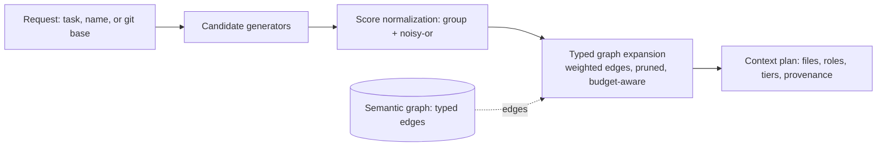

Retrieval narrows a workspace to the files a task needs by reading the persistent semantic graph, not by ranking a fresh in-memory index. It runs in three steps: generate candidate nodes from several sources, normalize their scores into one ranking, and expand the seed set through the typed edges with per-edge weights and pruning. The result is a context plan: an ordered set of files, each with a role, a render tier, a token estimate, and a provenance chain. This page documents those steps and where their accuracy ends.

This page is for maintainers working on retrieval behavior and for engineers who need to know why a query includes or omits a given file.

## Implementation context

Retrieval is only as good as the index beneath it. When the workspace loads through MSBuild and Roslyn, the graph carries resolved symbols and the wiring edges (DI, MediatR, routes, options); when it falls back to syntax-only indexing, the graph is sparser and expansion has fewer typed edges to follow. The index mode (`semantic`, `partial`, or `syntax`) is recorded so a result can be read in light of how much structure was available.

## Candidate generation

A localization request is turned into candidate nodes by several generators, each blind to the others:

- Exact resolution: a named route, service, request, or config section is resolved through the graph to its node (the same lookup `fuse resolve` uses), and a symbol name is matched to its declaration. These are the highest-confidence candidates.
- Lexical (BM25F with pseudo-relevance feedback): the query tokens are matched against the FTS5 index over chunk path, name, declared symbols, signature, comments, body, and a subtokens field, with column weights that favor names and signatures over body text. The **subtokens** field is the subword expansion of the chunk's identifiers: at index time each identifier in the name, declared symbols, and signature is split on camelCase humps, snake_case underscores, acronym boundaries, and letter/digit transitions (so `ApplyRoundingMode` stores `apply`, `rounding`, `mode`), computed in C# and stored as text, no tokenizer plugin required. The query is split the same way before it hits FTS, so a prose word matches a compound name (`rounding` finds `ApplyRoundingMode`) even though the default tokenizer treats the whole identifier as one opaque token. The subtokens column is weighted below the exact name but above the body, so an exact name match still ranks first. Two further offline bridges compose with subwords. A **stems** field holds the Porter-stemmed form of the identifiers and comments, and query terms are stemmed the same way, so an inflected word matches an inflected one (`calculate` finds `Calculation`, `rounds` finds `rounding`); it is weighted lowest, as a fuzzy bridge, and only letters are stemmed so code tokens and digits pass through unchanged. The **comments** field indexes the human-written comment prose extracted from each chunk (line, block, XML-doc, and hash comments, markers and tags stripped) as its own field weighted above the body, because comment prose uses the developer's vocabulary, which is the vocabulary a natural-language query is written in. Unlike a flat full-text pass, the lexical generator carries the BM25 rank through to the candidate score: hits are collapsed to one candidate per file, the best in-pool file keeps its band ceiling (a name-field match outranks a body-only match), and the score decays with rank to a floor, so the lexical order survives the noisy-or merge and truncation. It then runs one round of pseudo-relevance feedback: the distinctive symbol names of the top files seed an expanded query, and a capped number of new, vocabulary-related files are added as a weaker signal. This is the channel that recovers identifier-rich and natural-language recall without a model.
- Dense (embedding similarity, on by default): each chunk is embedded at index time and the vector is persisted alongside the relational tables. At query time the query is embedded once and ranked by cosine over the persisted vectors (unit vectors, so cosine is a dot product), collapsed to the best chunk per file. This is the channel that finds a file by meaning when a prose query shares no tokens with the code. The small embedding model (all-MiniLM-L6-v2, about 23 MB) is fetched once and cached on the first index, then every later run and all query-time work is offline. The retired floor: the old "no model present" design floor is gone, so dense is part of the headline path, opt-out via `FUSE_DENSE` set to a falsy value. The no-rewrite rule holds: the query string is embedded as written, never paraphrased. When the model is genuinely absent (offline first run, or the fetch blocked) the path degrades gracefully to lexical only.
- Path: query tokens of three or more characters are matched against file paths.
- Changed files: when a git base is supplied, the changed files become must-keep candidates.

A candidate carries a node id (for exact and graph candidates) or a file path (for file-only full-text and path candidates), a source weight, and a reason.

## Score normalization

Candidates that point at the same node or file are grouped and their source scores combined with a noisy-or rule: the combined score is one minus the product of one minus each source score. Corroboration from several sources raises the score toward but never past one, and a single-source candidate keeps its own weight. Grouping is by node id, so a symbol-level candidate stays distinct from a file-level one while duplicate file candidates (a full-text hit and a path hit for the same file) merge. The output is ranked by score, then by path for stability.

## Structural priors

After scoring, a structural prior nudges ambiguous candidates by where they sit in the graph, not just what they match. The dependency-centrality prior multiplies a candidate's score by a small, capped factor (at most plus ten percent) proportional to its file's normalized node degree, so a widely-depended-on file outranks a leaf for an otherwise-tied query. The multiplier is on the existing score, so it tunes the ranking and cannot promote an irrelevant (near-zero score) file on centrality alone. It is computed over the semantic node and edge tables, so in syntax mode (no edges) it is a no-op and scoring is unchanged; it moves results only where a real graph exists (partial or semantic mode).

The git co-change prior recovers the sibling files of a multi-file change. At index time a bounded git-history miner records, for each pair of source files, how often they changed in the same commit, with the pair's Jaccard coefficient and PMI (see [Caching Internals](/docs/internals/caching-internals)). At query time the prior boosts a candidate that co-changes with a strictly stronger candidate by a small, capped factor (at most plus fifteen percent) proportional to the Jaccard of that coupling, so a file that historically ships alongside a strong hit is nudged up even when it shares little query vocabulary. Like centrality, the multiplier is on the existing score, so it cannot promote a near-zero-score file on co-change alone, and it is a no-op when no co-change was mined (no git history, or a repository whose pairs all fell below the miner's floor). It reads the language-agnostic file paths, so it carries to any language.

## Graph-aware discovery (opt-in)

Localization can optionally enrich its selected candidates with their typed-graph neighborhood, so a query that lexically hits only an interface also returns its implementation and a caller even when those share no vocabulary with the query. After the set is selected, the top one or two seeds are expanded one hop through the typed graph (the same expansion review and context use), and a capped number of new neighbor files are admitted at their decayed expansion score, then the set is re-ranked. The expansion is bounded by seed count, depth, and a neighbor cap, so a single weak seed cannot pull in a large subtree, and it is a no-op in syntax mode. It is off by default and enabled per request (the `expand` option), because the structural blast radius widens recall but pressures precision: it is an explicit operating point for discovery, not the precise default.

## Typed graph expansion

From the scored seeds, expansion walks the edges to a configured depth. Edges are typed and weighted: a strong, deterministic edge (a route to its action, a request to its handler, a service to its implementation) carries more weight than a weaker structural or co-change edge, and a neighbor's score is its parent's score times the edge weight. Expansion admits the highest-scoring candidate first and prunes low-scoring branches, so the seed and its nearest semantic neighborhood survive while distant, weakly connected files are cut. Each file is included once, by the highest-scoring chain that reaches it, and the chain is recorded as that file's provenance.

When a token budget is set, expansion is budget-aware: it keeps admitting candidates in score order until a pre-render token estimate of the admitted set would exceed the budget, then stops. Must-keep seeds (the exact resolution targets, and the changed files in a review) are always admitted regardless of budget.

## Resolve

Resolve is the deterministic core the other modes reuse. It finds a node by display name or by a constructed id (`route:{METHOD}:{pattern}`, `service:{name}`, `config:{section}`, or a symbol id) and follows one typed edge to its target: `di_resolves_to` for a service, `mediatr_handles` for a request, `route_handles` for a route, `options_binds` for a config section. It returns the matched node, its target, and the evidence, with no source bodies.

## Review

Review seeds the plan with the files a git diff changed, marked must-keep, and expands the blast radius: the changed symbols' callers, the DI consumers of changed services, the handlers of changed routes and requests, the consumers of changed options, and the related tests. The changed files are always kept; the expansion adds the unchanged context needed to understand the change, each with a provenance chain naming the edge that pulled it in.

## What this does not cover

This page documents the retrieval algorithms. It does not give command syntax (see [Scoping](/docs/concepts/scoping)), the index schema and analyzers that produce the edges (see [The Fuse pipeline](/docs/internals/pipeline)), or the rendering of the files retrieval selects.

## Next

See [Scoping](/docs/concepts/scoping) for task-oriented use of localize, resolve, and review, and [The Fuse pipeline](/docs/internals/pipeline) for where retrieval sits in the run.
