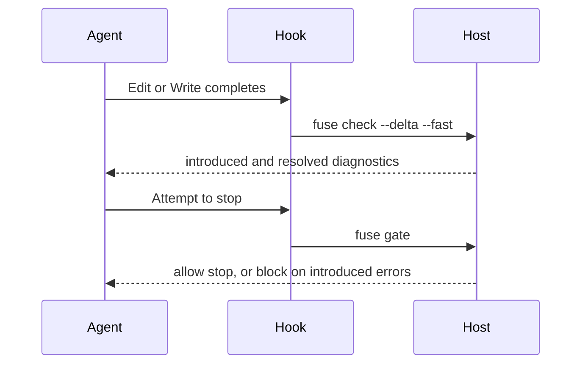

**Goal:** stop relying on the agent to remember to check its work. Push the compiler's
verdict into the session after every edit, and block a turn that would end with a broken
build.

## Do It

```bash
fuse mcp install --client claude --with-hooks
```

This writes two Claude Code hooks into your project's `.claude/settings.json`:

- a **PostToolUse** hook (on `Edit` and `Write`) that runs `fuse check --delta --fast`, so
  after every file change the transcript shows exactly the diagnostics that change
  introduced or resolved, and
- a **Stop** hook that runs `fuse gate`, which blocks the turn from ending while the session
  has introduced compiler errors it has not resolved.

The merge preserves any hooks and settings you already have, and re-running is idempotent.
Remove the two `fuse` entries from the `hooks` section of that file to uninstall.



## What The Agent Sees

After an edit that breaks a call, the hook adds a line like:

```
fuse: 1 diagnostic(s) introduced, 0 resolved by your change.
  introduced Error CS1061 src/Orders/OrderService.cs:42: 'Order' does not contain a definition for 'Total'
```

An edit that changes nothing the compiler cares about prints nothing: the hook is silent on
an empty delta, so it never spams the transcript. When the turn tries to end while an
introduced error remains, `fuse gate` exits nonzero and names the error, so the harness
holds the turn open until the agent fixes or reverts it.

## Baseline Discipline

"Red" means only the diagnostics the session itself introduced, never the errors that were
already in the repository when the session started. An agent working a repository that does
not currently build is not walled in by pre-existing errors; the gate blocks only on what
this session broke.

## How It Stays Fast

The hooks talk to the already-running Fuse host (the same process your editor and MCP client
use) over its local pipe and ask it for the delta; they never run a build. When no host is
serving the workspace, the commands exit immediately and silently, so a hook is never a
drag on editing. This is why ambient verification needs a resident host: the delta is read
from the live compilation the host holds, with no rebuild.

## Other Harnesses

The commands are not Claude-specific. Any harness that can run a command after an edit and on
turn end can wire the same two commands: `fuse check --delta --fast` for the per-edit delta
and `fuse gate` for the turn gate. `fuse mcp install --with-hooks` only automates the Claude
Code wiring.

## Verify the Hooks

Make a reversible edit that introduces a compiler error. Confirm the post-edit hook reports
that new diagnostic and the stop hook blocks while it remains. Revert the edit and confirm
the resolved diagnostic clears the gate.
