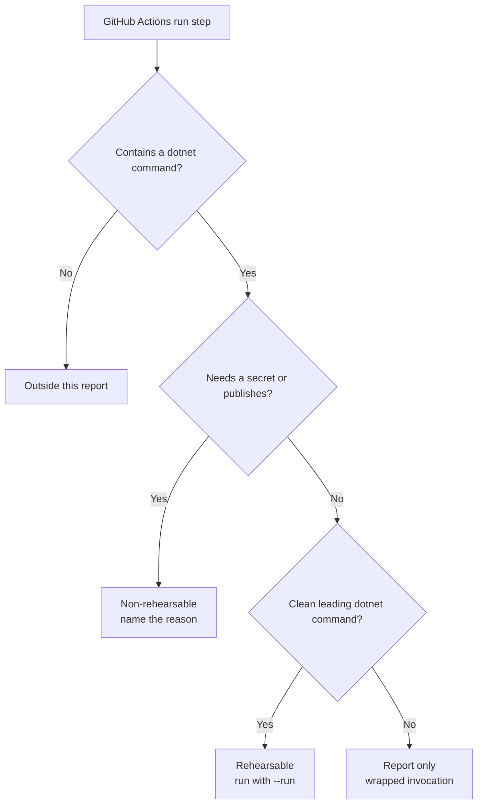

The last trust gap before the pipeline is "local green, CI red." Fuse closes the part of it that is knowable: it reads your GitHub Actions workflows, extracts the dotnet command sequence they run, and tells you which steps you can rehearse locally and which you cannot, so a CI failure has a named reason here first instead of a surprise after the push.

```bash
fuse verify --ci-parity
```

This is classification, not CI emulation. Fuse scans `.github/workflows`, extracts
`dotnet` steps from single-line `run:` entries and `run: |` blocks, then prints the
sequence in CI order. Steps it will not run locally carry a reason.



## Example

On a repository whose release workflow packs and pushes to NuGet:

```
ci-parity: 1 workflow(s) scanned (build.yml)

rehearsable dotnet steps (3), in CI order:
  $ dotnet tool install -g dotnet-coverage
  $ dotnet-coverage collect --output coverage.cobertura.xml "dotnet test"
  $ dotnet pack src/Scrutor/Scrutor.csproj --configuration Release --output ./artifacts

NOT rehearsable locally (2) - named, never silently skipped:
  - needs a secret: dotnet nuget push ./artifacts/*.nupkg --api-key ${{ secrets.NUGET_TOKEN }} ...
```

The two `nuget push` steps need a secret, so they are named non-rehearsable rather than attempted. Everything else is a step you can run before you push.

## Run the rehearsable steps

Add `--run` to execute the rehearsable dotnet commands locally through the same executor Fuse uses for build-grade verification, in CI order, reporting each command's outcome:

```bash
fuse verify --ci-parity --run
```

Only a clean leading-`dotnet` command is executed; a dotnet invocation wrapped in another tool (a coverage collector) is reported as rehearsable but not auto-run, so the executor is never handed a non-dotnet program.

## What is classified non-rehearsable

| Class | Why |
|-------|-----|
| Needs a secret | The step references `${{ secrets.* }}` or `--api-key`; it needs credentials this machine does not have. |
| Publishes a package | A `dotnet nuget push`; it mutates a remote feed. |
| Wrapped invocation (with `--run`) | A `dotnet` call embedded in another tool is reported but not auto-run. |

Matrix legs (a `setup-dotnet` target-framework matrix) and workflow-specific service
containers are environment concerns Fuse names rather than reproduces. Workflow extraction
is best-effort. If the report misses a command, run that command directly.

## Rehearse the Current Workflow

Run `fuse verify --ci-parity` and read every non-rehearsable reason. If the extracted
leading `dotnet` commands are safe on your machine, rerun with `--run`. Execute any missed
local command manually before pushing.
