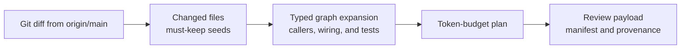

**Goal:** review a branch by fetching just what it changed and the code that change
impacts, not the whole repository.

## Do It

```bash
fuse review ./src --changed-since origin/main --max-tokens 25000
```



The seed is every file changed since the git ref. `fuse review` then computes the **blast
radius**, the callers, DI consumers, route and request handlers, options consumers, and
related tests reachable from the changed files, and emits the changed files plus that
neighborhood as packed context. The ref can be a branch, a commit, or a relative reference
like `HEAD~5`. This needs `git` on your PATH.

## Control What It Includes

```bash
fuse review ./src --changed-since origin/main --include-tests --format markdown
```

`--include-tests` (on by default) keeps the related test files in the radius. `--format`
picks the output shape (`xml`, `markdown`, or `json`). `--max-tokens` caps the output;
the changed files are always kept, so the cut falls on the periphery first.

## What You Get

A context plan scoped to the change set and its available graph blast radius, emitted with
the changed files always kept. Change scoping is the strongest mode by measurement: over 69 real merged pull requests,
`fuse review` keeps 100 percent of changed files at 93.4 percent precision in a median
1,026 returned tokens ([benchmarks](/docs/project/benchmarks)). Changed-file recall is
100 percent by construction because Git supplies the must-keep seeds.

## When to Use It

Use this for branch and pull-request review and for inspecting the graph-visible blast
radius. Static analysis can miss reflection and runtime dispatch, and syntax-tier projects
carry fewer typed edges.

## Review the Current Branch

Run the command against the branch's real base. In the manifest, confirm that every
Git-changed file is marked must-keep, then inspect which support files were included by
typed-edge provenance.
